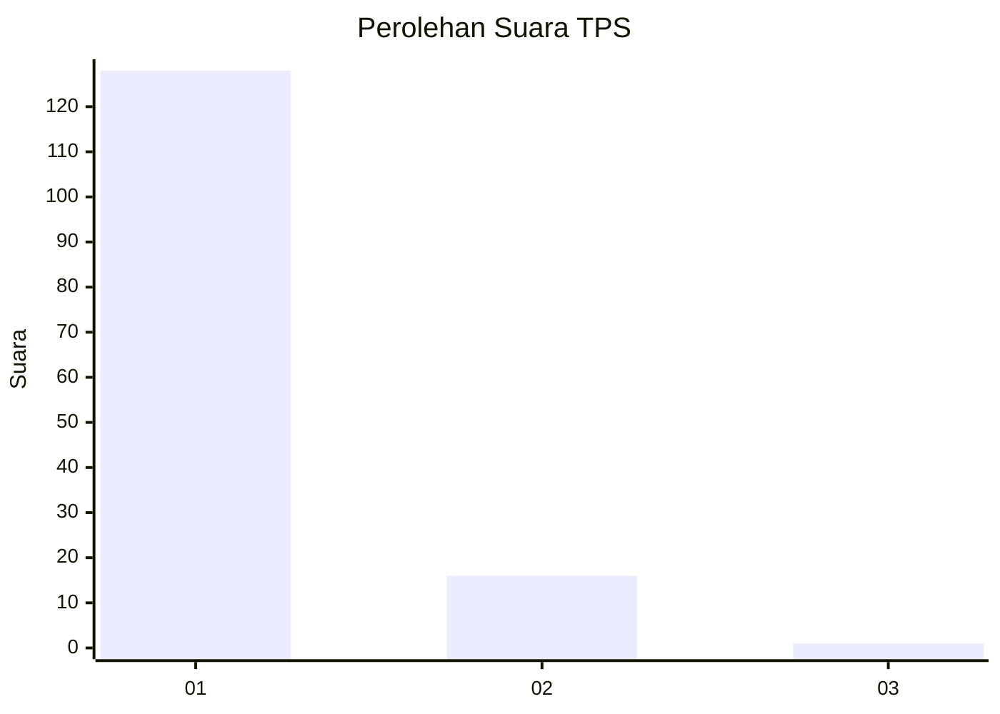
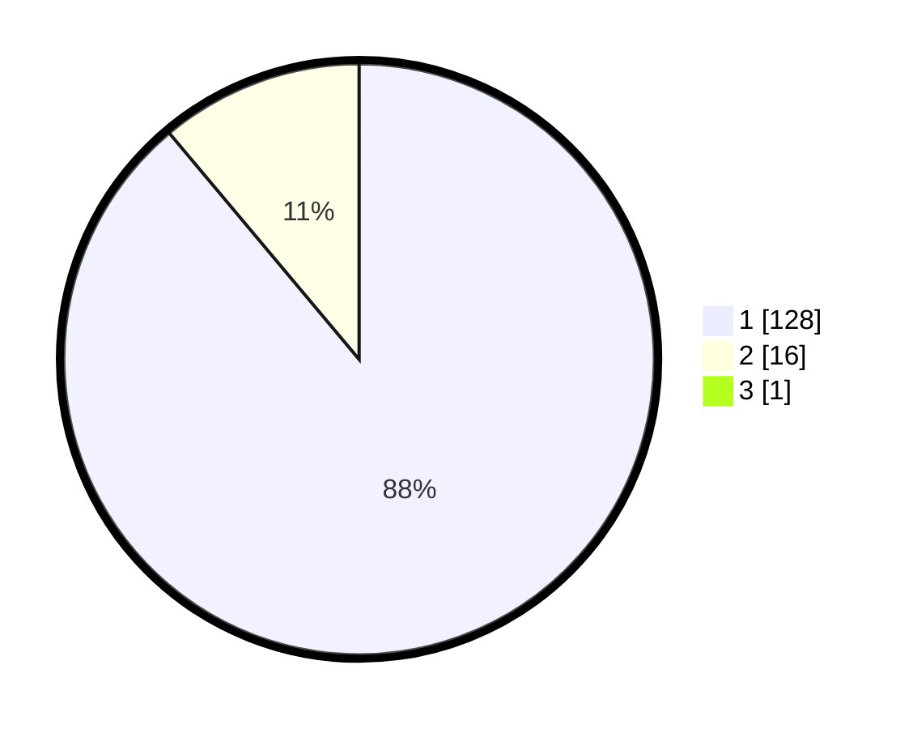

# Hasil

## Grafik

## Tabel

| No. | Nama Paslon    | Suara | Suara (raw) | Persentase |
|:--- |:-------------- | -----:| -----------:| ----------:|
| 1   | ANIES MUHAIMIN | 128   | [128][p-1]  | 88,28      |
| 2   | PRABOWO GIBRAN | 16    | [16][p-2]   | 11,03      |
| 3   | GANJAR MAHFUD  | 1     | [1][p-3]    | 0,69       |

[p-1]: https://github.com/gigit-pemilu/pemilu-2024-11-aceh/blob/main/pilpres/hitung-suara/sub/11-aceh/sub/07-pidie/sub/12-muara-tiga/sub/2007-deyah/sub/001-tps/sub/paslon-1.txt
[p-2]: https://github.com/gigit-pemilu/pemilu-2024-11-aceh/blob/main/pilpres/hitung-suara/sub/11-aceh/sub/07-pidie/sub/12-muara-tiga/sub/2007-deyah/sub/001-tps/sub/paslon-2.txt
[p-3]: https://github.com/gigit-pemilu/pemilu-2024-11-aceh/blob/main/pilpres/hitung-suara/sub/11-aceh/sub/07-pidie/sub/12-muara-tiga/sub/2007-deyah/sub/001-tps/sub/paslon-3.txt

## Foto C Plano

https://sirekap-obj-formc.kpu.go.id/5d84/pemilu/ppwp/11/07/12/20/07/1107122007001-20240215-110854--d4267e92-4913-4ca4-8538-3a97cdf9e218.jpg

https://sirekap-obj-formc.kpu.go.id/5d84/pemilu/ppwp/11/07/12/20/07/1107122007001-20240215-110944--417f1b29-33d7-4152-91cf-f5f71d3e85d2.jpg

https://sirekap-obj-formc.kpu.go.id/5d84/pemilu/ppwp/11/07/12/20/07/1107122007001-20240215-111027--a48d3c93-a178-44cf-b115-1db2b6d14a56.jpg

## Metadata

| Key        | Value               |
| ---------- | ------------------- |
| Time Stamp | 2024-02-17 03:30:02 |

