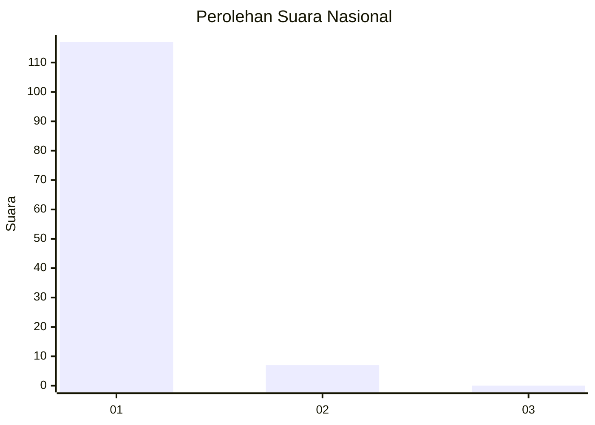
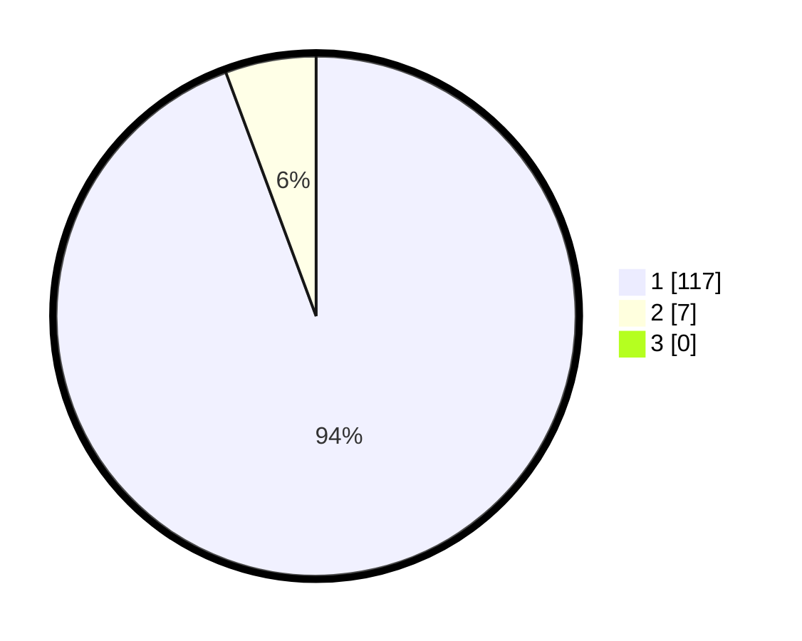

# Hasil

## Grafik

## Tabel

| No. | Nama Paslon    | Suara | Suara (raw) | Persentase |
|:--- |:-------------- | -----:| -----------:| ----------:|
| 1   | ANIES MUHAIMIN | 117   | [117][p-1]  | 94,35      |
| 2   | PRABOWO GIBRAN | 7     | [7][p-2]    | 5,65       |
| 3   | GANJAR MAHFUD  | 0     | [0][p-3]    | 0,00       |

[p-1]: https://github.com/gigit-pemilu/pemilu-2024/blob/main/pilpres/hitung-suara/sub/11-aceh/sub/07-pidie/sub/12-muara-tiga/sub/2007-deyah/sub/002-tps/sub/paslon-1.txt
[p-2]: https://github.com/gigit-pemilu/pemilu-2024/blob/main/pilpres/hitung-suara/sub/11-aceh/sub/07-pidie/sub/12-muara-tiga/sub/2007-deyah/sub/002-tps/sub/paslon-2.txt
[p-3]: https://github.com/gigit-pemilu/pemilu-2024/blob/main/pilpres/hitung-suara/sub/11-aceh/sub/07-pidie/sub/12-muara-tiga/sub/2007-deyah/sub/002-tps/sub/paslon-3.txt

## Foto C Plano

https://sirekap-obj-formc.kpu.go.id/20ec/pemilu/ppwp/11/07/12/20/07/1107122007002-20240215-095336--d65cfd02-1ad3-484b-a3d6-6f37d3330193.jpg

https://sirekap-obj-formc.kpu.go.id/20ec/pemilu/ppwp/11/07/12/20/07/1107122007002-20240215-094950--52afbdc8-f083-404b-afc3-4c46e51456d4.jpg

https://sirekap-obj-formc.kpu.go.id/20ec/pemilu/ppwp/11/07/12/20/07/1107122007002-20240215-095526--3f4201bc-fd93-472c-85ea-a68781cb1b7e.jpg

## Metadata

| Key        | Value               |
| ---------- | ------------------- |
| Time Stamp | 2024-02-15 23:29:50 |

