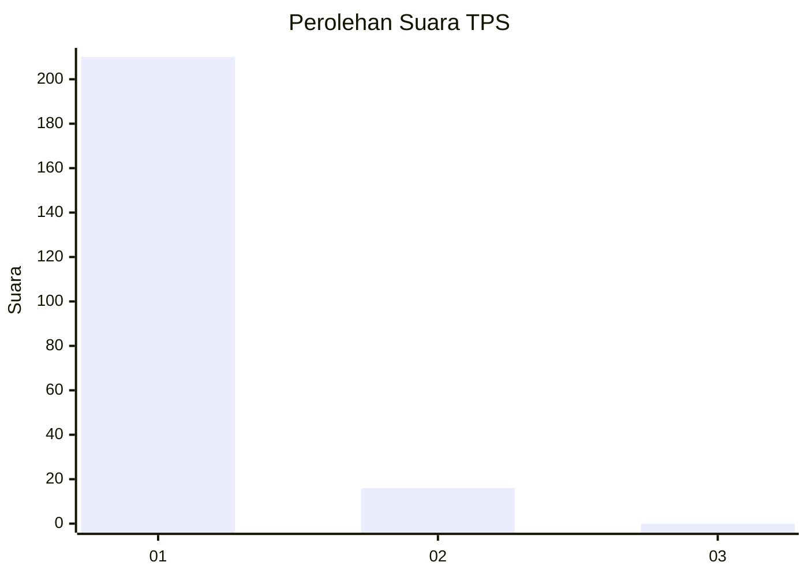
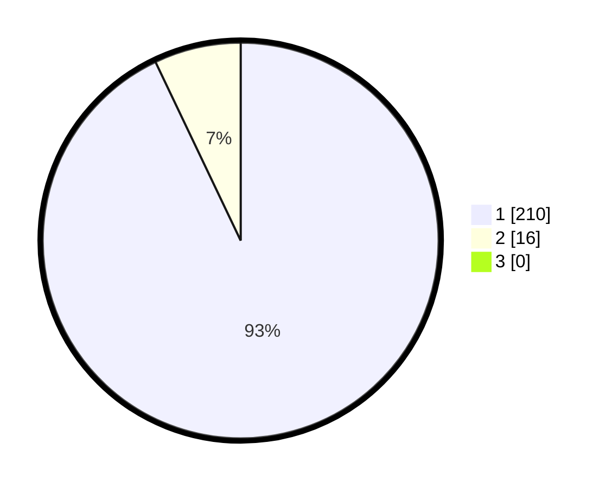

# Hasil

## Grafik

## Tabel

| No. | Nama Paslon    | Suara | Suara (raw) | Persentase |
|:--- |:-------------- | -----:| -----------:| ----------:|
| 1   | ANIES MUHAIMIN | 210   | [210][p-1]  | 92,92      |
| 2   | PRABOWO GIBRAN | 16    | [16][p-2]   | 7,08       |
| 3   | GANJAR MAHFUD  | 0     | [0][p-3]    | 0,00       |

[p-1]: https://github.com/gigit-pemilu/pemilu-2024-11-aceh/blob/main/pilpres/hitung-suara/sub/11-aceh/sub/07-pidie/sub/12-muara-tiga/sub/2010-ie-masen/sub/001-tps/sub/paslon-1.txt
[p-2]: https://github.com/gigit-pemilu/pemilu-2024-11-aceh/blob/main/pilpres/hitung-suara/sub/11-aceh/sub/07-pidie/sub/12-muara-tiga/sub/2010-ie-masen/sub/001-tps/sub/paslon-2.txt
[p-3]: https://github.com/gigit-pemilu/pemilu-2024-11-aceh/blob/main/pilpres/hitung-suara/sub/11-aceh/sub/07-pidie/sub/12-muara-tiga/sub/2010-ie-masen/sub/001-tps/sub/paslon-3.txt

## Foto C Plano

https://sirekap-obj-formc.kpu.go.id/a67c/pemilu/ppwp/11/07/12/20/10/1107122010001-20240215-101134--add2e407-b3fd-47ac-9048-d44d312636b4.jpg

https://sirekap-obj-formc.kpu.go.id/a67c/pemilu/ppwp/11/07/12/20/10/1107122010001-20240215-101352--e03e9b46-fd0e-4657-af32-4a275fe25373.jpg

https://sirekap-obj-formc.kpu.go.id/a67c/pemilu/ppwp/11/07/12/20/10/1107122010001-20240215-101612--d163d21d-f7cc-46ab-b884-86ae86ef9766.jpg

## Metadata

| Key        | Value               |
| ---------- | ------------------- |
| Time Stamp | 2024-02-24 22:31:28 |

