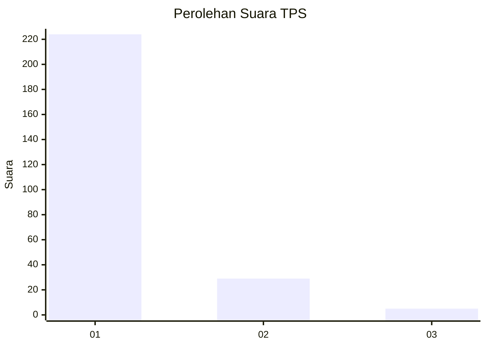
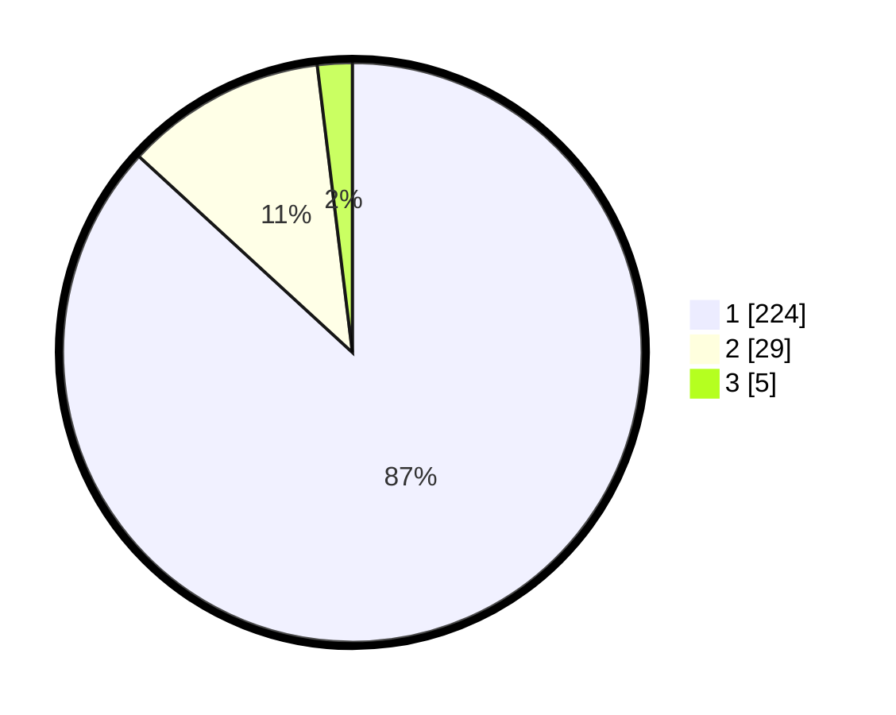

# Hasil

## Grafik

## Tabel

| No. | Nama Paslon    | Suara | Suara (raw) | Persentase |
|:--- |:-------------- | -----:| -----------:| ----------:|
| 1   | ANIES MUHAIMIN | 224   | [224][p-1]  | 86,82      |
| 2   | PRABOWO GIBRAN | 29    | [29][p-2]   | 11,24      |
| 3   | GANJAR MAHFUD  | 5     | [5][p-3]    | 1,94       |

[p-1]: https://github.com/gigit-pemilu/pemilu-2024-11-aceh/blob/main/pilpres/hitung-suara/sub/11-aceh/sub/07-pidie/sub/13-mutiara/sub/2001-mesjid-yaman/sub/002-tps/sub/paslon-1.txt
[p-2]: https://github.com/gigit-pemilu/pemilu-2024-11-aceh/blob/main/pilpres/hitung-suara/sub/11-aceh/sub/07-pidie/sub/13-mutiara/sub/2001-mesjid-yaman/sub/002-tps/sub/paslon-2.txt
[p-3]: https://github.com/gigit-pemilu/pemilu-2024-11-aceh/blob/main/pilpres/hitung-suara/sub/11-aceh/sub/07-pidie/sub/13-mutiara/sub/2001-mesjid-yaman/sub/002-tps/sub/paslon-3.txt

## Foto C Plano

https://sirekap-obj-formc.kpu.go.id/7951/pemilu/ppwp/11/07/13/20/01/1107132001002-20240215-100439--e480050f-5762-4437-8abc-b06f62206b48.jpg

https://sirekap-obj-formc.kpu.go.id/7951/pemilu/ppwp/11/07/13/20/01/1107132001002-20240215-100543--49c05f89-285f-4299-ac7e-76c3f23a9caf.jpg

https://sirekap-obj-formc.kpu.go.id/7951/pemilu/ppwp/11/07/13/20/01/1107132001002-20240217-025512--d52fdf04-93f1-4c01-80c9-58f3e6fb9209.jpg

## Metadata

| Key        | Value               |
| ---------- | ------------------- |
| Time Stamp | 2024-02-17 03:00:02 |

## DATA PEMILIH TETAP

Jumlah pemilih dalam DPT: **278**.
 * L: **122**.
 * P: **156**.

## DATA PENGGUNA HAK PILIH

Jumlah pengguna hak pilih dalam DPT: **262**.
 * L: **113**.
 * P: **149**.

Jumlah pengguna hak pilih dalam DPTb: **0**.
 * L: **0**.
 * P: **0**.

Jumlah pengguna hak pilih dalam DPK: **0**.
 * L: **0**.
 * P: **0**.

Jumlah pengguna hak pilih: **262**.
 * L: **0**.
 * P: **0**.

## JUMLAH SUARA SAH DAN TIDAK SAH

JUMLAH SELURUH SUARA SAH: **258**.

JUMLAH SUARA TIDAK SAH: **4**.

JUMLAH SELURUH SUARA SAH DAN SUARA TIDAK SAH: **262**.

