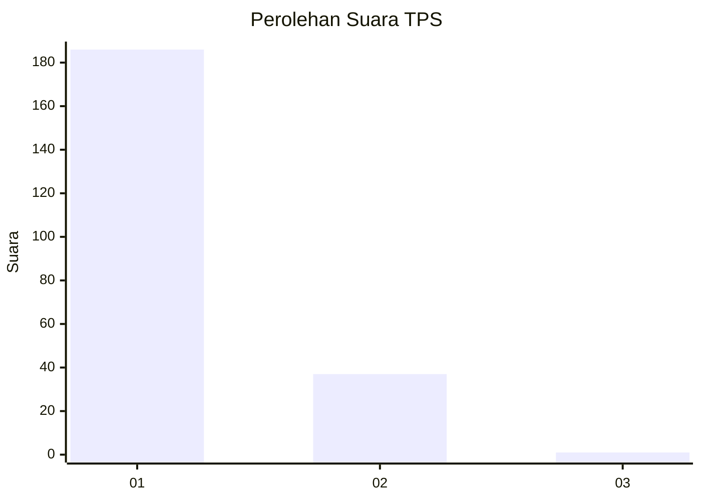
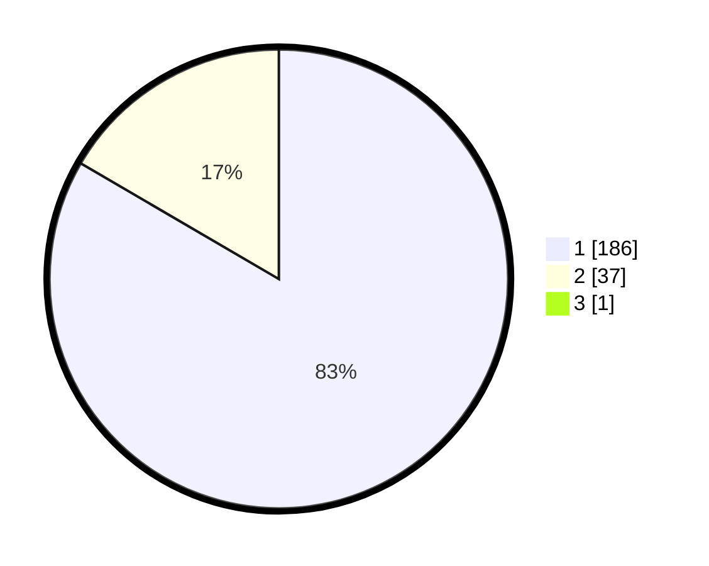

# Hasil

## Grafik

## Tabel

| No. | Nama Paslon    | Suara | Suara (raw) | Persentase |
|:--- |:-------------- | -----:| -----------:| ----------:|
| 1   | ANIES MUHAIMIN | 186   | [186][p-1]  | 83,04      |
| 2   | PRABOWO GIBRAN | 37    | [37][p-2]   | 16,52      |
| 3   | GANJAR MAHFUD  | 1     | [1][p-3]    | 0,45       |

[p-1]: https://github.com/gigit-pemilu/pemilu-2024-11-aceh/blob/main/pilpres/hitung-suara/sub/11-aceh/sub/07-pidie/sub/13-mutiara/sub/2002-baro-yaman/sub/001-tps/sub/paslon-1.txt
[p-2]: https://github.com/gigit-pemilu/pemilu-2024-11-aceh/blob/main/pilpres/hitung-suara/sub/11-aceh/sub/07-pidie/sub/13-mutiara/sub/2002-baro-yaman/sub/001-tps/sub/paslon-2.txt
[p-3]: https://github.com/gigit-pemilu/pemilu-2024-11-aceh/blob/main/pilpres/hitung-suara/sub/11-aceh/sub/07-pidie/sub/13-mutiara/sub/2002-baro-yaman/sub/001-tps/sub/paslon-3.txt

## Foto C Plano

https://sirekap-obj-formc.kpu.go.id/7d33/pemilu/ppwp/11/07/13/20/02/1107132002001-20240215-103553--d26bd523-32a0-490e-9f47-31a9b8511f66.jpg

https://sirekap-obj-formc.kpu.go.id/7d33/pemilu/ppwp/11/07/13/20/02/1107132002001-20240215-104210--bb6ca199-020c-4d55-a5d7-a3bc7434a9a6.jpg

https://sirekap-obj-formc.kpu.go.id/7d33/pemilu/ppwp/11/07/13/20/02/1107132002001-20240215-104331--517d8288-8fc9-4cb6-96f3-f0b879d878b4.jpg

## Metadata

| Key        | Value               |
| ---------- | ------------------- |
| Time Stamp | 2024-02-19 06:16:00 |

