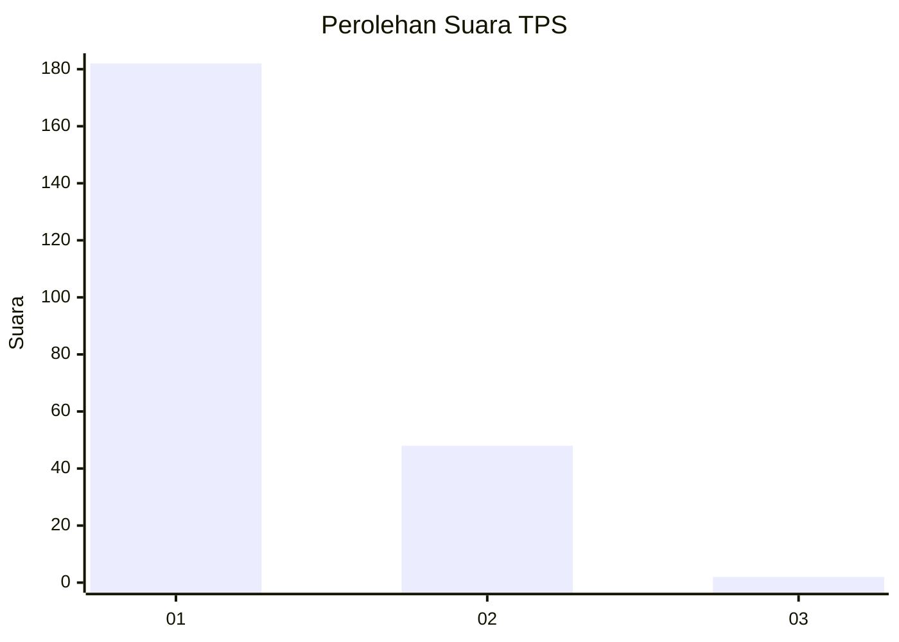
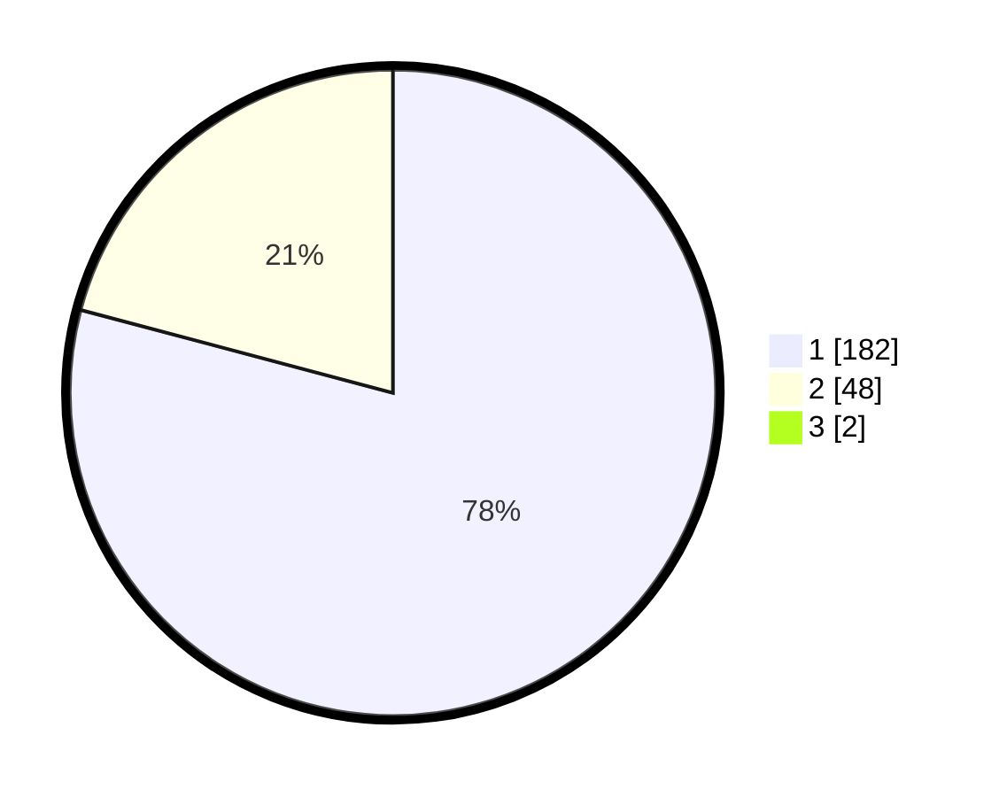

# Hasil

## Grafik

## Tabel

| No. | Nama Paslon    | Suara | Suara (raw) | Persentase |
|:--- |:-------------- | -----:| -----------:| ----------:|
| 1   | ANIES MUHAIMIN | 182   | [182][p-1]  | 78,45      |
| 2   | PRABOWO GIBRAN | 48    | [48][p-2]   | 20,69      |
| 3   | GANJAR MAHFUD  | 2     | [2][p-3]    | 0,86       |

[p-1]: https://github.com/gigit-pemilu/pemilu-2024-11-aceh/blob/main/pilpres/hitung-suara/sub/11-aceh/sub/07-pidie/sub/13-mutiara/sub/2002-baro-yaman/sub/002-tps/sub/paslon-1.txt
[p-2]: https://github.com/gigit-pemilu/pemilu-2024-11-aceh/blob/main/pilpres/hitung-suara/sub/11-aceh/sub/07-pidie/sub/13-mutiara/sub/2002-baro-yaman/sub/002-tps/sub/paslon-2.txt
[p-3]: https://github.com/gigit-pemilu/pemilu-2024-11-aceh/blob/main/pilpres/hitung-suara/sub/11-aceh/sub/07-pidie/sub/13-mutiara/sub/2002-baro-yaman/sub/002-tps/sub/paslon-3.txt

## Foto C Plano

https://sirekap-obj-formc.kpu.go.id/252a/pemilu/ppwp/11/07/13/20/02/1107132002002-20240215-103934--ea354d25-d247-4f58-975e-d1a4b0553af1.jpg

https://sirekap-obj-formc.kpu.go.id/252a/pemilu/ppwp/11/07/13/20/02/1107132002002-20240215-104348--ba44bd70-6e2f-46fd-ae08-39260075eb64.jpg

https://sirekap-obj-formc.kpu.go.id/252a/pemilu/ppwp/11/07/13/20/02/1107132002002-20240215-104425--f6eee818-57b1-4ad3-af74-9a7b8e4a81a6.jpg

## Metadata

| Key        | Value               |
| ---------- | ------------------- |
| Time Stamp | 2024-02-19 06:16:00 |

