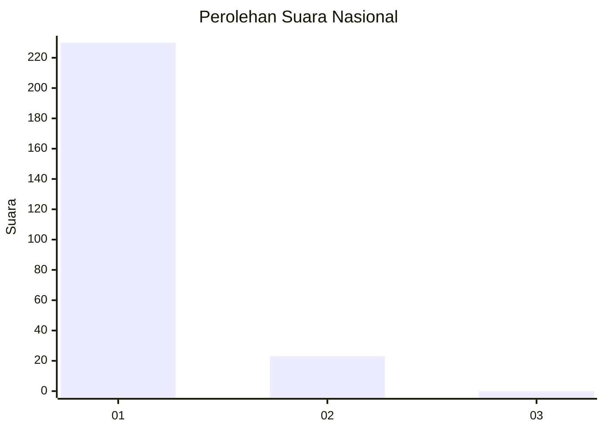
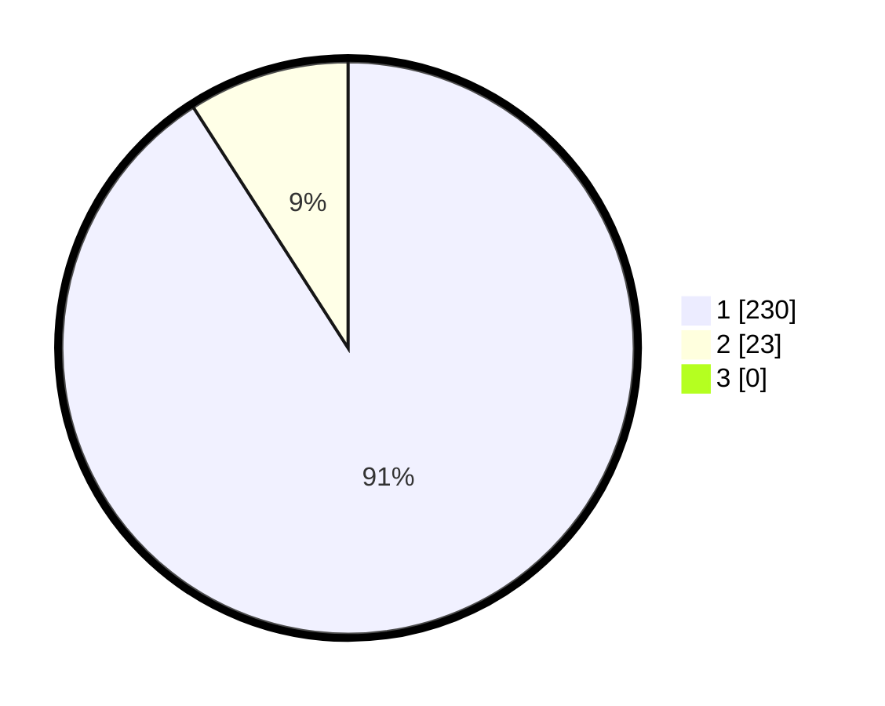

# Hasil

## Grafik

## Tabel

| No. | Nama Paslon    | Suara | Suara (raw) | Persentase |
|:--- |:-------------- | -----:| -----------:| ----------:|
| 1   | ANIES MUHAIMIN | 230   | [230][p-1]  | 90,91      |
| 2   | PRABOWO GIBRAN | 23    | [23][p-2]   | 9,09       |
| 3   | GANJAR MAHFUD  | 0     | [0][p-3]    | 0,00       |

[p-1]: https://github.com/gigit-pemilu/pemilu-2024/blob/main/pilpres/hitung-suara/sub/11-aceh/sub/07-pidie/sub/13-mutiara/sub/2003-mee-teungoh/sub/001-tps/sub/paslon-1.txt
[p-2]: https://github.com/gigit-pemilu/pemilu-2024/blob/main/pilpres/hitung-suara/sub/11-aceh/sub/07-pidie/sub/13-mutiara/sub/2003-mee-teungoh/sub/001-tps/sub/paslon-2.txt
[p-3]: https://github.com/gigit-pemilu/pemilu-2024/blob/main/pilpres/hitung-suara/sub/11-aceh/sub/07-pidie/sub/13-mutiara/sub/2003-mee-teungoh/sub/001-tps/sub/paslon-3.txt

## Foto C Plano

https://sirekap-obj-formc.kpu.go.id/85a3/pemilu/ppwp/11/07/13/20/03/1107132003001-20240215-050045--3118cc8b-318c-4b05-9288-cdcffc97c17d.jpg

https://sirekap-obj-formc.kpu.go.id/85a3/pemilu/ppwp/11/07/13/20/03/1107132003001-20240215-050142--e28c2695-94a1-4ada-8971-ccc05ea51b0b.jpg

https://sirekap-obj-formc.kpu.go.id/85a3/pemilu/ppwp/11/07/13/20/03/1107132003001-20240215-050231--95a259a8-2b56-41d9-a15f-58986ceb8048.jpg

## Metadata

| Key        | Value               |
| ---------- | ------------------- |
| Time Stamp | 2024-02-19 06:16:00 |

