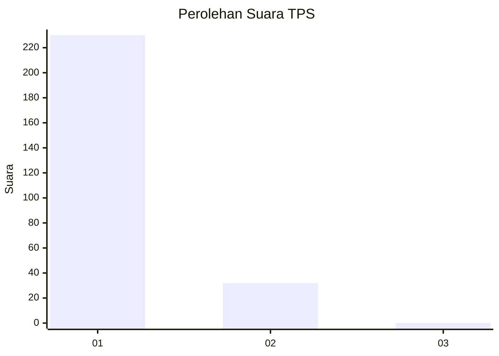
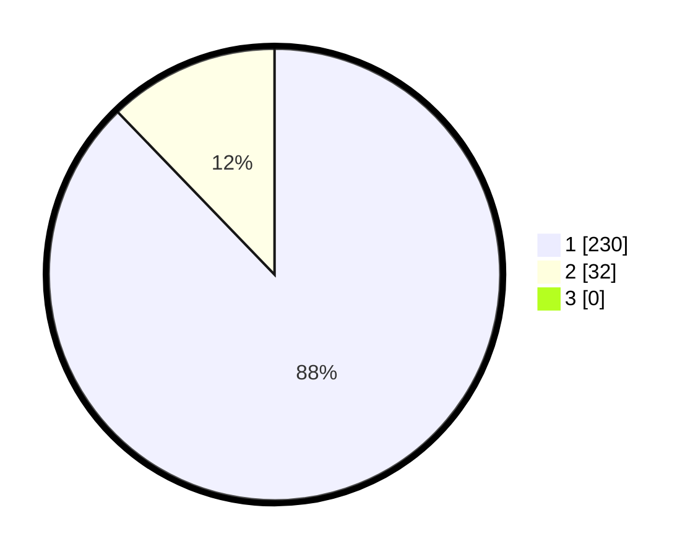

# Hasil

## Grafik

## Tabel

| No. | Nama Paslon    | Suara | Suara (raw) | Persentase |
|:--- |:-------------- | -----:| -----------:| ----------:|
| 1   | ANIES MUHAIMIN | 230   | [230][p-1]  | 87,79      |
| 2   | PRABOWO GIBRAN | 32    | [32][p-2]   | 12,21      |
| 3   | GANJAR MAHFUD  | 0     | [0][p-3]    | 0,00       |

[p-1]: https://github.com/gigit-pemilu/pemilu-2024-11-aceh/blob/main/pilpres/hitung-suara/sub/11-aceh/sub/07-pidie/sub/13-mutiara/sub/2003-mee-teungoh/sub/002-tps/sub/paslon-1.txt
[p-2]: https://github.com/gigit-pemilu/pemilu-2024-11-aceh/blob/main/pilpres/hitung-suara/sub/11-aceh/sub/07-pidie/sub/13-mutiara/sub/2003-mee-teungoh/sub/002-tps/sub/paslon-2.txt
[p-3]: https://github.com/gigit-pemilu/pemilu-2024-11-aceh/blob/main/pilpres/hitung-suara/sub/11-aceh/sub/07-pidie/sub/13-mutiara/sub/2003-mee-teungoh/sub/002-tps/sub/paslon-3.txt

## Foto C Plano

https://sirekap-obj-formc.kpu.go.id/f9c8/pemilu/ppwp/11/07/13/20/03/1107132003002-20240215-043913--7662a4e8-0962-4119-816a-f24699e7a504.jpg

https://sirekap-obj-formc.kpu.go.id/f9c8/pemilu/ppwp/11/07/13/20/03/1107132003002-20240215-044219--828c3ef0-0fe1-4c6d-be1a-a863ba277108.jpg

https://sirekap-obj-formc.kpu.go.id/f9c8/pemilu/ppwp/11/07/13/20/03/1107132003002-20240215-044323--4ab6539d-8b46-45f0-ab87-bbc70efe6e88.jpg

## Metadata

| Key        | Value               |
| ---------- | ------------------- |
| Time Stamp | 2024-02-19 06:16:00 |

