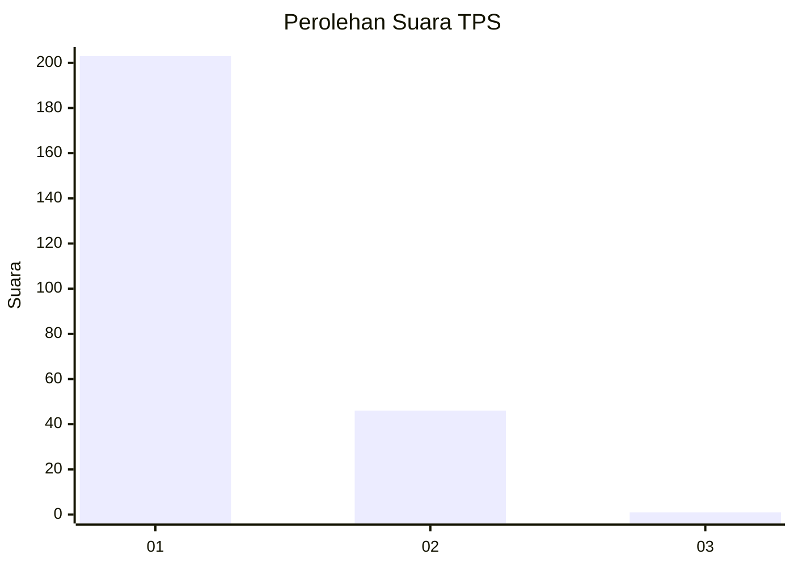
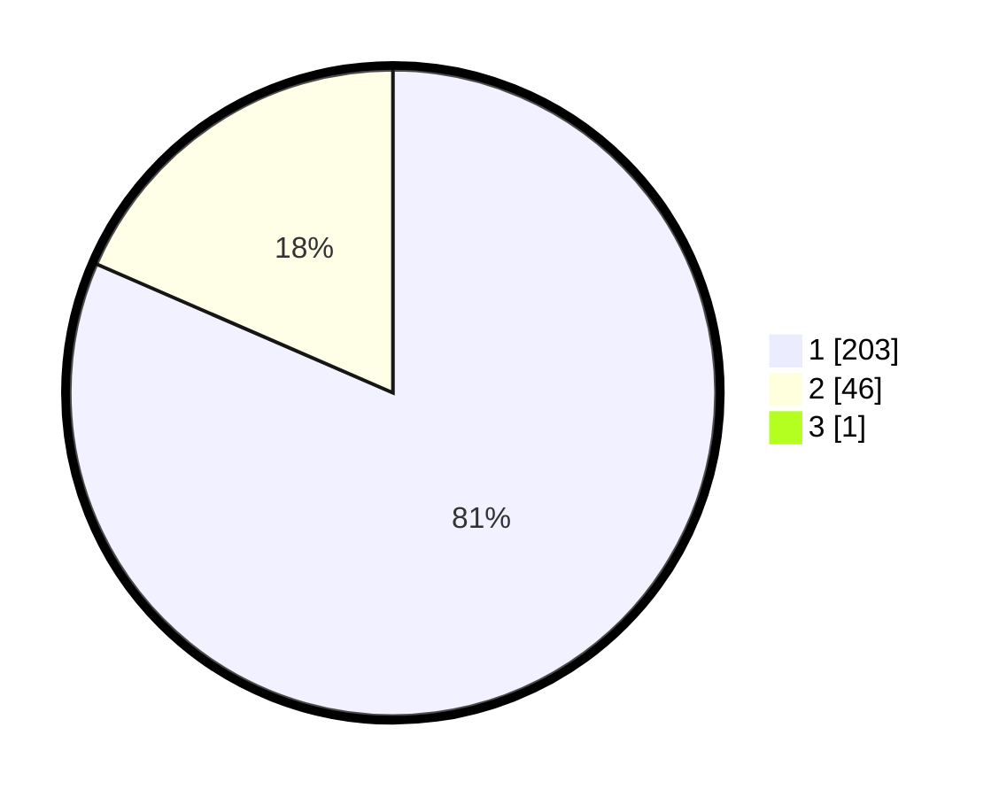

# Hasil

## Grafik

## Tabel

| No. | Nama Paslon    | Suara | Suara (raw) | Persentase |
|:--- |:-------------- | -----:| -----------:| ----------:|
| 1   | ANIES MUHAIMIN | 203   | [203][p-1]  | 81,20      |
| 2   | PRABOWO GIBRAN | 46    | [46][p-2]   | 18,40      |
| 3   | GANJAR MAHFUD  | 1     | [1][p-3]    | 0,40       |

[p-1]: https://github.com/gigit-pemilu/pemilu-2024-11-aceh/blob/main/pilpres/hitung-suara/sub/11-aceh/sub/07-pidie/sub/13-mutiara/sub/2004-sentosa/sub/001-tps/sub/paslon-1.txt
[p-2]: https://github.com/gigit-pemilu/pemilu-2024-11-aceh/blob/main/pilpres/hitung-suara/sub/11-aceh/sub/07-pidie/sub/13-mutiara/sub/2004-sentosa/sub/001-tps/sub/paslon-2.txt
[p-3]: https://github.com/gigit-pemilu/pemilu-2024-11-aceh/blob/main/pilpres/hitung-suara/sub/11-aceh/sub/07-pidie/sub/13-mutiara/sub/2004-sentosa/sub/001-tps/sub/paslon-3.txt

## Foto C Plano

https://sirekap-obj-formc.kpu.go.id/8fd6/pemilu/ppwp/11/07/13/20/04/1107132004001-20240215-113929--7ca6fa29-c5c9-495a-bcbd-bdef946f747e.jpg

https://sirekap-obj-formc.kpu.go.id/8fd6/pemilu/ppwp/11/07/13/20/04/1107132004001-20240215-114140--f5729a8f-a510-427b-aece-116918bdd1cd.jpg

https://sirekap-obj-formc.kpu.go.id/8fd6/pemilu/ppwp/11/07/13/20/04/1107132004001-20240215-114346--5449efef-e7ea-4bad-a501-4e788acfb478.jpg

## Metadata

| Key        | Value               |
| ---------- | ------------------- |
| Time Stamp | 2024-02-24 22:31:28 |

