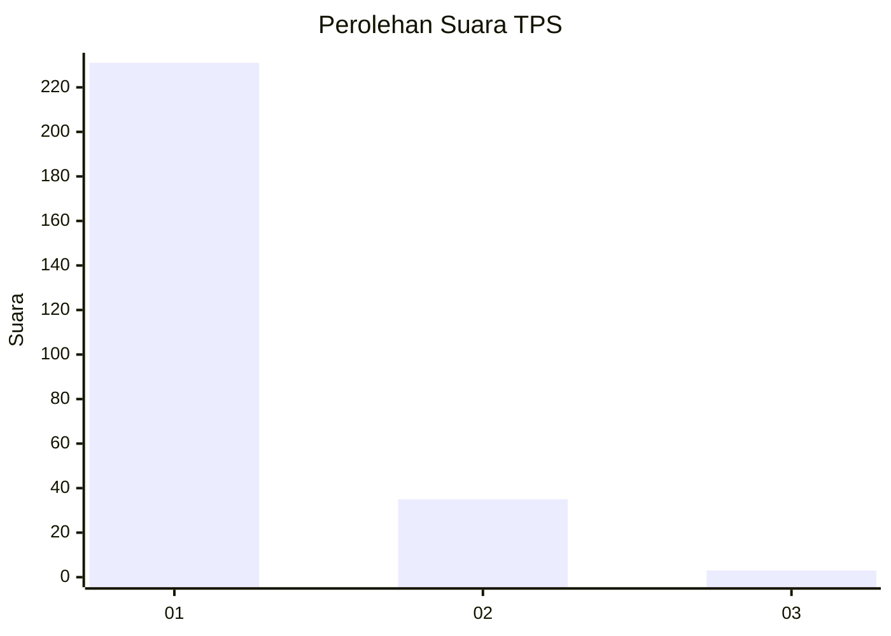
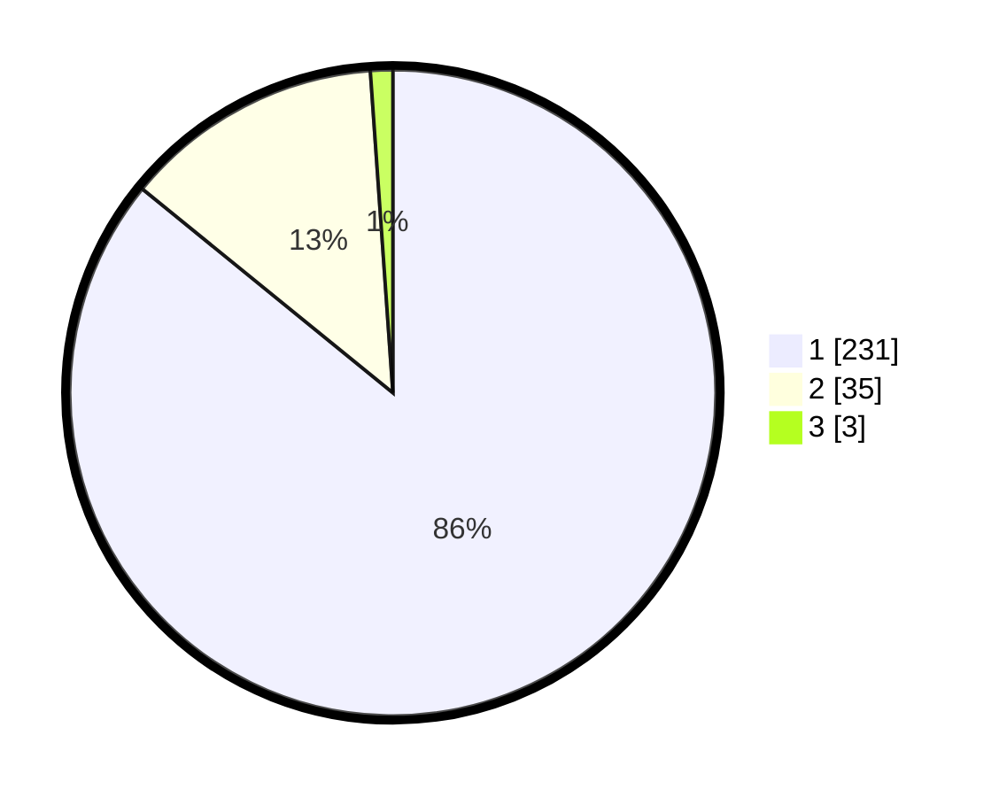

# Hasil

## Grafik

## Tabel

| No. | Nama Paslon    | Suara | Suara (raw) | Persentase |
|:--- |:-------------- | -----:| -----------:| ----------:|
| 1   | ANIES MUHAIMIN | 231   | [231][p-1]  | 85,87      |
| 2   | PRABOWO GIBRAN | 35    | [35][p-2]   | 13,01      |
| 3   | GANJAR MAHFUD  | 3     | [3][p-3]    | 1,12       |

[p-1]: https://github.com/gigit-pemilu/pemilu-2024-11-aceh/blob/main/pilpres/hitung-suara/sub/11-aceh/sub/07-pidie/sub/13-mutiara/sub/2004-sentosa/sub/003-tps/sub/paslon-1.txt
[p-2]: https://github.com/gigit-pemilu/pemilu-2024-11-aceh/blob/main/pilpres/hitung-suara/sub/11-aceh/sub/07-pidie/sub/13-mutiara/sub/2004-sentosa/sub/003-tps/sub/paslon-2.txt
[p-3]: https://github.com/gigit-pemilu/pemilu-2024-11-aceh/blob/main/pilpres/hitung-suara/sub/11-aceh/sub/07-pidie/sub/13-mutiara/sub/2004-sentosa/sub/003-tps/sub/paslon-3.txt

## Foto C Plano

https://sirekap-obj-formc.kpu.go.id/4ccf/pemilu/ppwp/11/07/13/20/04/1107132004003-20240215-120214--36dad718-0701-4c89-ae15-0a4f56807bbd.jpg

https://sirekap-obj-formc.kpu.go.id/4ccf/pemilu/ppwp/11/07/13/20/04/1107132004003-20240215-120623--86b04f25-aaae-443f-90e2-73ae0f9280a5.jpg

https://sirekap-obj-formc.kpu.go.id/4ccf/pemilu/ppwp/11/07/13/20/04/1107132004003-20240215-120851--3b46542c-cdb5-4db0-a1ac-7a3122a7a5a6.jpg

## Metadata

| Key        | Value               |
| ---------- | ------------------- |
| Time Stamp | 2024-02-19 06:16:00 |

