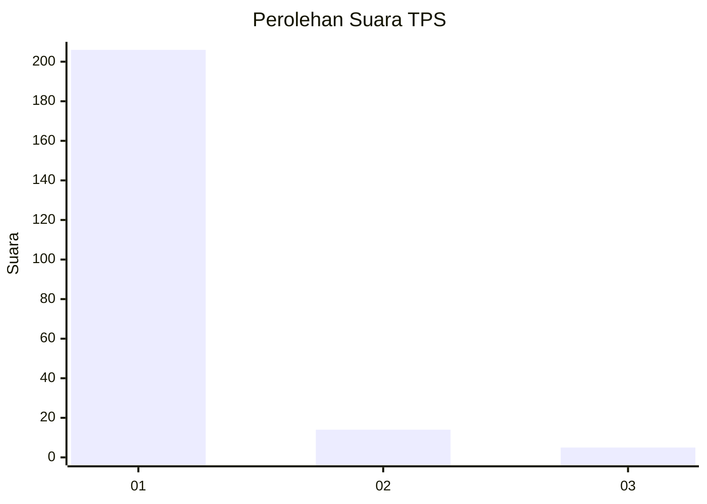
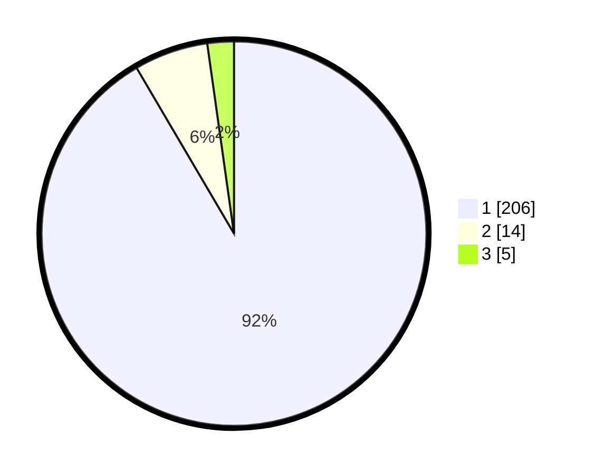

# Hasil

## Grafik

## Tabel

| No. | Nama Paslon    | Suara | Suara (raw) | Persentase |
|:--- |:-------------- | -----:| -----------:| ----------:|
| 1   | ANIES MUHAIMIN | 206   | [206][p-1]  | 91,56      |
| 2   | PRABOWO GIBRAN | 14    | [14][p-2]   | 6,22       |
| 3   | GANJAR MAHFUD  | 5     | [5][p-3]    | 2,22       |

[p-1]: https://github.com/gigit-pemilu/pemilu-2024-11-aceh/blob/main/pilpres/hitung-suara/sub/11-aceh/sub/07-pidie/sub/13-mutiara/sub/2005-baroh-barat-yaman/sub/003-tps/sub/paslon-1.txt
[p-2]: https://github.com/gigit-pemilu/pemilu-2024-11-aceh/blob/main/pilpres/hitung-suara/sub/11-aceh/sub/07-pidie/sub/13-mutiara/sub/2005-baroh-barat-yaman/sub/003-tps/sub/paslon-2.txt
[p-3]: https://github.com/gigit-pemilu/pemilu-2024-11-aceh/blob/main/pilpres/hitung-suara/sub/11-aceh/sub/07-pidie/sub/13-mutiara/sub/2005-baroh-barat-yaman/sub/003-tps/sub/paslon-3.txt

## Foto C Plano

https://sirekap-obj-formc.kpu.go.id/88f0/pemilu/ppwp/11/07/13/20/05/1107132005003-20240215-085129--c4ef5caf-d9f9-402e-aa98-42eea47f6251.jpg

https://sirekap-obj-formc.kpu.go.id/88f0/pemilu/ppwp/11/07/13/20/05/1107132005003-20240215-160736--4e7c8816-4527-457b-8cdb-0120b917d707.jpg

https://sirekap-obj-formc.kpu.go.id/88f0/pemilu/ppwp/11/07/13/20/05/1107132005003-20240215-085403--874539c2-3bef-4e43-a4d1-43a40cb84e6e.jpg

## Metadata

| Key        | Value               |
| ---------- | ------------------- |
| Time Stamp | 2024-02-19 06:16:00 |

