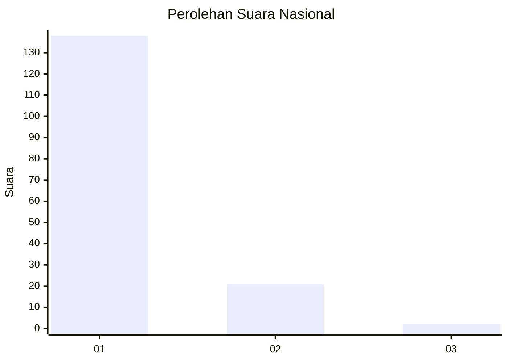
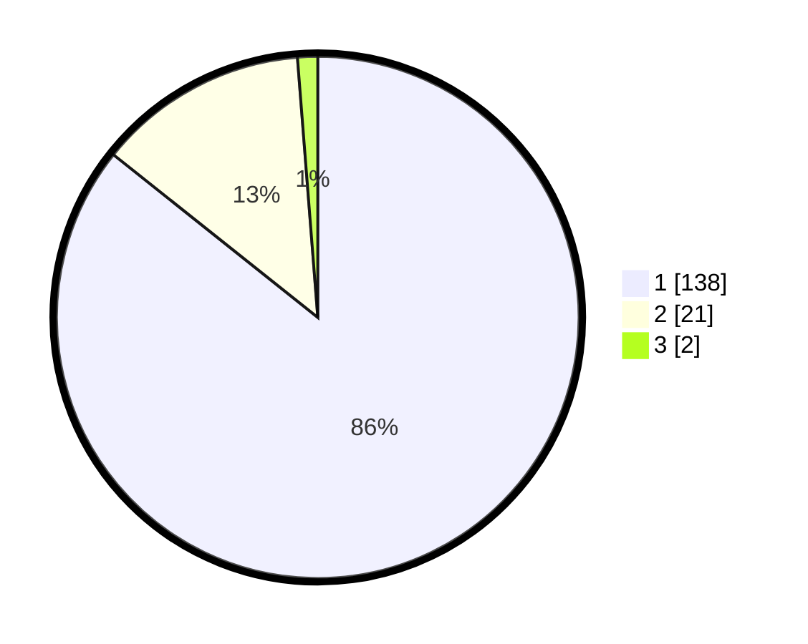

# Hasil

## Grafik

## Tabel

| No. | Nama Paslon    | Suara | Suara (raw) | Persentase |
|:--- |:-------------- | -----:| -----------:| ----------:|
| 1   | ANIES MUHAIMIN | 138   | [138][p-1]  | 85,71      |
| 2   | PRABOWO GIBRAN | 21    | [21][p-2]   | 13,04      |
| 3   | GANJAR MAHFUD  | 2     | [2][p-3]    | 1,24       |

[p-1]: https://github.com/gigit-pemilu/pemilu-2024/blob/main/pilpres/hitung-suara/sub/11-aceh/sub/07-pidie/sub/13-mutiara/sub/2006-tuha-gampong-gajah/sub/001-tps/sub/paslon-1.txt
[p-2]: https://github.com/gigit-pemilu/pemilu-2024/blob/main/pilpres/hitung-suara/sub/11-aceh/sub/07-pidie/sub/13-mutiara/sub/2006-tuha-gampong-gajah/sub/001-tps/sub/paslon-2.txt
[p-3]: https://github.com/gigit-pemilu/pemilu-2024/blob/main/pilpres/hitung-suara/sub/11-aceh/sub/07-pidie/sub/13-mutiara/sub/2006-tuha-gampong-gajah/sub/001-tps/sub/paslon-3.txt

## Foto C Plano

https://sirekap-obj-formc.kpu.go.id/da71/pemilu/ppwp/11/07/13/20/06/1107132006001-20240214-231555--b93b6137-3257-4485-9010-42b9dad4bad1.jpg

https://sirekap-obj-formc.kpu.go.id/da71/pemilu/ppwp/11/07/13/20/06/1107132006001-20240214-231727--e04b7715-04d3-4be7-aaef-2f45565a28c5.jpg

https://sirekap-obj-formc.kpu.go.id/da71/pemilu/ppwp/11/07/13/20/06/1107132006001-20240214-231952--7f3af36e-3a21-4922-8648-8256365d40da.jpg

## Metadata

| Key        | Value               |
| ---------- | ------------------- |
| Time Stamp | 2024-02-15 17:00:25 |

