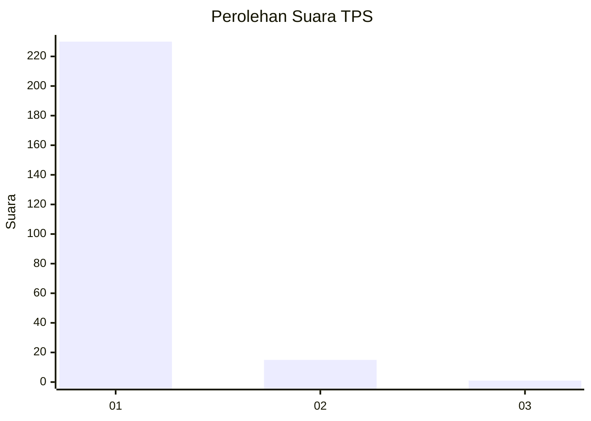
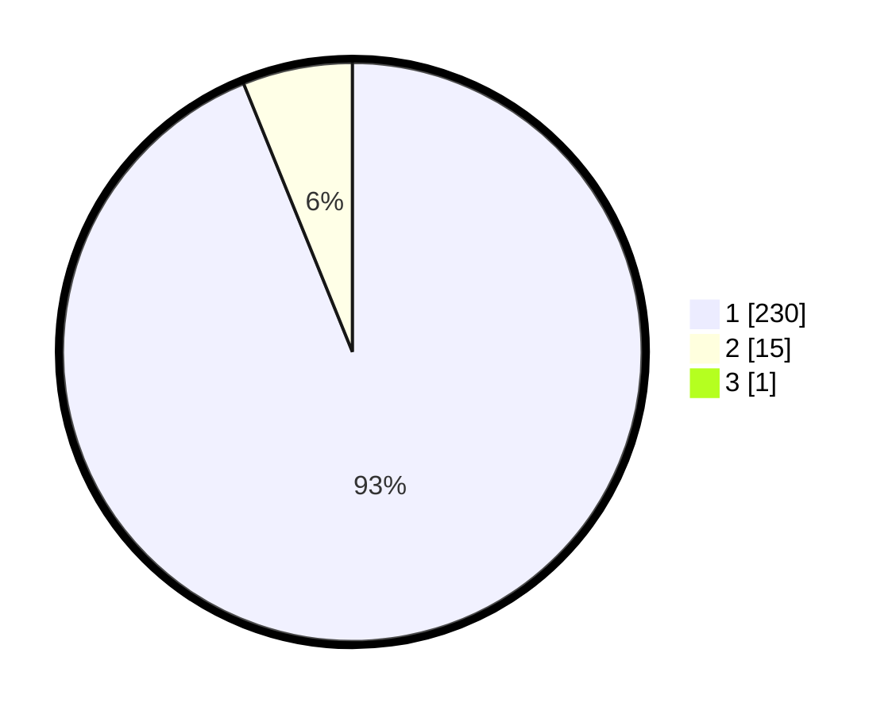

# Hasil

## Grafik

## Tabel

| No. | Nama Paslon    | Suara | Suara (raw) | Persentase |
|:--- |:-------------- | -----:| -----------:| ----------:|
| 1   | ANIES MUHAIMIN | 230   | [230][p-1]  | 93,50      |
| 2   | PRABOWO GIBRAN | 15    | [15][p-2]   | 6,10       |
| 3   | GANJAR MAHFUD  | 1     | [1][p-3]    | 0,41       |

[p-1]: https://github.com/gigit-pemilu/pemilu-2024-11-aceh/blob/main/pilpres/hitung-suara/sub/11-aceh/sub/07-pidie/sub/13-mutiara/sub/2007-jadan/sub/001-tps/sub/paslon-1.txt
[p-2]: https://github.com/gigit-pemilu/pemilu-2024-11-aceh/blob/main/pilpres/hitung-suara/sub/11-aceh/sub/07-pidie/sub/13-mutiara/sub/2007-jadan/sub/001-tps/sub/paslon-2.txt
[p-3]: https://github.com/gigit-pemilu/pemilu-2024-11-aceh/blob/main/pilpres/hitung-suara/sub/11-aceh/sub/07-pidie/sub/13-mutiara/sub/2007-jadan/sub/001-tps/sub/paslon-3.txt

## Foto C Plano

https://sirekap-obj-formc.kpu.go.id/413e/pemilu/ppwp/11/07/13/20/07/1107132007001-20240215-111941--85e98b14-4ba0-4013-be67-95a743d0ba2e.jpg

https://sirekap-obj-formc.kpu.go.id/413e/pemilu/ppwp/11/07/13/20/07/1107132007001-20240215-110534--d8600225-fef6-4db9-90f2-d43913c70b31.jpg

https://sirekap-obj-formc.kpu.go.id/413e/pemilu/ppwp/11/07/13/20/07/1107132007001-20240215-112130--10f7f105-adb2-4083-b8fe-87ff0ab46905.jpg

## Metadata

| Key        | Value               |
| ---------- | ------------------- |
| Time Stamp | 2024-02-19 06:16:00 |

