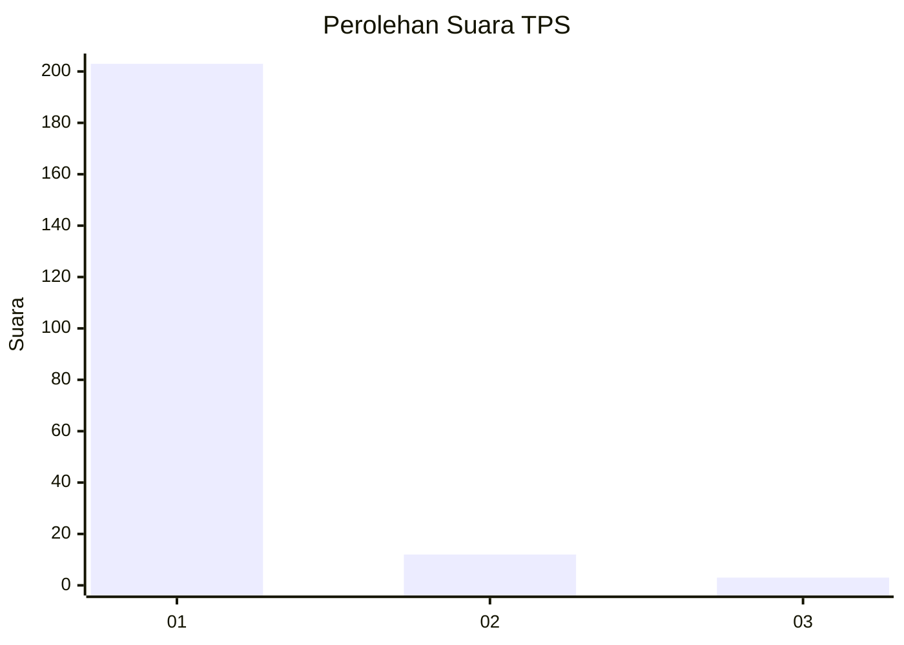
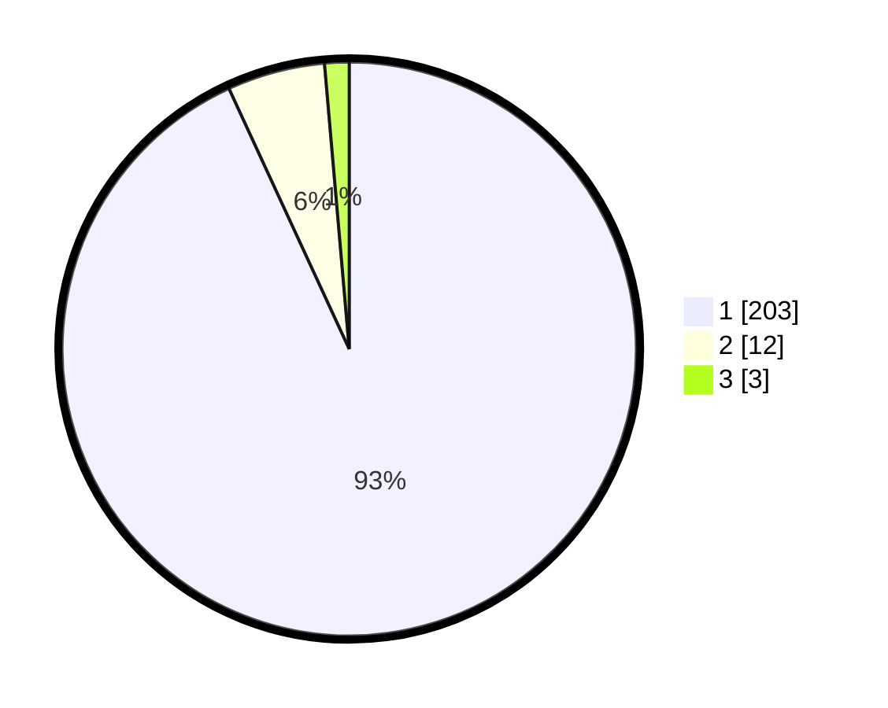

# Hasil

## Grafik

## Tabel

| No. | Nama Paslon    | Suara | Suara (raw) | Persentase |
|:--- |:-------------- | -----:| -----------:| ----------:|
| 1   | ANIES MUHAIMIN | 203   | [203][p-1]  | 93,12      |
| 2   | PRABOWO GIBRAN | 12    | [12][p-2]   | 5,50       |
| 3   | GANJAR MAHFUD  | 3     | [3][p-3]    | 1,38       |

[p-1]: https://github.com/gigit-pemilu/pemilu-2024-11-aceh/blob/main/pilpres/hitung-suara/sub/11-aceh/sub/07-pidie/sub/13-mutiara/sub/2007-jadan/sub/002-tps/sub/paslon-1.txt
[p-2]: https://github.com/gigit-pemilu/pemilu-2024-11-aceh/blob/main/pilpres/hitung-suara/sub/11-aceh/sub/07-pidie/sub/13-mutiara/sub/2007-jadan/sub/002-tps/sub/paslon-2.txt
[p-3]: https://github.com/gigit-pemilu/pemilu-2024-11-aceh/blob/main/pilpres/hitung-suara/sub/11-aceh/sub/07-pidie/sub/13-mutiara/sub/2007-jadan/sub/002-tps/sub/paslon-3.txt

## Foto C Plano

https://sirekap-obj-formc.kpu.go.id/a755/pemilu/ppwp/11/07/13/20/07/1107132007002-20240215-104921--c9c99523-1bc4-4ba2-8cbb-ce6b8d64cb76.jpg

https://sirekap-obj-formc.kpu.go.id/a755/pemilu/ppwp/11/07/13/20/07/1107132007002-20240215-105034--d3f023d1-0e7d-43f8-b850-23048407f688.jpg

https://sirekap-obj-formc.kpu.go.id/a755/pemilu/ppwp/11/07/13/20/07/1107132007002-20240215-105234--13735bf1-bb83-4ae5-8552-ef26cf203829.jpg

## Metadata

| Key        | Value               |
| ---------- | ------------------- |
| Time Stamp | 2024-02-19 06:16:00 |

