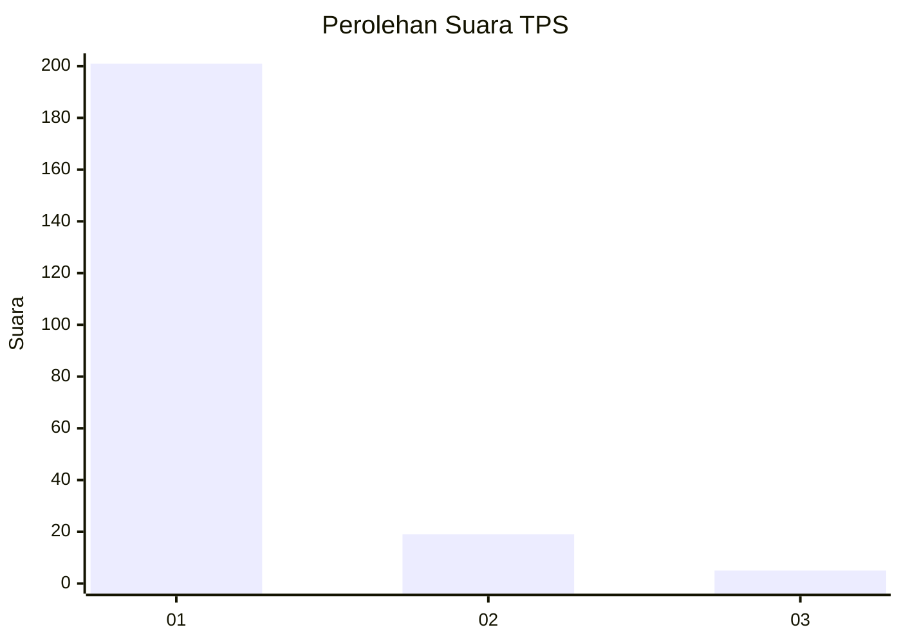
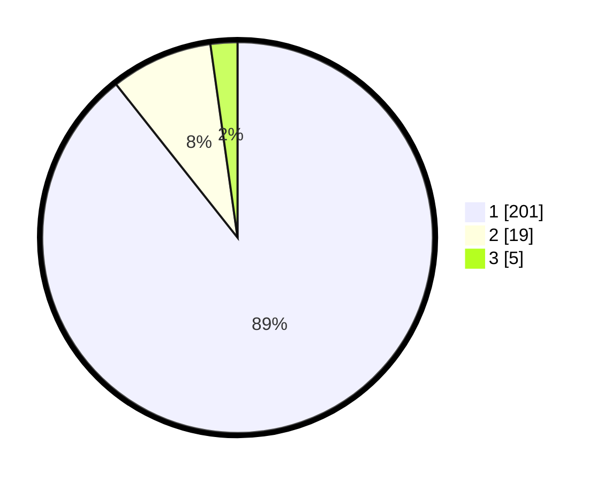

# Hasil

## Grafik

## Tabel

| No. | Nama Paslon    | Suara | Suara (raw) | Persentase |
|:--- |:-------------- | -----:| -----------:| ----------:|
| 1   | ANIES MUHAIMIN | 201   | [201][p-1]  | 89,33      |
| 2   | PRABOWO GIBRAN | 19    | [19][p-2]   | 8,44       |
| 3   | GANJAR MAHFUD  | 5     | [5][p-3]    | 2,22       |

[p-1]: https://github.com/gigit-pemilu/pemilu-2024-11-aceh/blob/main/pilpres/hitung-suara/sub/11-aceh/sub/07-pidie/sub/13-mutiara/sub/2009-blang-tidiek/sub/001-tps/sub/paslon-1.txt
[p-2]: https://github.com/gigit-pemilu/pemilu-2024-11-aceh/blob/main/pilpres/hitung-suara/sub/11-aceh/sub/07-pidie/sub/13-mutiara/sub/2009-blang-tidiek/sub/001-tps/sub/paslon-2.txt
[p-3]: https://github.com/gigit-pemilu/pemilu-2024-11-aceh/blob/main/pilpres/hitung-suara/sub/11-aceh/sub/07-pidie/sub/13-mutiara/sub/2009-blang-tidiek/sub/001-tps/sub/paslon-3.txt

## Foto C Plano

https://sirekap-obj-formc.kpu.go.id/a0fd/pemilu/ppwp/11/07/13/20/09/1107132009001-20240215-052745--7527a79b-f810-4374-8fe7-cc528d431874.jpg

https://sirekap-obj-formc.kpu.go.id/a0fd/pemilu/ppwp/11/07/13/20/09/1107132009001-20240215-025618--ba60bbb5-01df-4d9d-94d0-d8ec33dd48f0.jpg

https://sirekap-obj-formc.kpu.go.id/a0fd/pemilu/ppwp/11/07/13/20/09/1107132009001-20240215-024941--3e24b4a2-b6d0-4aff-bd1c-49fad75b473c.jpg

## Metadata

| Key        | Value               |
| ---------- | ------------------- |
| Time Stamp | 2024-02-19 06:16:00 |

