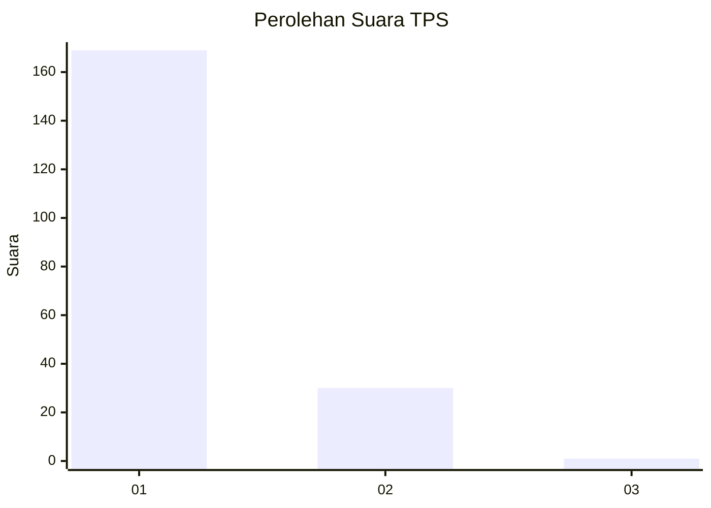
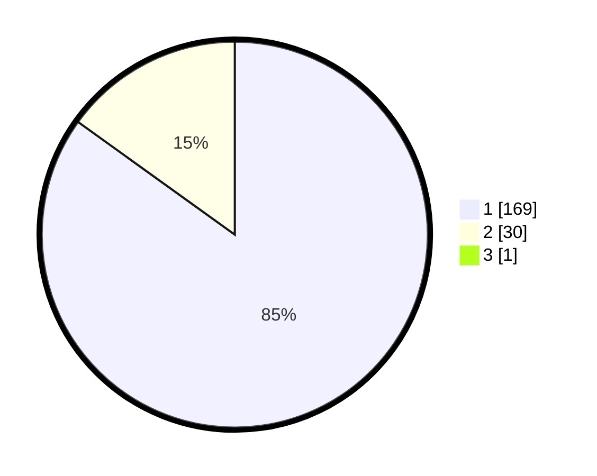

# Hasil

## Grafik

## Tabel

| No. | Nama Paslon    | Suara | Suara (raw) | Persentase |
|:--- |:-------------- | -----:| -----------:| ----------:|
| 1   | ANIES MUHAIMIN | 169   | [169][p-1]  | 84,50      |
| 2   | PRABOWO GIBRAN | 30    | [30][p-2]   | 15,00      |
| 3   | GANJAR MAHFUD  | 1     | [1][p-3]    | 0,50       |

[p-1]: https://github.com/gigit-pemilu/pemilu-2024-11-aceh/blob/main/pilpres/hitung-suara/sub/11-aceh/sub/07-pidie/sub/13-mutiara/sub/2010-blang-lileue/sub/002-tps/sub/paslon-1.txt
[p-2]: https://github.com/gigit-pemilu/pemilu-2024-11-aceh/blob/main/pilpres/hitung-suara/sub/11-aceh/sub/07-pidie/sub/13-mutiara/sub/2010-blang-lileue/sub/002-tps/sub/paslon-2.txt
[p-3]: https://github.com/gigit-pemilu/pemilu-2024-11-aceh/blob/main/pilpres/hitung-suara/sub/11-aceh/sub/07-pidie/sub/13-mutiara/sub/2010-blang-lileue/sub/002-tps/sub/paslon-3.txt

## Foto C Plano

https://sirekap-obj-formc.kpu.go.id/6b02/pemilu/ppwp/11/07/13/20/10/1107132010002-20240215-053609--779683b5-83c9-4532-a269-a777588727ce.jpg

https://sirekap-obj-formc.kpu.go.id/6b02/pemilu/ppwp/11/07/13/20/10/1107132010002-20240215-021930--7ed9ad41-e3d9-4c97-ac3b-57cb74d6a46d.jpg

https://sirekap-obj-formc.kpu.go.id/6b02/pemilu/ppwp/11/07/13/20/10/1107132010002-20240215-022204--63e90686-05c9-45fb-b26c-ba1b2459a078.jpg

## Metadata

| Key        | Value               |
| ---------- | ------------------- |
| Time Stamp | 2024-02-15 15:00:29 |

