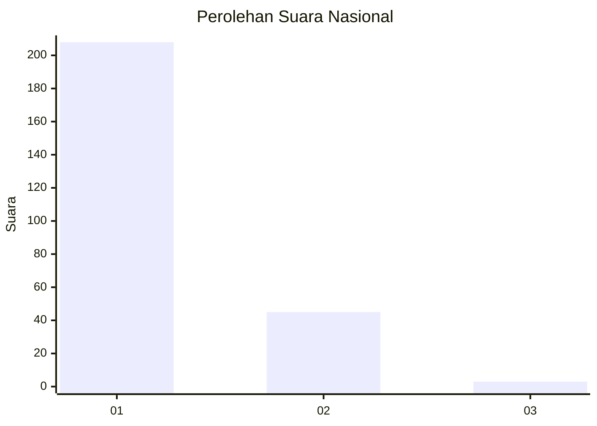
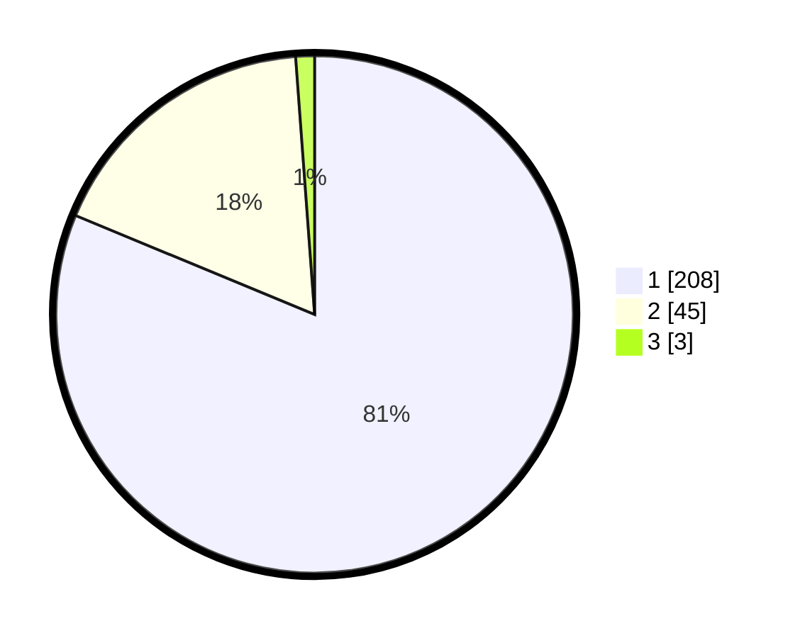

# Hasil

## Grafik

## Tabel

| No. | Nama Paslon    | Suara | Suara (raw) | Persentase |
|:--- |:-------------- | -----:| -----------:| ----------:|
| 1   | ANIES MUHAIMIN | 208   | [208][p-1]  | 81,25      |
| 2   | PRABOWO GIBRAN | 45    | [45][p-2]   | 17,58      |
| 3   | GANJAR MAHFUD  | 3     | [3][p-3]    | 1,17       |

[p-1]: https://github.com/gigit-pemilu/pemilu-2024/blob/main/pilpres/hitung-suara/sub/11-aceh/sub/07-pidie/sub/13-mutiara/sub/2011-keumangan-cut/sub/001-tps/sub/paslon-1.txt
[p-2]: https://github.com/gigit-pemilu/pemilu-2024/blob/main/pilpres/hitung-suara/sub/11-aceh/sub/07-pidie/sub/13-mutiara/sub/2011-keumangan-cut/sub/001-tps/sub/paslon-2.txt
[p-3]: https://github.com/gigit-pemilu/pemilu-2024/blob/main/pilpres/hitung-suara/sub/11-aceh/sub/07-pidie/sub/13-mutiara/sub/2011-keumangan-cut/sub/001-tps/sub/paslon-3.txt

## Foto C Plano

https://sirekap-obj-formc.kpu.go.id/a47c/pemilu/ppwp/11/07/13/20/11/1107132011001-20240215-090731--fdbf7b86-babc-4d0d-8b7a-059d73c2a7af.jpg

https://sirekap-obj-formc.kpu.go.id/a47c/pemilu/ppwp/11/07/13/20/11/1107132011001-20240214-204310--21e30424-767a-4433-935c-e75da44ef40b.jpg

https://sirekap-obj-formc.kpu.go.id/a47c/pemilu/ppwp/11/07/13/20/11/1107132011001-20240215-091007--6b081cd4-e6d8-4ca0-bd05-18dd38c88ee4.jpg

## Metadata

| Key        | Value               |
| ---------- | ------------------- |
| Time Stamp | 2024-02-19 06:16:00 |

