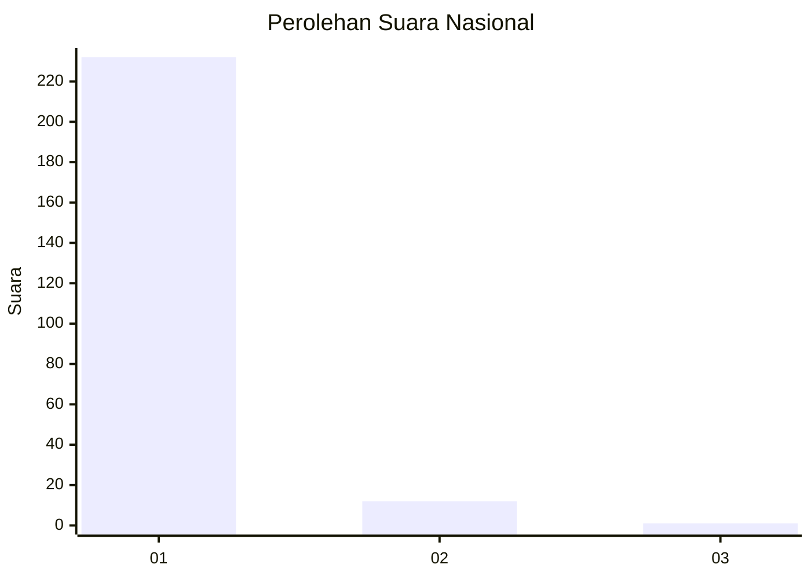
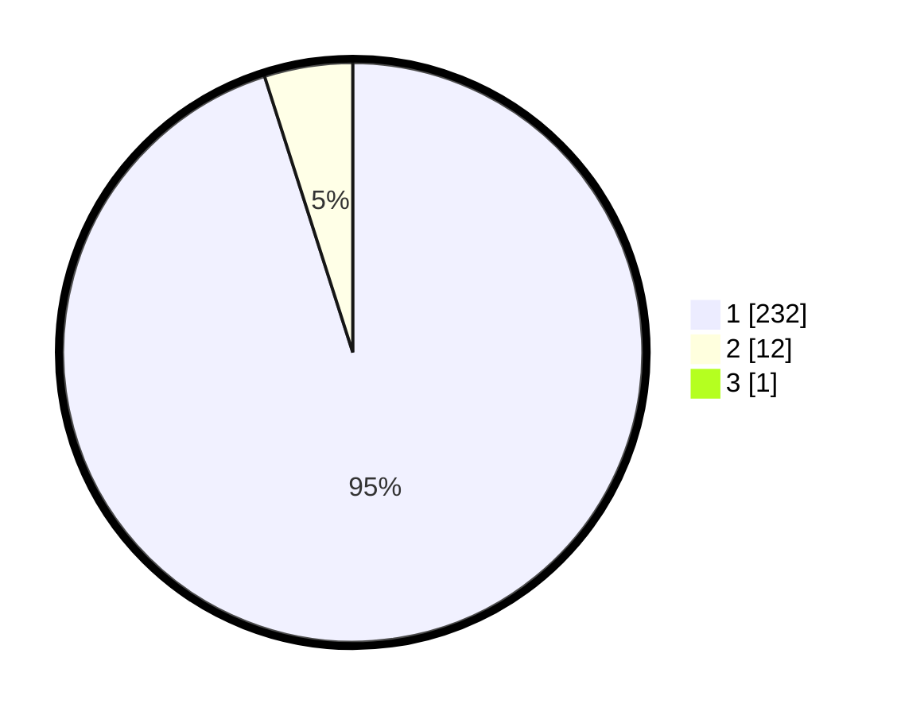

# Hasil

## Grafik

## Tabel

| No. | Nama Paslon    | Suara | Suara (raw) | Persentase |
|:--- |:-------------- | -----:| -----------:| ----------:|
| 1   | ANIES MUHAIMIN | 232   | [232][p-1]  | 94,69      |
| 2   | PRABOWO GIBRAN | 12    | [12][p-2]   | 4,90       |
| 3   | GANJAR MAHFUD  | 1     | [1][p-3]    | 0,41       |

[p-1]: https://github.com/gigit-pemilu/pemilu-2024/blob/main/pilpres/hitung-suara/sub/11-aceh/sub/07-pidie/sub/13-mutiara/sub/2013-dayah-tidiek/sub/001-tps/sub/paslon-1.txt
[p-2]: https://github.com/gigit-pemilu/pemilu-2024/blob/main/pilpres/hitung-suara/sub/11-aceh/sub/07-pidie/sub/13-mutiara/sub/2013-dayah-tidiek/sub/001-tps/sub/paslon-2.txt
[p-3]: https://github.com/gigit-pemilu/pemilu-2024/blob/main/pilpres/hitung-suara/sub/11-aceh/sub/07-pidie/sub/13-mutiara/sub/2013-dayah-tidiek/sub/001-tps/sub/paslon-3.txt

## Foto C Plano

https://sirekap-obj-formc.kpu.go.id/e301/pemilu/ppwp/11/07/13/20/13/1107132013001-20240215-092819--08a8811c-7843-451b-ac30-a18393de8547.jpg

https://sirekap-obj-formc.kpu.go.id/e301/pemilu/ppwp/11/07/13/20/13/1107132013001-20240215-093023--352898ad-ce6a-4949-8de0-34fdfa5b804c.jpg

https://sirekap-obj-formc.kpu.go.id/e301/pemilu/ppwp/11/07/13/20/13/1107132013001-20240215-093154--a8dd8c87-12ca-412e-bb1f-f86d1a3d2bf7.jpg

## Metadata

| Key        | Value               |
| ---------- | ------------------- |
| Time Stamp | 2024-02-24 22:31:28 |

