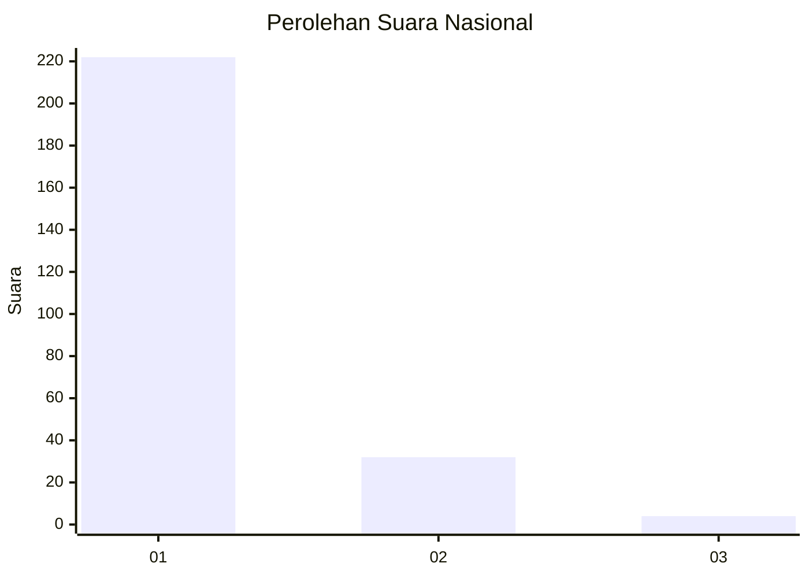
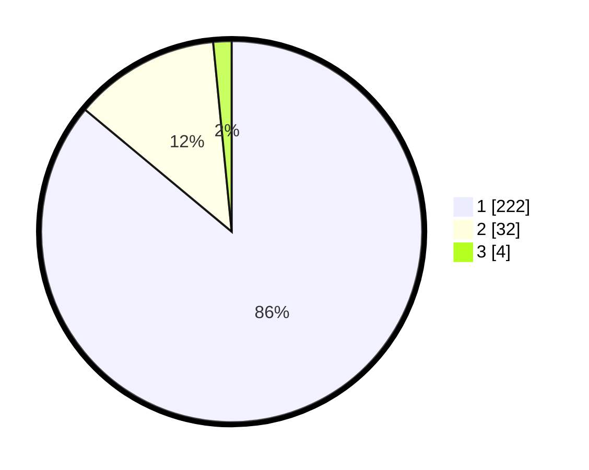

# Hasil

## Grafik

## Tabel

| No. | Nama Paslon    | Suara | Suara (raw) | Persentase |
|:--- |:-------------- | -----:| -----------:| ----------:|
| 1   | ANIES MUHAIMIN | 222   | [222][p-1]  | 86,05      |
| 2   | PRABOWO GIBRAN | 32    | [32][p-2]   | 12,40      |
| 3   | GANJAR MAHFUD  | 4     | [4][p-3]    | 1,55       |

[p-1]: https://github.com/gigit-pemilu/pemilu-2024/blob/main/pilpres/hitung-suara/sub/11-aceh/sub/07-pidie/sub/13-mutiara/sub/2014-lueng-sagoe/sub/002-tps/sub/paslon-1.txt
[p-2]: https://github.com/gigit-pemilu/pemilu-2024/blob/main/pilpres/hitung-suara/sub/11-aceh/sub/07-pidie/sub/13-mutiara/sub/2014-lueng-sagoe/sub/002-tps/sub/paslon-2.txt
[p-3]: https://github.com/gigit-pemilu/pemilu-2024/blob/main/pilpres/hitung-suara/sub/11-aceh/sub/07-pidie/sub/13-mutiara/sub/2014-lueng-sagoe/sub/002-tps/sub/paslon-3.txt

## Foto C Plano

https://sirekap-obj-formc.kpu.go.id/adc3/pemilu/ppwp/11/07/13/20/14/1107132014002-20240215-014324--bc809249-1417-4a69-8cd6-5ebd9438d4dc.jpg

https://sirekap-obj-formc.kpu.go.id/adc3/pemilu/ppwp/11/07/13/20/14/1107132014002-20240215-005014--f81a4607-8d7b-4e75-936f-c8ff68376fd3.jpg

https://sirekap-obj-formc.kpu.go.id/adc3/pemilu/ppwp/11/07/13/20/14/1107132014002-20240215-005058--07c42c11-7d6d-4c36-a020-fa362d3f12f2.jpg

## Metadata

| Key        | Value               |
| ---------- | ------------------- |
| Time Stamp | 2024-02-15 15:00:29 |

