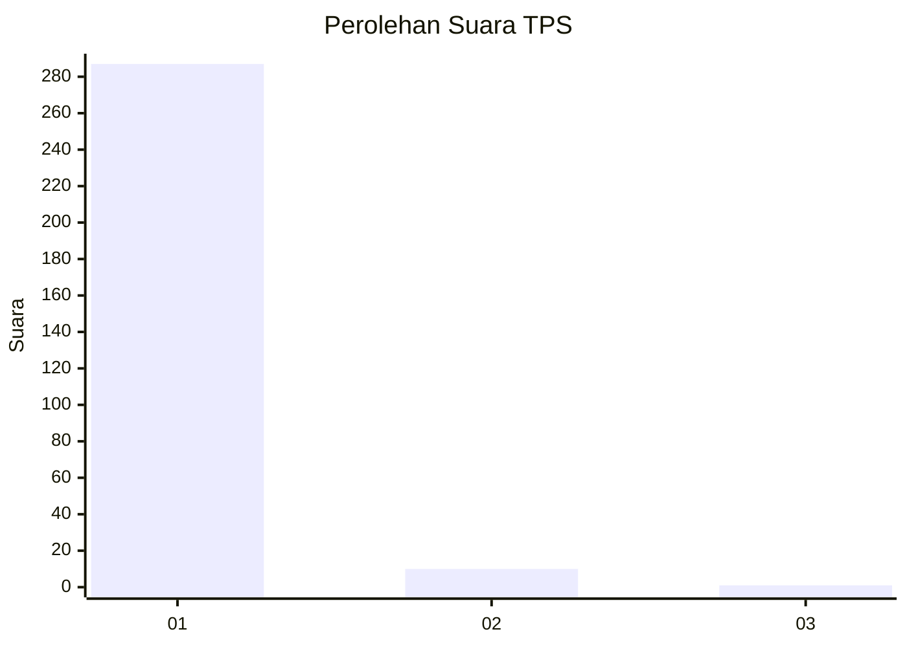
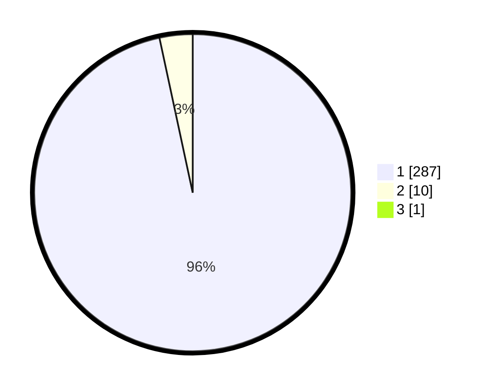

# Hasil

## Grafik

## Tabel

| No. | Nama Paslon    | Suara | Suara (raw) | Persentase |
|:--- |:-------------- | -----:| -----------:| ----------:|
| 1   | ANIES MUHAIMIN | 287   | [287][p-1]  | 96,31      |
| 2   | PRABOWO GIBRAN | 10    | [10][p-2]   | 3,36       |
| 3   | GANJAR MAHFUD  | 1     | [1][p-3]    | 0,34       |

[p-1]: https://github.com/gigit-pemilu/pemilu-2024-11-aceh/blob/main/pilpres/hitung-suara/sub/11-aceh/sub/07-pidie/sub/13-mutiara/sub/2015-blang-beureueh/sub/001-tps/sub/paslon-1.txt
[p-2]: https://github.com/gigit-pemilu/pemilu-2024-11-aceh/blob/main/pilpres/hitung-suara/sub/11-aceh/sub/07-pidie/sub/13-mutiara/sub/2015-blang-beureueh/sub/001-tps/sub/paslon-2.txt
[p-3]: https://github.com/gigit-pemilu/pemilu-2024-11-aceh/blob/main/pilpres/hitung-suara/sub/11-aceh/sub/07-pidie/sub/13-mutiara/sub/2015-blang-beureueh/sub/001-tps/sub/paslon-3.txt

## Foto C Plano

https://sirekap-obj-formc.kpu.go.id/37a5/pemilu/ppwp/11/07/13/20/15/1107132015001-20240214-222127--673cc0fd-1e93-472a-9230-eaaaf8f80144.jpg

https://sirekap-obj-formc.kpu.go.id/37a5/pemilu/ppwp/11/07/13/20/15/1107132015001-20240214-222230--9449728d-4af5-4c62-9bb4-b5797f4d692f.jpg

https://sirekap-obj-formc.kpu.go.id/37a5/pemilu/ppwp/11/07/13/20/15/1107132015001-20240214-222408--a68c799b-3608-4cfa-b738-27c45220e1f3.jpg

## Metadata

| Key        | Value               |
| ---------- | ------------------- |
| Time Stamp | 2024-02-15 17:00:25 |

## DATA PEMILIH TETAP

Jumlah pemilih dalam DPT: **292**.
 * L: **150**.
 * P: **142**.

## DATA PENGGUNA HAK PILIH

Jumlah pengguna hak pilih dalam DPT: **292**.
 * L: **150**.
 * P: **142**.

Jumlah pengguna hak pilih dalam DPTb: **0**.
 * L: **0**.
 * P: **0**.

Jumlah pengguna hak pilih dalam DPK: **6**.
 * L: **3**.
 * P: **3**.

Jumlah pengguna hak pilih: **298**.
 * L: **153**.
 * P: **145**.

## JUMLAH SUARA SAH DAN TIDAK SAH

JUMLAH SELURUH SUARA SAH: **298**.

JUMLAH SUARA TIDAK SAH: **0**.

JUMLAH SELURUH SUARA SAH DAN SUARA TIDAK SAH: **298**.

