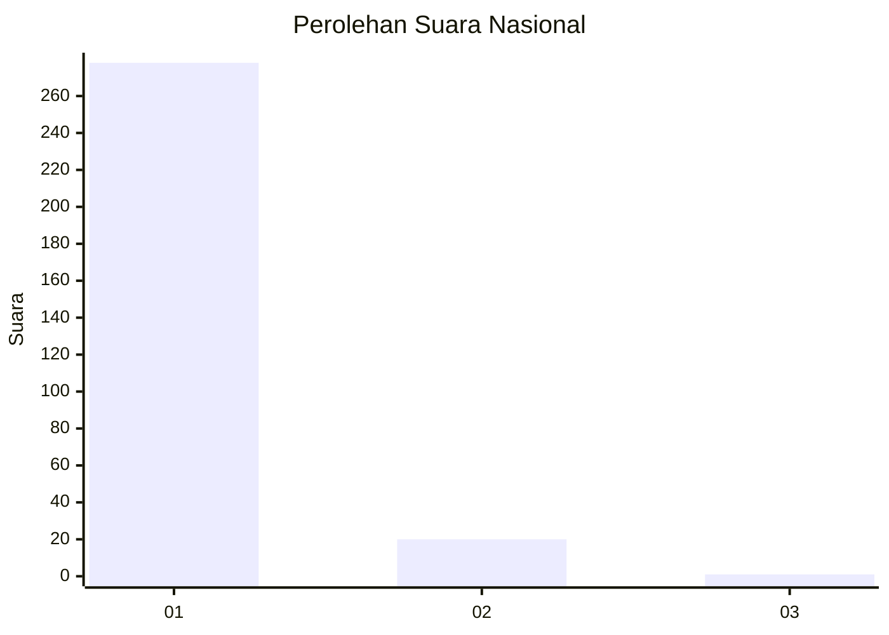
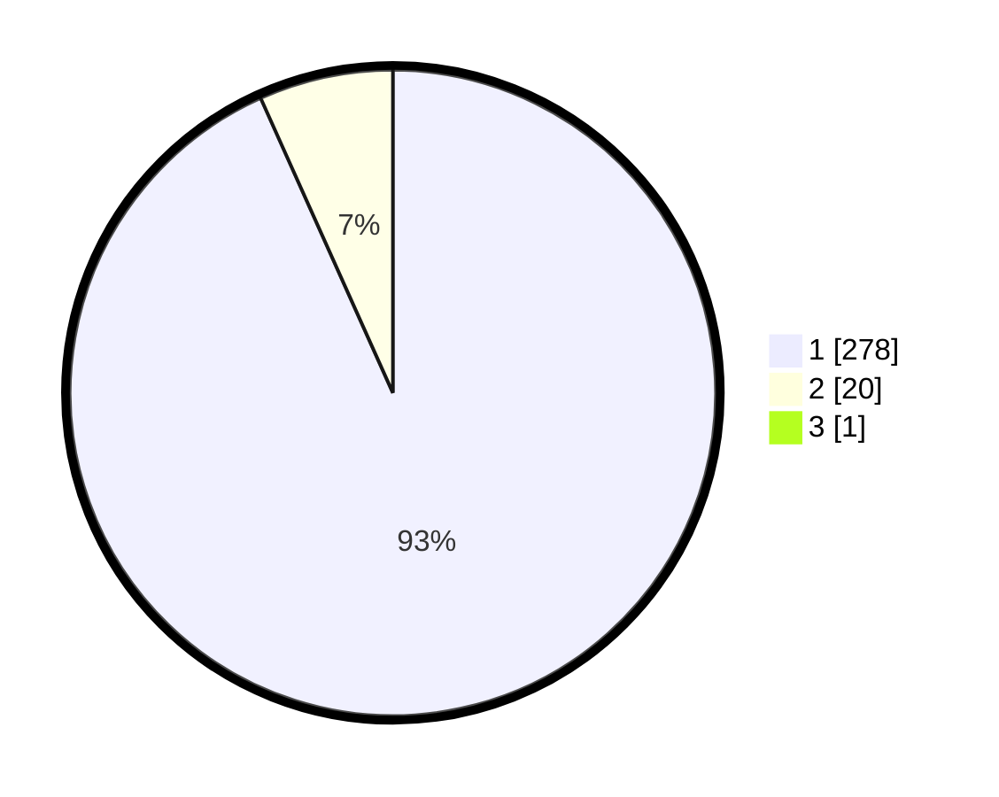

# Hasil

## Grafik

## Tabel

| No. | Nama Paslon    | Suara | Suara (raw) | Persentase |
|:--- |:-------------- | -----:| -----------:| ----------:|
| 1   | ANIES MUHAIMIN | 278   | [278][p-1]  | 92,98      |
| 2   | PRABOWO GIBRAN | 20    | [20][p-2]   | 6,69       |
| 3   | GANJAR MAHFUD  | 1     | [1][p-3]    | 0,33       |

[p-1]: https://github.com/gigit-pemilu/pemilu-2024/blob/main/pilpres/hitung-suara/sub/11-aceh/sub/07-pidie/sub/13-mutiara/sub/2015-blang-beureueh/sub/002-tps/sub/paslon-1.txt
[p-2]: https://github.com/gigit-pemilu/pemilu-2024/blob/main/pilpres/hitung-suara/sub/11-aceh/sub/07-pidie/sub/13-mutiara/sub/2015-blang-beureueh/sub/002-tps/sub/paslon-2.txt
[p-3]: https://github.com/gigit-pemilu/pemilu-2024/blob/main/pilpres/hitung-suara/sub/11-aceh/sub/07-pidie/sub/13-mutiara/sub/2015-blang-beureueh/sub/002-tps/sub/paslon-3.txt

## Foto C Plano

https://sirekap-obj-formc.kpu.go.id/920c/pemilu/ppwp/11/07/13/20/15/1107132015002-20240216-151418--31964056-ce22-42e9-990e-43f9009dcbbe.jpg

https://sirekap-obj-formc.kpu.go.id/920c/pemilu/ppwp/11/07/13/20/15/1107132015002-20240216-151419--fc5d507f-8e4e-4f67-9b87-d2cd67f17743.jpg

https://sirekap-obj-formc.kpu.go.id/920c/pemilu/ppwp/11/07/13/20/15/1107132015002-20240216-151418--48f22dda-43a5-4c84-a997-7850b667b717.jpg

## Metadata

| Key        | Value               |
| ---------- | ------------------- |
| Time Stamp | 2024-02-16 23:30:00 |

## DATA PEMILIH TETAP

Jumlah pemilih dalam DPT: **293**.
 * L: **138**.
 * P: **155**.

## DATA PENGGUNA HAK PILIH

Jumlah pengguna hak pilih dalam DPT: **293**.
 * L: **138**.
 * P: **155**.

Jumlah pengguna hak pilih dalam DPTb: **0**.
 * L: **0**.
 * P: **0**.

Jumlah pengguna hak pilih dalam DPK: **6**.
 * L: **4**.
 * P: **2**.

Jumlah pengguna hak pilih: **299**.
 * L: **142**.
 * P: **157**.

## JUMLAH SUARA SAH DAN TIDAK SAH

JUMLAH SELURUH SUARA SAH: **299**.

JUMLAH SUARA TIDAK SAH: **0**.

JUMLAH SELURUH SUARA SAH DAN SUARA TIDAK SAH: **299**.

