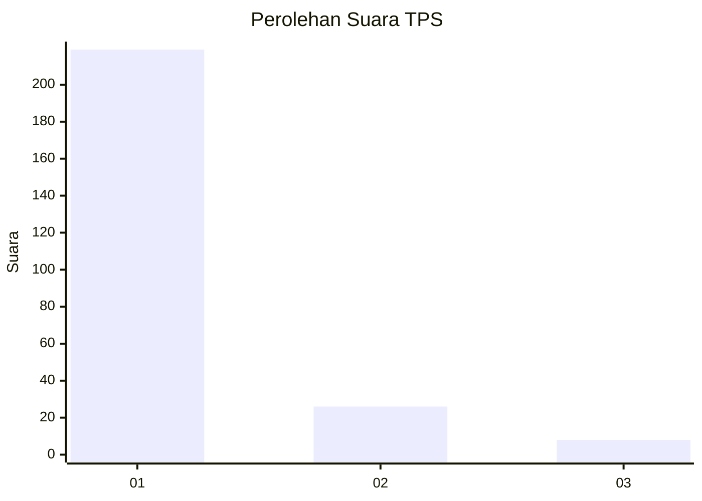
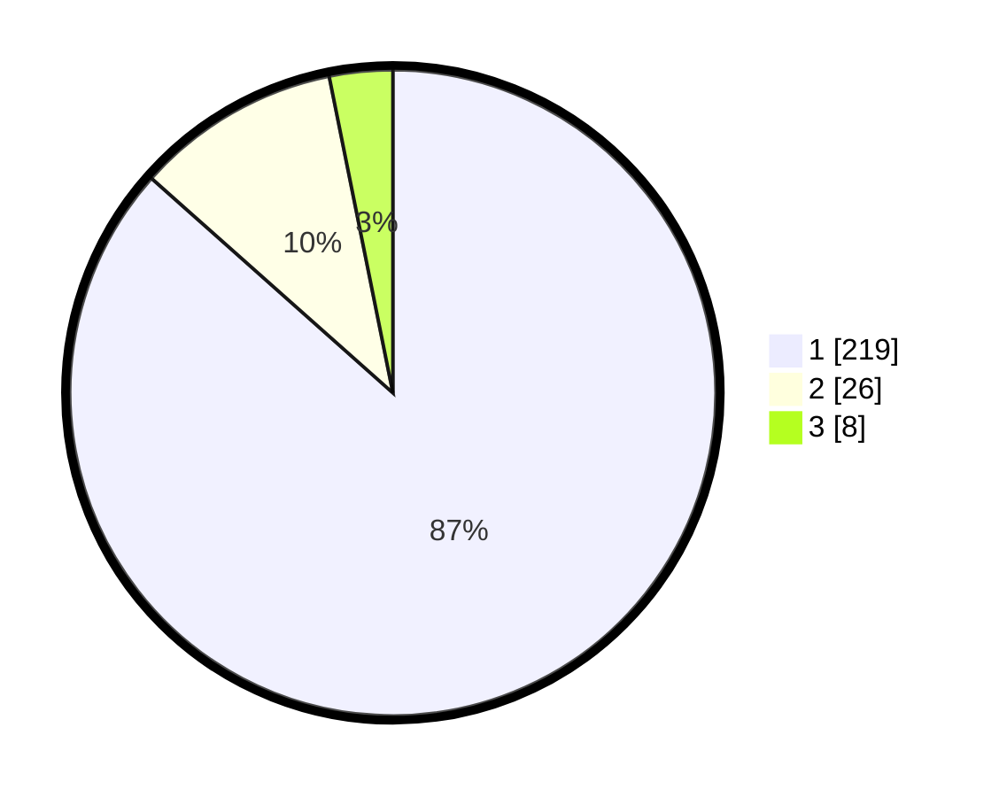

# Hasil

## Grafik

## Tabel

| No. | Nama Paslon    | Suara | Suara (raw) | Persentase |
|:--- |:-------------- | -----:| -----------:| ----------:|
| 1   | ANIES MUHAIMIN | 219   | [219][p-1]  | 86,56      |
| 2   | PRABOWO GIBRAN | 26    | [26][p-2]   | 10,28      |
| 3   | GANJAR MAHFUD  | 8     | [8][p-3]    | 3,16       |

[p-1]: https://github.com/gigit-pemilu/pemilu-2024-11-aceh/blob/main/pilpres/hitung-suara/sub/11-aceh/sub/07-pidie/sub/13-mutiara/sub/2018-rapana/sub/002-tps/sub/paslon-1.txt
[p-2]: https://github.com/gigit-pemilu/pemilu-2024-11-aceh/blob/main/pilpres/hitung-suara/sub/11-aceh/sub/07-pidie/sub/13-mutiara/sub/2018-rapana/sub/002-tps/sub/paslon-2.txt
[p-3]: https://github.com/gigit-pemilu/pemilu-2024-11-aceh/blob/main/pilpres/hitung-suara/sub/11-aceh/sub/07-pidie/sub/13-mutiara/sub/2018-rapana/sub/002-tps/sub/paslon-3.txt

## Foto C Plano

https://sirekap-obj-formc.kpu.go.id/97e4/pemilu/ppwp/11/07/13/20/18/1107132018002-20240215-043207--c60de7ab-00d7-4882-9ca2-aed027ce0454.jpg

https://sirekap-obj-formc.kpu.go.id/97e4/pemilu/ppwp/11/07/13/20/18/1107132018002-20240215-043024--e03883f9-85f9-4746-92b9-8fd3e5fb24e9.jpg

https://sirekap-obj-formc.kpu.go.id/97e4/pemilu/ppwp/11/07/13/20/18/1107132018002-20240215-060338--aa93df46-3152-4ab8-9d63-6bf23b044395.jpg

## Metadata

| Key        | Value               |
| ---------- | ------------------- |
| Time Stamp | 2024-02-15 16:00:26 |

