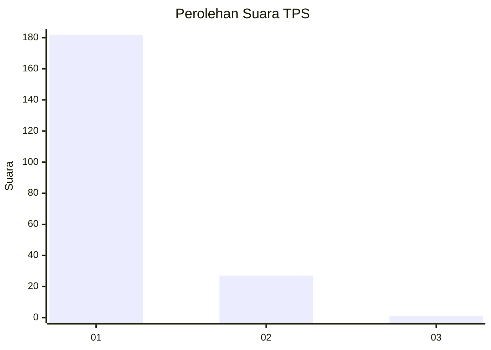
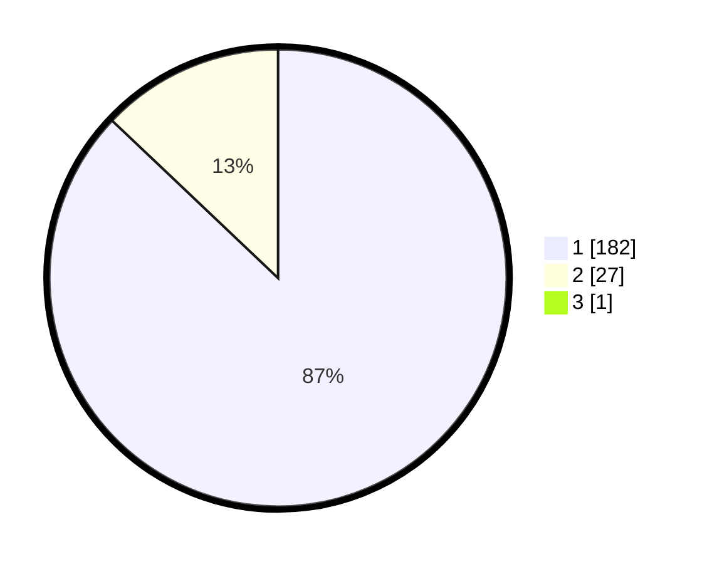

# Hasil

## Grafik

## Tabel

| No. | Nama Paslon    | Suara | Suara (raw) | Persentase |
|:--- |:-------------- | -----:| -----------:| ----------:|
| 1   | ANIES MUHAIMIN | 182   | [182][p-1]  | 86,67      |
| 2   | PRABOWO GIBRAN | 27    | [27][p-2]   | 12,86      |
| 3   | GANJAR MAHFUD  | 1     | [1][p-3]    | 0,48       |

[p-1]: https://github.com/gigit-pemilu/pemilu-2024-11-aceh/blob/main/pilpres/hitung-suara/sub/11-aceh/sub/07-pidie/sub/13-mutiara/sub/2018-rapana/sub/003-tps/sub/paslon-1.txt
[p-2]: https://github.com/gigit-pemilu/pemilu-2024-11-aceh/blob/main/pilpres/hitung-suara/sub/11-aceh/sub/07-pidie/sub/13-mutiara/sub/2018-rapana/sub/003-tps/sub/paslon-2.txt
[p-3]: https://github.com/gigit-pemilu/pemilu-2024-11-aceh/blob/main/pilpres/hitung-suara/sub/11-aceh/sub/07-pidie/sub/13-mutiara/sub/2018-rapana/sub/003-tps/sub/paslon-3.txt

## Foto C Plano

https://sirekap-obj-formc.kpu.go.id/93d8/pemilu/ppwp/11/07/13/20/18/1107132018003-20240215-075215--044b7d6b-0f49-4539-9c5d-96f028c8938e.jpg

https://sirekap-obj-formc.kpu.go.id/93d8/pemilu/ppwp/11/07/13/20/18/1107132018003-20240215-075415--2ac11fc1-ccca-4973-83a3-b8f6067de1f1.jpg

https://sirekap-obj-formc.kpu.go.id/93d8/pemilu/ppwp/11/07/13/20/18/1107132018003-20240215-075536--8827231e-5704-4ae7-a7cc-5d451faa23a2.jpg

## Metadata

| Key        | Value               |
| ---------- | ------------------- |
| Time Stamp | 2024-02-19 06:16:00 |

