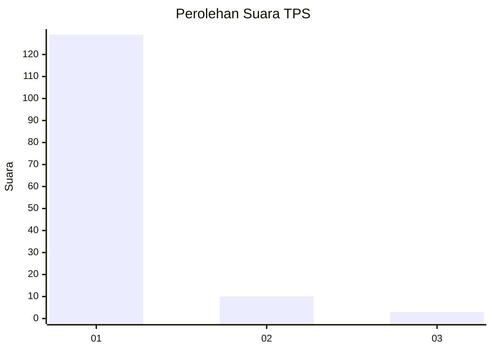
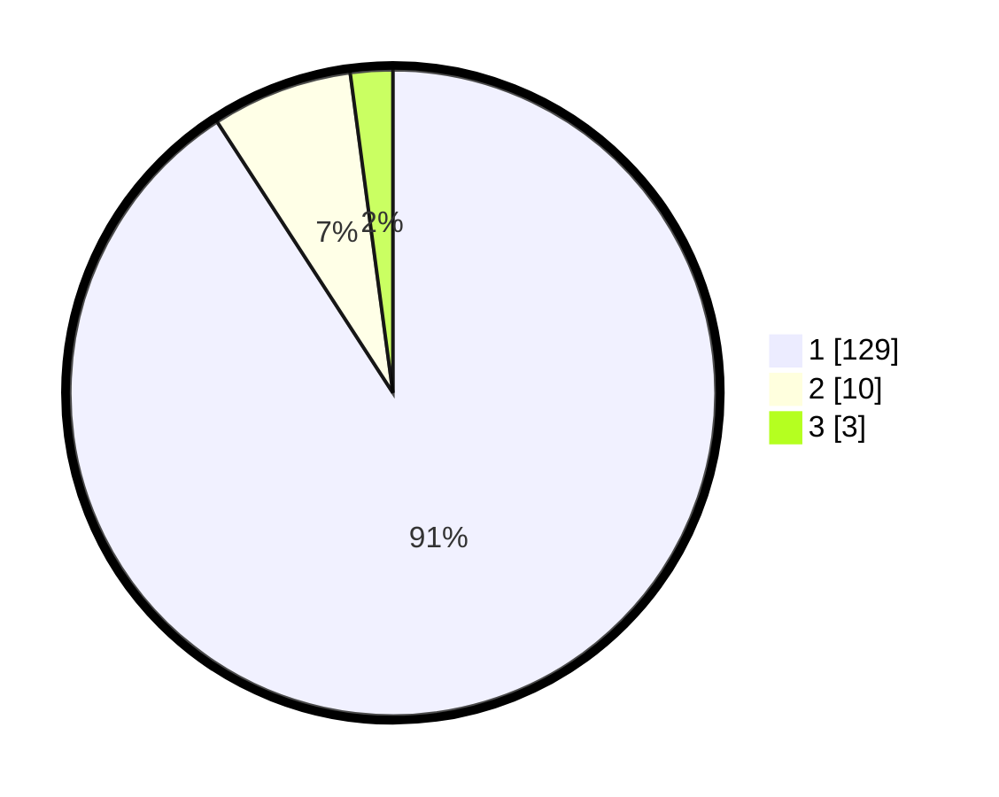

# Hasil

## Grafik

## Tabel

| No. | Nama Paslon    | Suara | Suara (raw) | Persentase |
|:--- |:-------------- | -----:| -----------:| ----------:|
| 1   | ANIES MUHAIMIN | 129   | [129][p-1]  | 90,85      |
| 2   | PRABOWO GIBRAN | 10    | [10][p-2]   | 7,04       |
| 3   | GANJAR MAHFUD  | 3     | [3][p-3]    | 2,11       |

[p-1]: https://github.com/gigit-pemilu/pemilu-2024-11-aceh/blob/main/pilpres/hitung-suara/sub/11-aceh/sub/07-pidie/sub/13-mutiara/sub/2022-mee-panyang/sub/001-tps/sub/paslon-1.txt
[p-2]: https://github.com/gigit-pemilu/pemilu-2024-11-aceh/blob/main/pilpres/hitung-suara/sub/11-aceh/sub/07-pidie/sub/13-mutiara/sub/2022-mee-panyang/sub/001-tps/sub/paslon-2.txt
[p-3]: https://github.com/gigit-pemilu/pemilu-2024-11-aceh/blob/main/pilpres/hitung-suara/sub/11-aceh/sub/07-pidie/sub/13-mutiara/sub/2022-mee-panyang/sub/001-tps/sub/paslon-3.txt

## Foto C Plano

https://sirekap-obj-formc.kpu.go.id/7d58/pemilu/ppwp/11/07/13/20/22/1107132022001-20240215-115309--fd910568-28d8-4a32-a94f-fe4785d861e8.jpg

https://sirekap-obj-formc.kpu.go.id/7d58/pemilu/ppwp/11/07/13/20/22/1107132022001-20240215-115416--c2ca5b0c-408b-4ac6-8bb5-13ca74ca8231.jpg

https://sirekap-obj-formc.kpu.go.id/7d58/pemilu/ppwp/11/07/13/20/22/1107132022001-20240215-115544--3a830862-08e6-427d-a7ce-44256a3df99b.jpg

## Metadata

| Key        | Value               |
| ---------- | ------------------- |
| Time Stamp | 2024-02-24 22:31:28 |

