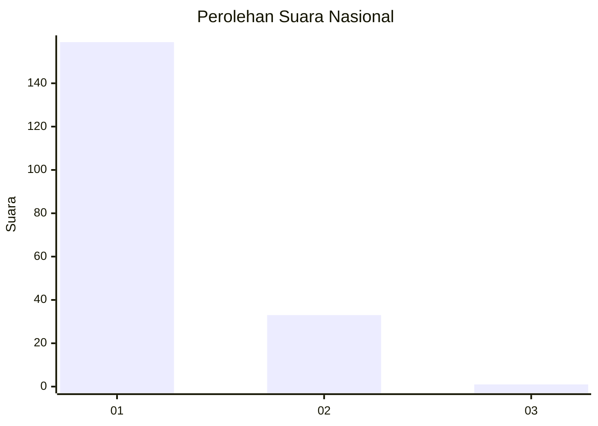
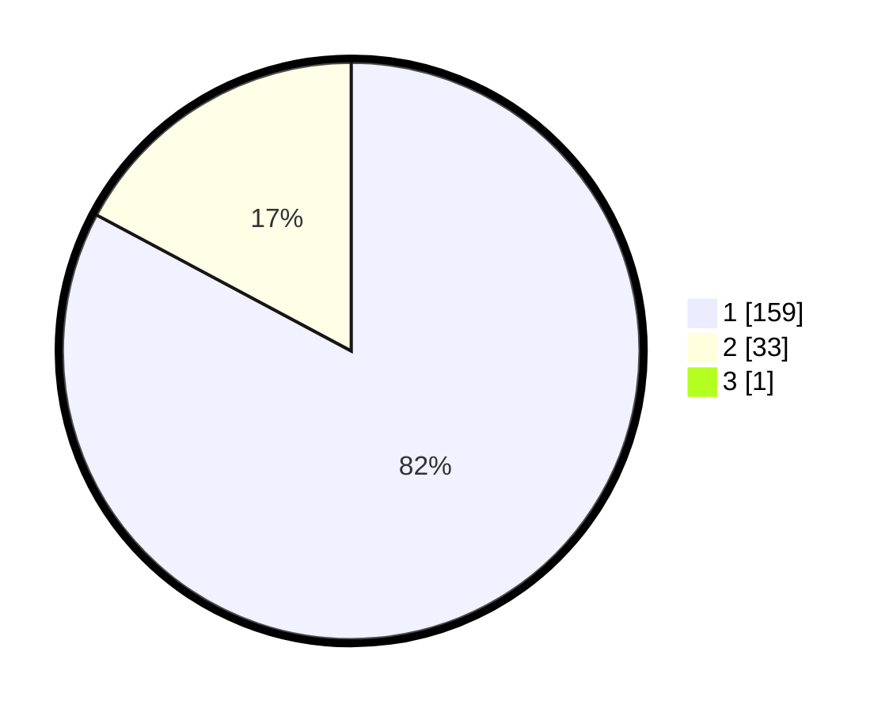

# Hasil

## Grafik

## Tabel

| No. | Nama Paslon    | Suara | Suara (raw) | Persentase |
|:--- |:-------------- | -----:| -----------:| ----------:|
| 1   | ANIES MUHAIMIN | 159   | [159][p-1]  | 82,38      |
| 2   | PRABOWO GIBRAN | 33    | [33][p-2]   | 17,10      |
| 3   | GANJAR MAHFUD  | 1     | [1][p-3]    | 0,52       |

[p-1]: https://github.com/gigit-pemilu/pemilu-2024/blob/main/pilpres/hitung-suara/sub/11-aceh/sub/07-pidie/sub/13-mutiara/sub/2023-reului/sub/002-tps/sub/paslon-1.txt
[p-2]: https://github.com/gigit-pemilu/pemilu-2024/blob/main/pilpres/hitung-suara/sub/11-aceh/sub/07-pidie/sub/13-mutiara/sub/2023-reului/sub/002-tps/sub/paslon-2.txt
[p-3]: https://github.com/gigit-pemilu/pemilu-2024/blob/main/pilpres/hitung-suara/sub/11-aceh/sub/07-pidie/sub/13-mutiara/sub/2023-reului/sub/002-tps/sub/paslon-3.txt

## Foto C Plano

https://sirekap-obj-formc.kpu.go.id/f4d6/pemilu/ppwp/11/07/13/20/23/1107132023002-20240215-081701--ca84549e-083a-49ed-a1f8-38b9e5fc4eae.jpg

https://sirekap-obj-formc.kpu.go.id/f4d6/pemilu/ppwp/11/07/13/20/23/1107132023002-20240215-150015--38290f0a-a5eb-465a-a982-c8d661fc0a61.jpg

https://sirekap-obj-formc.kpu.go.id/f4d6/pemilu/ppwp/11/07/13/20/23/1107132023002-20240215-081929--d4aa5f67-b7d8-4797-b122-2e34a10d5c4e.jpg

## Metadata

| Key        | Value               |
| ---------- | ------------------- |
| Time Stamp | 2024-02-19 06:16:00 |

