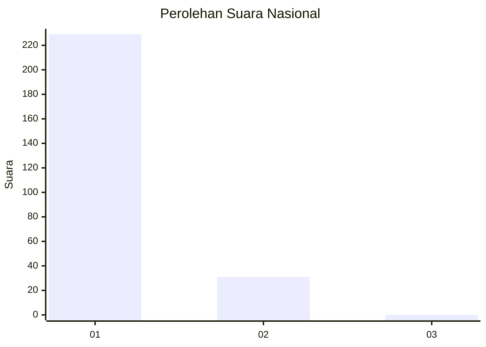
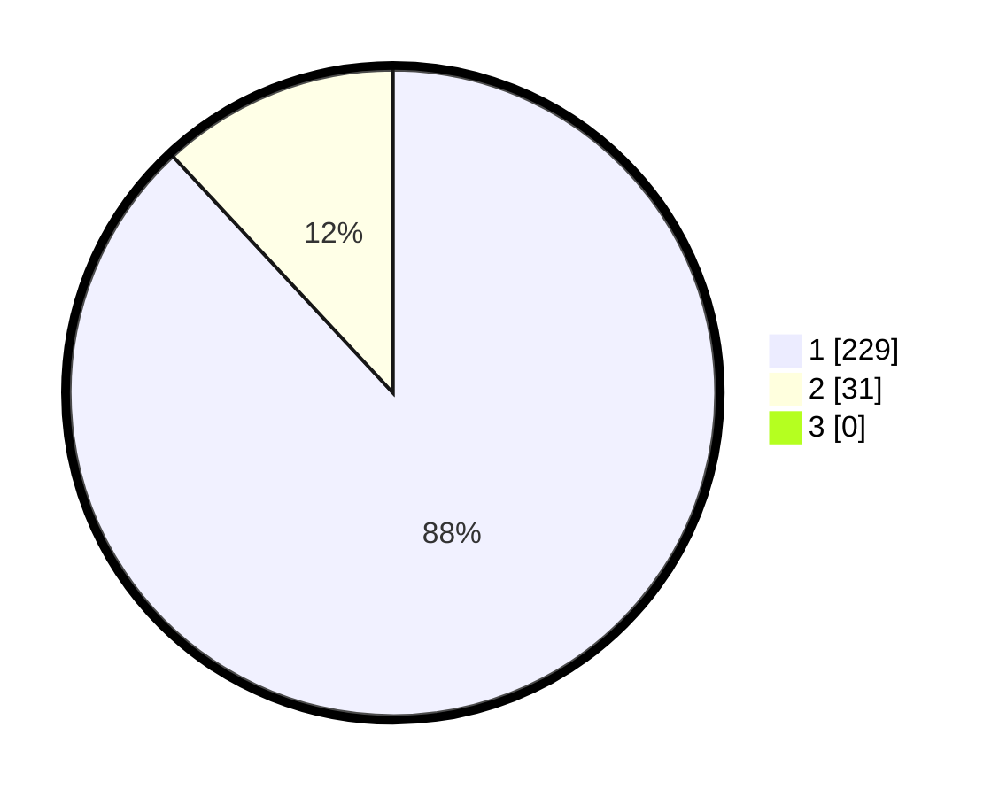

# Hasil

## Grafik

## Tabel

| No. | Nama Paslon    | Suara | Suara (raw) | Persentase |
|:--- |:-------------- | -----:| -----------:| ----------:|
| 1   | ANIES MUHAIMIN | 229   | [229][p-1]  | 88,08      |
| 2   | PRABOWO GIBRAN | 31    | [31][p-2]   | 11,92      |
| 3   | GANJAR MAHFUD  | 0     | [0][p-3]    | 0,00       |

[p-1]: https://github.com/gigit-pemilu/pemilu-2024/blob/main/pilpres/hitung-suara/sub/11-aceh/sub/07-pidie/sub/13-mutiara/sub/2024-dayah-syarif/sub/002-tps/sub/paslon-1.txt
[p-2]: https://github.com/gigit-pemilu/pemilu-2024/blob/main/pilpres/hitung-suara/sub/11-aceh/sub/07-pidie/sub/13-mutiara/sub/2024-dayah-syarif/sub/002-tps/sub/paslon-2.txt
[p-3]: https://github.com/gigit-pemilu/pemilu-2024/blob/main/pilpres/hitung-suara/sub/11-aceh/sub/07-pidie/sub/13-mutiara/sub/2024-dayah-syarif/sub/002-tps/sub/paslon-3.txt

## Foto C Plano

https://sirekap-obj-formc.kpu.go.id/2978/pemilu/ppwp/11/07/13/20/24/1107132024002-20240214-194113--7d1d61b6-d279-4044-b666-69cd499b90b7.jpg

https://sirekap-obj-formc.kpu.go.id/2978/pemilu/ppwp/11/07/13/20/24/1107132024002-20240214-194121--096b73ac-df33-4560-a7dd-59fd898c83c5.jpg

https://sirekap-obj-formc.kpu.go.id/2978/pemilu/ppwp/11/07/13/20/24/1107132024002-20240214-194132--bfa9a7a6-fd3d-4f0b-81b0-76b919d3698b.jpg

## Metadata

| Key        | Value               |
| ---------- | ------------------- |
| Time Stamp | 2024-02-24 22:31:28 |

