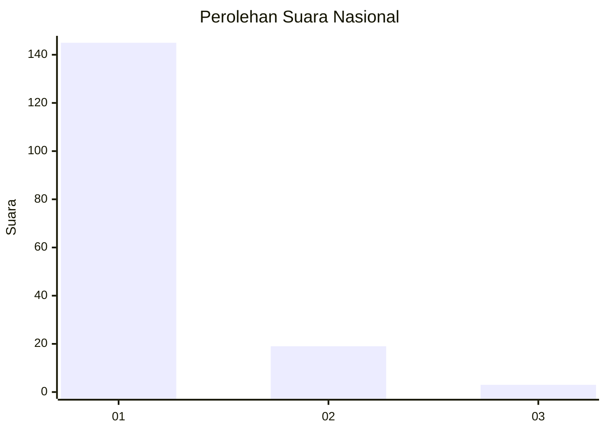
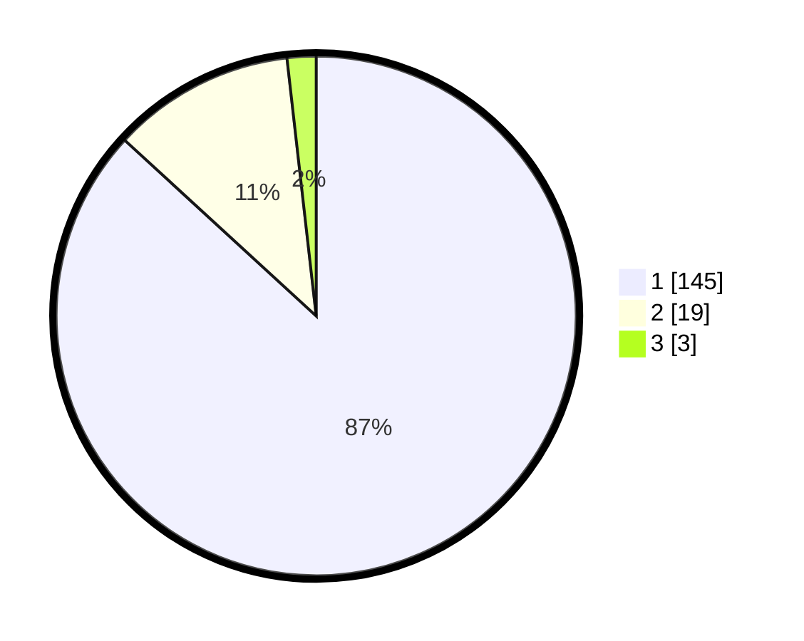

# Hasil

## Grafik

## Tabel

| No. | Nama Paslon    | Suara | Suara (raw) | Persentase |
|:--- |:-------------- | -----:| -----------:| ----------:|
| 1   | ANIES MUHAIMIN | 145   | [145][p-1]  | 86,83      |
| 2   | PRABOWO GIBRAN | 19    | [19][p-2]   | 11,38      |
| 3   | GANJAR MAHFUD  | 3     | [3][p-3]    | 1,80       |

[p-1]: https://github.com/gigit-pemilu/pemilu-2024/blob/main/pilpres/hitung-suara/sub/11-aceh/sub/07-pidie/sub/13-mutiara/sub/2025-peureulak/sub/001-tps/sub/paslon-1.txt
[p-2]: https://github.com/gigit-pemilu/pemilu-2024/blob/main/pilpres/hitung-suara/sub/11-aceh/sub/07-pidie/sub/13-mutiara/sub/2025-peureulak/sub/001-tps/sub/paslon-2.txt
[p-3]: https://github.com/gigit-pemilu/pemilu-2024/blob/main/pilpres/hitung-suara/sub/11-aceh/sub/07-pidie/sub/13-mutiara/sub/2025-peureulak/sub/001-tps/sub/paslon-3.txt

## Foto C Plano

https://sirekap-obj-formc.kpu.go.id/643a/pemilu/ppwp/11/07/13/20/25/1107132025001-20240215-025956--3162d720-3595-416b-95f0-0eacf3555c08.jpg

https://sirekap-obj-formc.kpu.go.id/643a/pemilu/ppwp/11/07/13/20/25/1107132025001-20240215-030111--4208b10b-51f0-4ce3-b35a-f2c7fa7159b1.jpg

https://sirekap-obj-formc.kpu.go.id/643a/pemilu/ppwp/11/07/13/20/25/1107132025001-20240215-030255--2fe49248-93dd-4b5c-9af8-e7e6dfbe9bdf.jpg

## Metadata

| Key        | Value               |
| ---------- | ------------------- |
| Time Stamp | 2024-02-19 06:16:00 |

