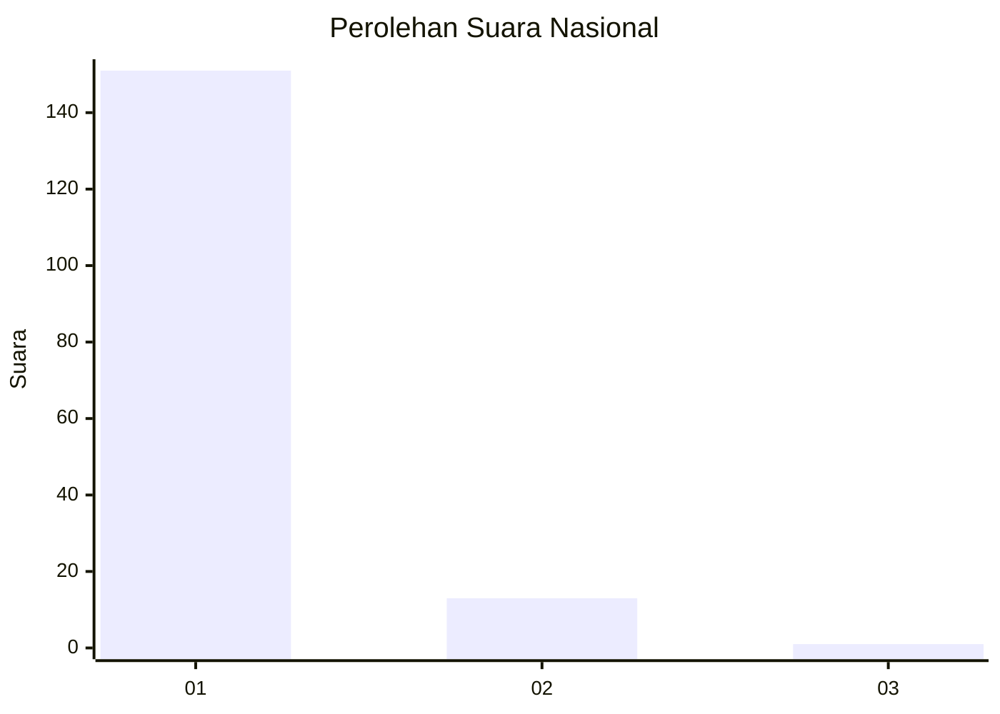
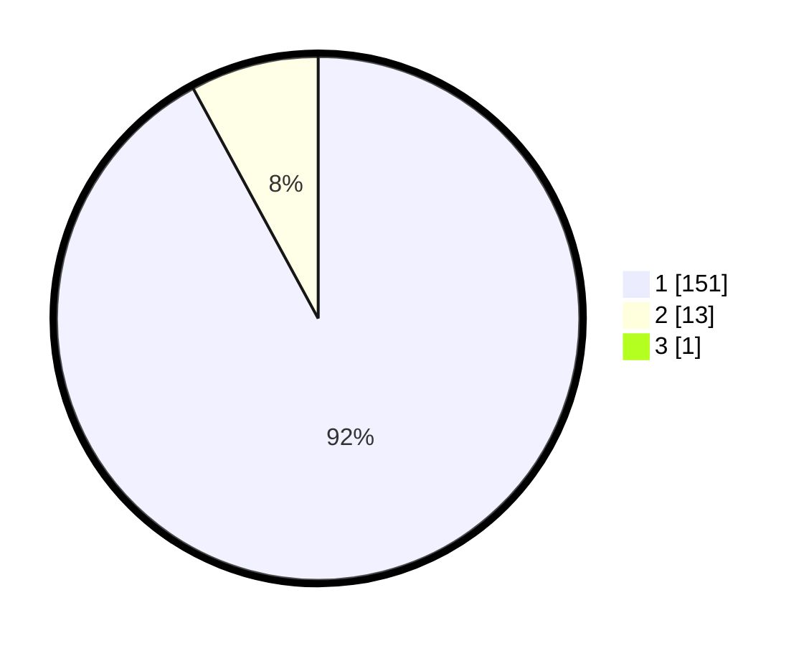

# Hasil

## Grafik

## Tabel

| No. | Nama Paslon    | Suara | Suara (raw) | Persentase |
|:--- |:-------------- | -----:| -----------:| ----------:|
| 1   | ANIES MUHAIMIN | 151   | [151][p-1]  | 91,52      |
| 2   | PRABOWO GIBRAN | 13    | [13][p-2]   | 7,88       |
| 3   | GANJAR MAHFUD  | 1     | [1][p-3]    | 0,61       |

[p-1]: https://github.com/gigit-pemilu/pemilu-2024/blob/main/pilpres/hitung-suara/sub/11-aceh/sub/07-pidie/sub/13-mutiara/sub/2025-peureulak/sub/002-tps/sub/paslon-1.txt
[p-2]: https://github.com/gigit-pemilu/pemilu-2024/blob/main/pilpres/hitung-suara/sub/11-aceh/sub/07-pidie/sub/13-mutiara/sub/2025-peureulak/sub/002-tps/sub/paslon-2.txt
[p-3]: https://github.com/gigit-pemilu/pemilu-2024/blob/main/pilpres/hitung-suara/sub/11-aceh/sub/07-pidie/sub/13-mutiara/sub/2025-peureulak/sub/002-tps/sub/paslon-3.txt

## Foto C Plano

https://sirekap-obj-formc.kpu.go.id/2aa1/pemilu/ppwp/11/07/13/20/25/1107132025002-20240215-022854--cfe390bb-e7a8-46a3-b252-a13098262bed.jpg

https://sirekap-obj-formc.kpu.go.id/2aa1/pemilu/ppwp/11/07/13/20/25/1107132025002-20240215-021549--dd082348-631b-4e29-918a-710e164ec10e.jpg

https://sirekap-obj-formc.kpu.go.id/2aa1/pemilu/ppwp/11/07/13/20/25/1107132025002-20240215-021628--318f5abd-6082-48b1-996c-91a3ecf42897.jpg

## Metadata

| Key        | Value               |
| ---------- | ------------------- |
| Time Stamp | 2024-02-19 06:16:00 |

