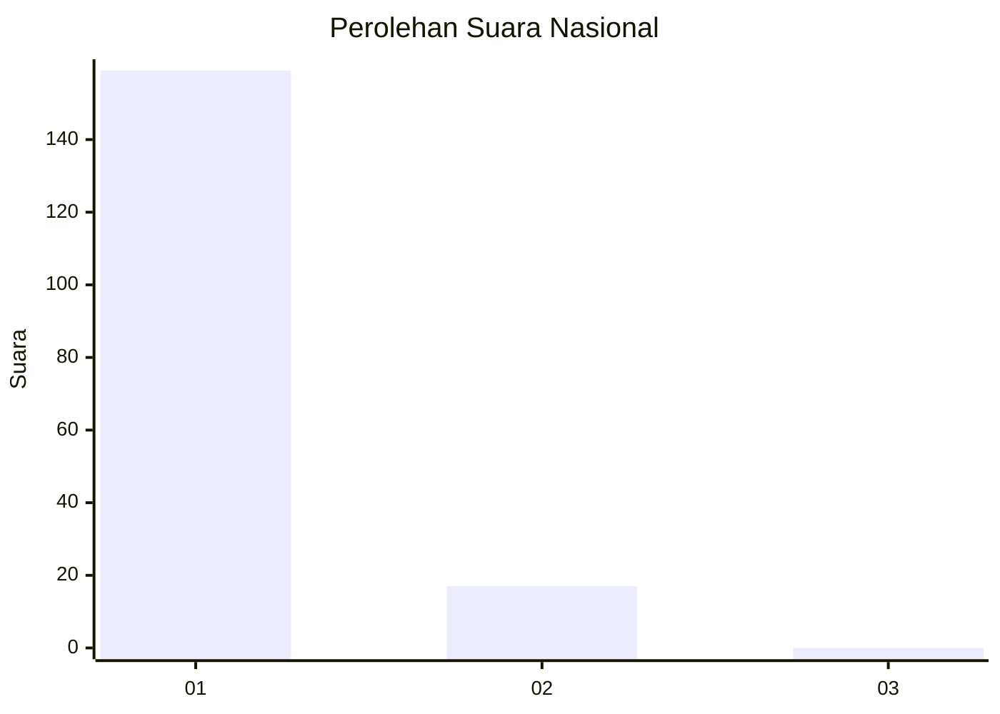
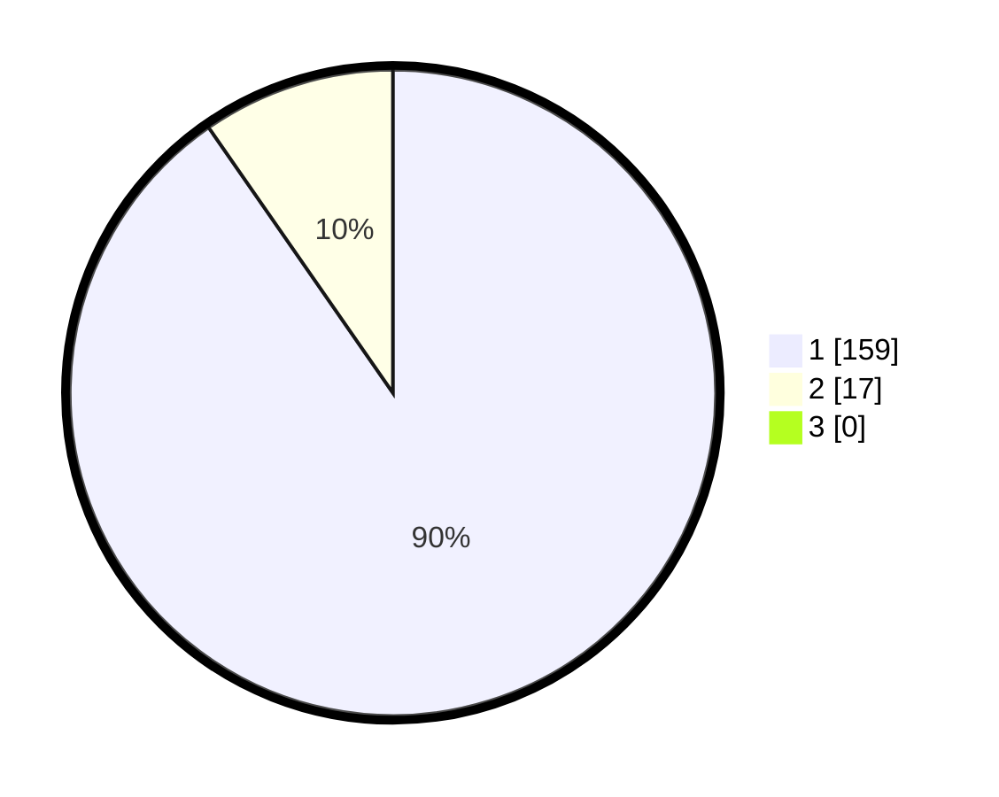

# Hasil

## Grafik

## Tabel

| No. | Nama Paslon    | Suara | Suara (raw) | Persentase |
|:--- |:-------------- | -----:| -----------:| ----------:|
| 1   | ANIES MUHAIMIN | 159   | [159][p-1]  | 90,34      |
| 2   | PRABOWO GIBRAN | 17    | [17][p-2]   | 9,66       |
| 3   | GANJAR MAHFUD  | 0     | [0][p-3]    | 0,00       |

[p-1]: https://github.com/gigit-pemilu/pemilu-2024/blob/main/pilpres/hitung-suara/sub/11-aceh/sub/07-pidie/sub/13-mutiara/sub/2026-ribeun/sub/001-tps/sub/paslon-1.txt
[p-2]: https://github.com/gigit-pemilu/pemilu-2024/blob/main/pilpres/hitung-suara/sub/11-aceh/sub/07-pidie/sub/13-mutiara/sub/2026-ribeun/sub/001-tps/sub/paslon-2.txt
[p-3]: https://github.com/gigit-pemilu/pemilu-2024/blob/main/pilpres/hitung-suara/sub/11-aceh/sub/07-pidie/sub/13-mutiara/sub/2026-ribeun/sub/001-tps/sub/paslon-3.txt

## Foto C Plano

https://sirekap-obj-formc.kpu.go.id/c46c/pemilu/ppwp/11/07/13/20/26/1107132026001-20240215-055547--b68c394d-e6c0-4074-93b5-303c9058f6fc.jpg

https://sirekap-obj-formc.kpu.go.id/c46c/pemilu/ppwp/11/07/13/20/26/1107132026001-20240215-154407--3b0b84e3-cb42-4f40-a373-0db4fcd55b9e.jpg

https://sirekap-obj-formc.kpu.go.id/c46c/pemilu/ppwp/11/07/13/20/26/1107132026001-20240215-154423--0d6a0e8f-6798-4cad-836c-35d417c3f73d.jpg

## Metadata

| Key        | Value               |
| ---------- | ------------------- |
| Time Stamp | 2024-02-19 06:16:00 |

