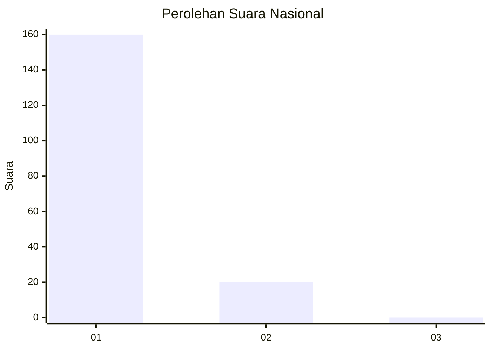
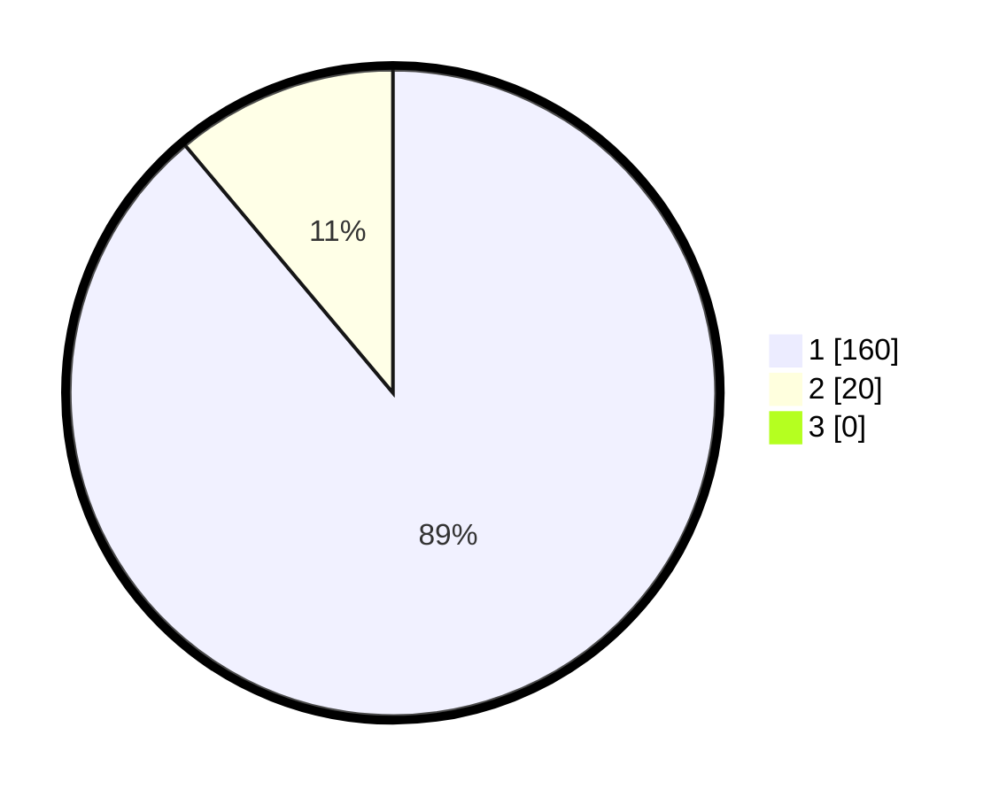

# Hasil

## Grafik

## Tabel

| No. | Nama Paslon    | Suara | Suara (raw) | Persentase |
|:--- |:-------------- | -----:| -----------:| ----------:|
| 1   | ANIES MUHAIMIN | 160   | [160][p-1]  | 88,89      |
| 2   | PRABOWO GIBRAN | 20    | [20][p-2]   | 11,11      |
| 3   | GANJAR MAHFUD  | 0     | [0][p-3]    | 0,00       |

[p-1]: https://github.com/gigit-pemilu/pemilu-2024/blob/main/pilpres/hitung-suara/sub/11-aceh/sub/07-pidie/sub/13-mutiara/sub/2026-ribeun/sub/002-tps/sub/paslon-1.txt
[p-2]: https://github.com/gigit-pemilu/pemilu-2024/blob/main/pilpres/hitung-suara/sub/11-aceh/sub/07-pidie/sub/13-mutiara/sub/2026-ribeun/sub/002-tps/sub/paslon-2.txt
[p-3]: https://github.com/gigit-pemilu/pemilu-2024/blob/main/pilpres/hitung-suara/sub/11-aceh/sub/07-pidie/sub/13-mutiara/sub/2026-ribeun/sub/002-tps/sub/paslon-3.txt

## Foto C Plano

https://sirekap-obj-formc.kpu.go.id/ae3a/pemilu/ppwp/11/07/13/20/26/1107132026002-20240215-081629--798c8495-e48f-4991-aecb-bfad1ad64894.jpg

https://sirekap-obj-formc.kpu.go.id/ae3a/pemilu/ppwp/11/07/13/20/26/1107132026002-20240215-142626--99a41943-d3c2-48fd-a860-0491edffb5c6.jpg

https://sirekap-obj-formc.kpu.go.id/ae3a/pemilu/ppwp/11/07/13/20/26/1107132026002-20240215-142448--e888a831-00dd-4a18-bf12-c2f1b1d430a2.jpg

## Metadata

| Key        | Value               |
| ---------- | ------------------- |
| Time Stamp | 2024-02-24 22:31:28 |

