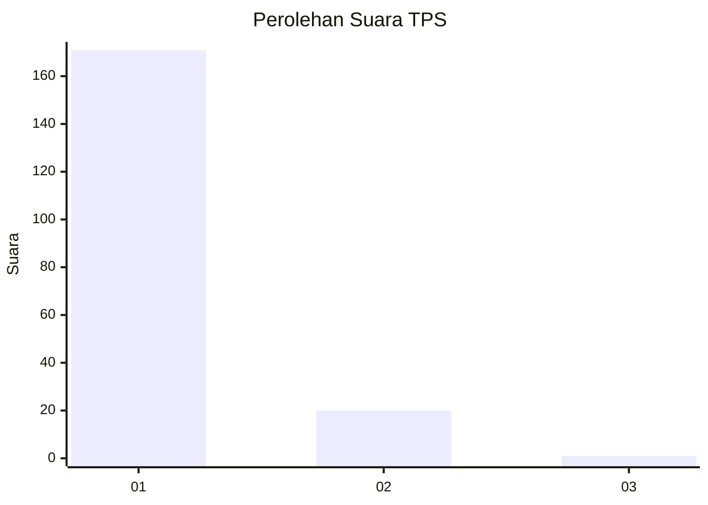
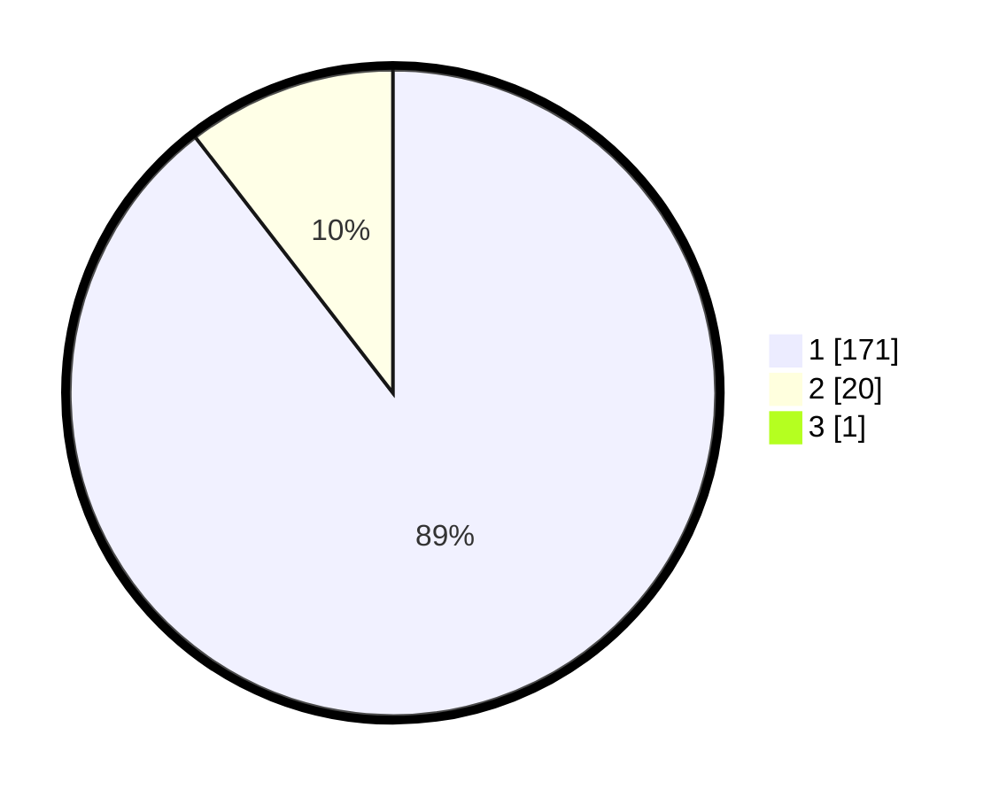

# Hasil

## Grafik

## Tabel

| No. | Nama Paslon    | Suara | Suara (raw) | Persentase |
|:--- |:-------------- | -----:| -----------:| ----------:|
| 1   | ANIES MUHAIMIN | 171   | [171][p-1]  | 89,06      |
| 2   | PRABOWO GIBRAN | 20    | [20][p-2]   | 10,42      |
| 3   | GANJAR MAHFUD  | 1     | [1][p-3]    | 0,52       |

[p-1]: https://github.com/gigit-pemilu/pemilu-2024-11-aceh/blob/main/pilpres/hitung-suara/sub/11-aceh/sub/07-pidie/sub/13-mutiara/sub/2027-balee-busu/sub/002-tps/sub/paslon-1.txt
[p-2]: https://github.com/gigit-pemilu/pemilu-2024-11-aceh/blob/main/pilpres/hitung-suara/sub/11-aceh/sub/07-pidie/sub/13-mutiara/sub/2027-balee-busu/sub/002-tps/sub/paslon-2.txt
[p-3]: https://github.com/gigit-pemilu/pemilu-2024-11-aceh/blob/main/pilpres/hitung-suara/sub/11-aceh/sub/07-pidie/sub/13-mutiara/sub/2027-balee-busu/sub/002-tps/sub/paslon-3.txt

## Foto C Plano

https://sirekap-obj-formc.kpu.go.id/4b5a/pemilu/ppwp/11/07/13/20/27/1107132027002-20240215-091940--c97cf6d8-b7aa-4555-8c61-ee7a927adb3a.jpg

https://sirekap-obj-formc.kpu.go.id/4b5a/pemilu/ppwp/11/07/13/20/27/1107132027002-20240215-092205--e4a273f0-e6b5-4d7a-8a2e-4b3b563ae11c.jpg

https://sirekap-obj-formc.kpu.go.id/4b5a/pemilu/ppwp/11/07/13/20/27/1107132027002-20240215-092405--6a723d7b-b7db-4002-8898-002ab13b6b19.jpg

## Metadata

| Key        | Value               |
| ---------- | ------------------- |
| Time Stamp | 2024-02-24 22:31:28 |

