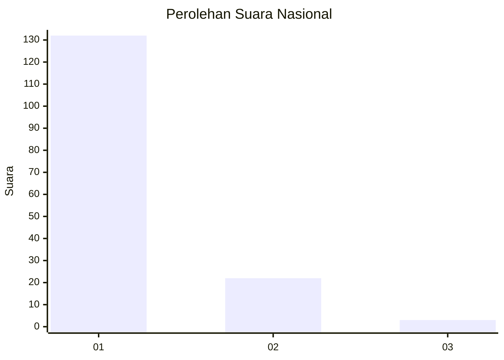
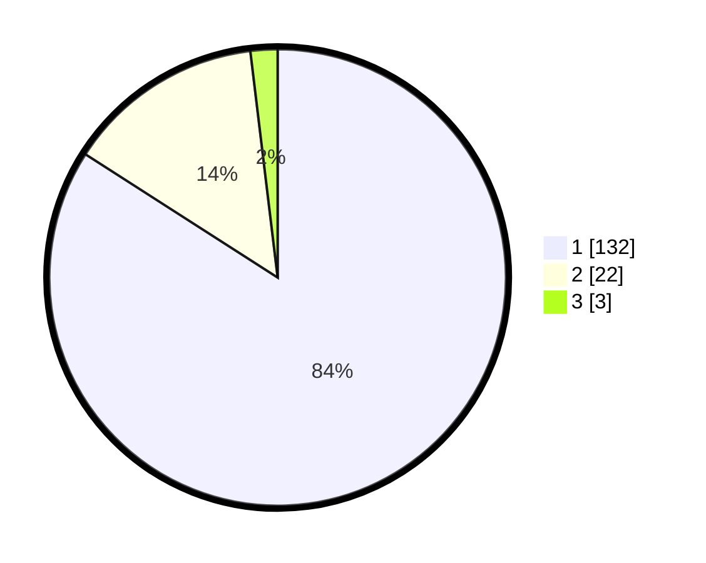

# Hasil

## Grafik

## Tabel

| No. | Nama Paslon    | Suara | Suara (raw) | Persentase |
|:--- |:-------------- | -----:| -----------:| ----------:|
| 1   | ANIES MUHAIMIN | 132   | [132][p-1]  | 84,08      |
| 2   | PRABOWO GIBRAN | 22    | [22][p-2]   | 14,01      |
| 3   | GANJAR MAHFUD  | 3     | [3][p-3]    | 1,91       |

[p-1]: https://github.com/gigit-pemilu/pemilu-2024/blob/main/pilpres/hitung-suara/sub/11-aceh/sub/07-pidie/sub/13-mutiara/sub/2028-lingkok/sub/001-tps/sub/paslon-1.txt
[p-2]: https://github.com/gigit-pemilu/pemilu-2024/blob/main/pilpres/hitung-suara/sub/11-aceh/sub/07-pidie/sub/13-mutiara/sub/2028-lingkok/sub/001-tps/sub/paslon-2.txt
[p-3]: https://github.com/gigit-pemilu/pemilu-2024/blob/main/pilpres/hitung-suara/sub/11-aceh/sub/07-pidie/sub/13-mutiara/sub/2028-lingkok/sub/001-tps/sub/paslon-3.txt

## Foto C Plano

https://sirekap-obj-formc.kpu.go.id/6879/pemilu/ppwp/11/07/13/20/28/1107132028001-20240215-090839--11216feb-f6e9-44cd-81cf-213cb0e289f2.jpg

https://sirekap-obj-formc.kpu.go.id/6879/pemilu/ppwp/11/07/13/20/28/1107132028001-20240215-075940--9dab4dda-b7ee-4493-97f5-2218a953d440.jpg

https://sirekap-obj-formc.kpu.go.id/6879/pemilu/ppwp/11/07/13/20/28/1107132028001-20240215-080019--00368e11-8f61-4d9a-9d7c-473bd615262b.jpg

## Metadata

| Key        | Value               |
| ---------- | ------------------- |
| Time Stamp | 2024-02-19 06:16:00 |

