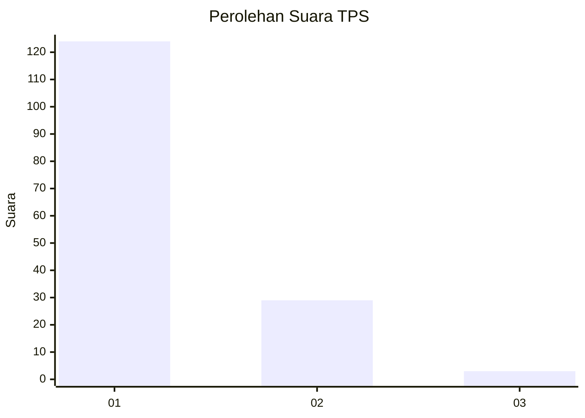
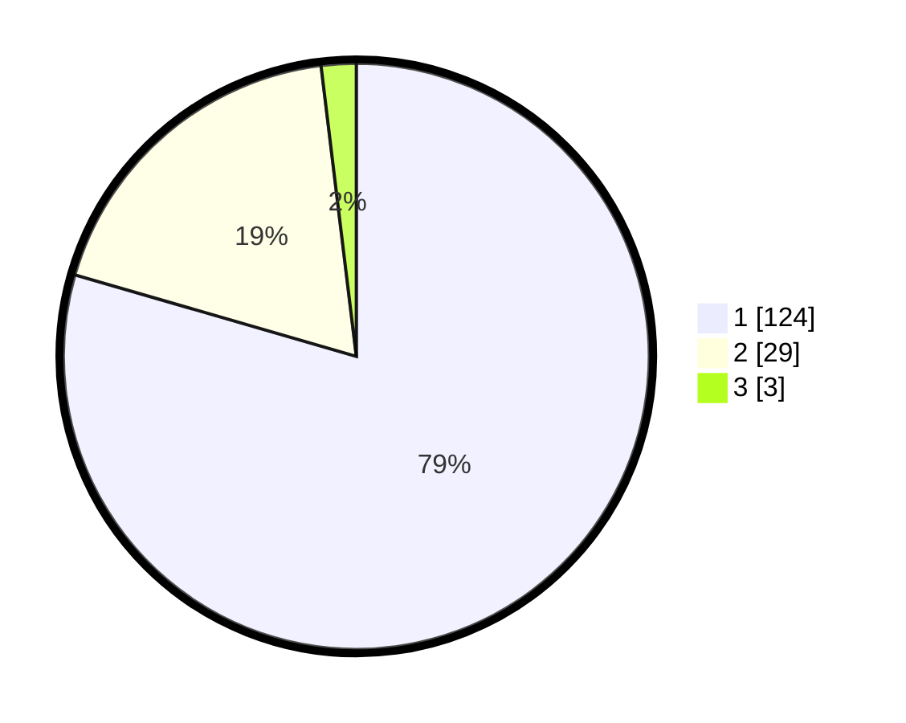

# Hasil

## Grafik

## Tabel

| No. | Nama Paslon    | Suara | Suara (raw) | Persentase |
|:--- |:-------------- | -----:| -----------:| ----------:|
| 1   | ANIES MUHAIMIN | 124   | [124][p-1]  | 79,49      |
| 2   | PRABOWO GIBRAN | 29    | [29][p-2]   | 18,59      |
| 3   | GANJAR MAHFUD  | 3     | [3][p-3]    | 1,92       |

[p-1]: https://github.com/gigit-pemilu/pemilu-2024-11-aceh/blob/main/pilpres/hitung-suara/sub/11-aceh/sub/07-pidie/sub/13-mutiara/sub/2028-lingkok/sub/002-tps/sub/paslon-1.txt
[p-2]: https://github.com/gigit-pemilu/pemilu-2024-11-aceh/blob/main/pilpres/hitung-suara/sub/11-aceh/sub/07-pidie/sub/13-mutiara/sub/2028-lingkok/sub/002-tps/sub/paslon-2.txt
[p-3]: https://github.com/gigit-pemilu/pemilu-2024-11-aceh/blob/main/pilpres/hitung-suara/sub/11-aceh/sub/07-pidie/sub/13-mutiara/sub/2028-lingkok/sub/002-tps/sub/paslon-3.txt

## Foto C Plano

https://sirekap-obj-formc.kpu.go.id/63e4/pemilu/ppwp/11/07/13/20/28/1107132028002-20240215-080747--faffbb94-79ff-45d2-8204-971483ddb698.jpg

https://sirekap-obj-formc.kpu.go.id/63e4/pemilu/ppwp/11/07/13/20/28/1107132028002-20240215-074210--bb18b9f2-4192-45dc-9236-3044b968d918.jpg

https://sirekap-obj-formc.kpu.go.id/63e4/pemilu/ppwp/11/07/13/20/28/1107132028002-20240215-074458--1ab96c57-55d5-4f64-8c9c-c383f411aca0.jpg

## Metadata

| Key        | Value               |
| ---------- | ------------------- |
| Time Stamp | 2024-02-19 06:16:00 |

