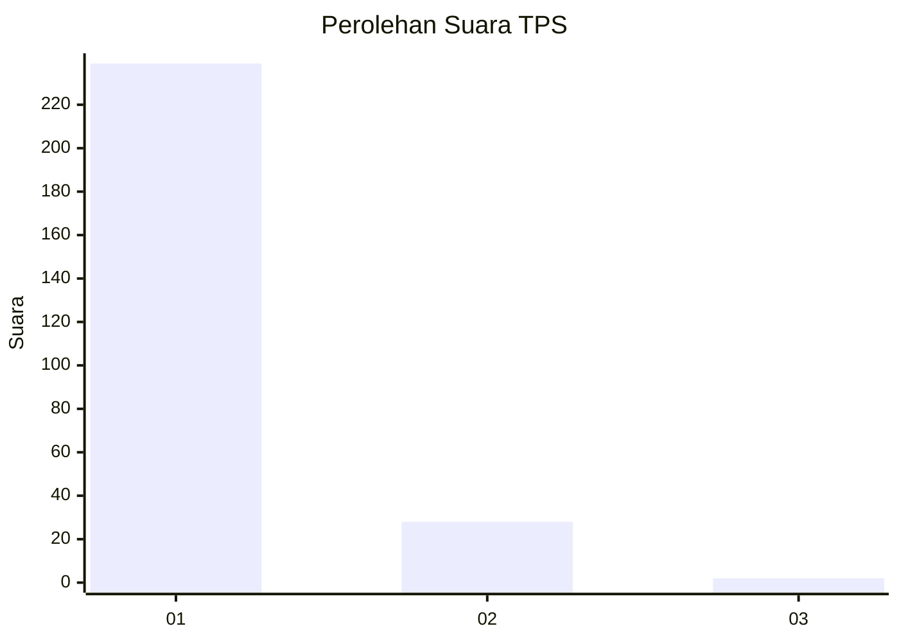
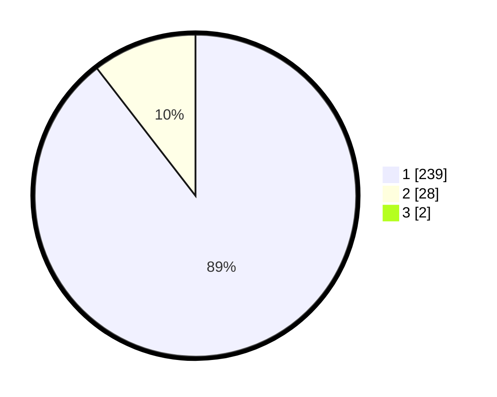

# Hasil

## Grafik

## Tabel

| No. | Nama Paslon    | Suara | Suara (raw) | Persentase |
|:--- |:-------------- | -----:| -----------:| ----------:|
| 1   | ANIES MUHAIMIN | 239   | [239][p-1]  | 88,85      |
| 2   | PRABOWO GIBRAN | 28    | [28][p-2]   | 10,41      |
| 3   | GANJAR MAHFUD  | 2     | [2][p-3]    | 0,74       |

[p-1]: https://github.com/gigit-pemilu/pemilu-2024-11-aceh/blob/main/pilpres/hitung-suara/sub/11-aceh/sub/07-pidie/sub/13-mutiara/sub/2029-kumbang/sub/001-tps/sub/paslon-1.txt
[p-2]: https://github.com/gigit-pemilu/pemilu-2024-11-aceh/blob/main/pilpres/hitung-suara/sub/11-aceh/sub/07-pidie/sub/13-mutiara/sub/2029-kumbang/sub/001-tps/sub/paslon-2.txt
[p-3]: https://github.com/gigit-pemilu/pemilu-2024-11-aceh/blob/main/pilpres/hitung-suara/sub/11-aceh/sub/07-pidie/sub/13-mutiara/sub/2029-kumbang/sub/001-tps/sub/paslon-3.txt

## Foto C Plano

https://sirekap-obj-formc.kpu.go.id/6a4c/pemilu/ppwp/11/07/13/20/29/1107132029001-20240215-074724--52d0b93f-32eb-4da4-96ca-b271813dd9f1.jpg

https://sirekap-obj-formc.kpu.go.id/6a4c/pemilu/ppwp/11/07/13/20/29/1107132029001-20240215-074854--5546870a-8dfb-49e1-99c4-9c9864c1f371.jpg

https://sirekap-obj-formc.kpu.go.id/6a4c/pemilu/ppwp/11/07/13/20/29/1107132029001-20240215-075013--0fc48f91-2884-4696-bb97-0ab0da8d222a.jpg

## Metadata

| Key        | Value               |
| ---------- | ------------------- |
| Time Stamp | 2024-02-19 06:16:00 |

