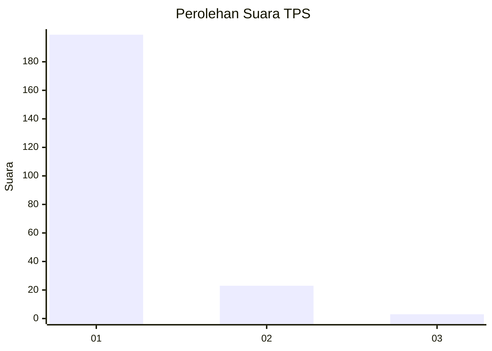
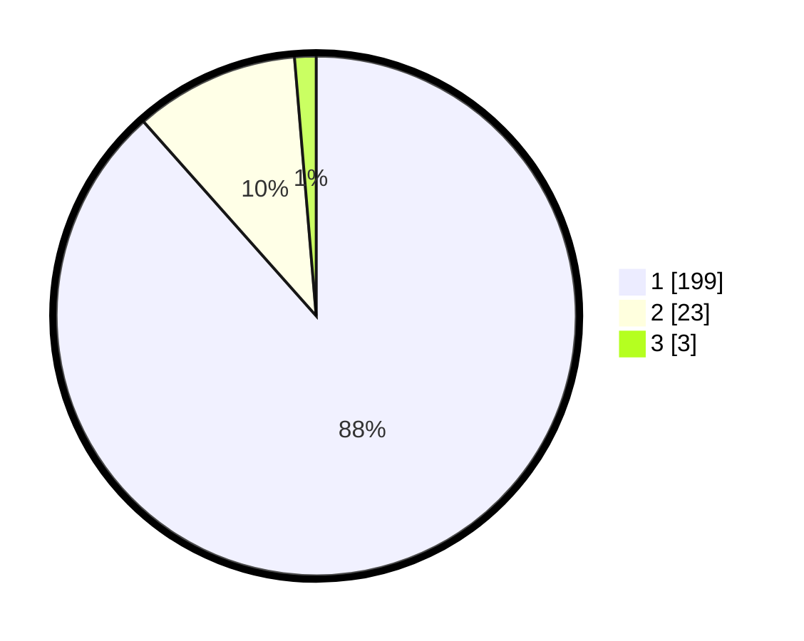

# Hasil

## Grafik

## Tabel

| No. | Nama Paslon    | Suara | Suara (raw) | Persentase |
|:--- |:-------------- | -----:| -----------:| ----------:|
| 1   | ANIES MUHAIMIN | 199   | [199][p-1]  | 88,44      |
| 2   | PRABOWO GIBRAN | 23    | [23][p-2]   | 10,22      |
| 3   | GANJAR MAHFUD  | 3     | [3][p-3]    | 1,33       |

[p-1]: https://github.com/gigit-pemilu/pemilu-2024-11-aceh/blob/main/pilpres/hitung-suara/sub/11-aceh/sub/07-pidie/sub/13-mutiara/sub/2029-kumbang/sub/002-tps/sub/paslon-1.txt
[p-2]: https://github.com/gigit-pemilu/pemilu-2024-11-aceh/blob/main/pilpres/hitung-suara/sub/11-aceh/sub/07-pidie/sub/13-mutiara/sub/2029-kumbang/sub/002-tps/sub/paslon-2.txt
[p-3]: https://github.com/gigit-pemilu/pemilu-2024-11-aceh/blob/main/pilpres/hitung-suara/sub/11-aceh/sub/07-pidie/sub/13-mutiara/sub/2029-kumbang/sub/002-tps/sub/paslon-3.txt

## Foto C Plano

https://sirekap-obj-formc.kpu.go.id/54c7/pemilu/ppwp/11/07/13/20/29/1107132029002-20240215-073849--0e024279-3960-4cc7-8508-c662bd04d585.jpg

https://sirekap-obj-formc.kpu.go.id/54c7/pemilu/ppwp/11/07/13/20/29/1107132029002-20240215-074018--4f32d115-19ed-4b44-a143-2a120d53988b.jpg

https://sirekap-obj-formc.kpu.go.id/54c7/pemilu/ppwp/11/07/13/20/29/1107132029002-20240215-074057--cd9b8b63-c772-41c2-ac67-e71f5debc80c.jpg

## Metadata

| Key        | Value               |
| ---------- | ------------------- |
| Time Stamp | 2024-02-19 06:16:00 |

