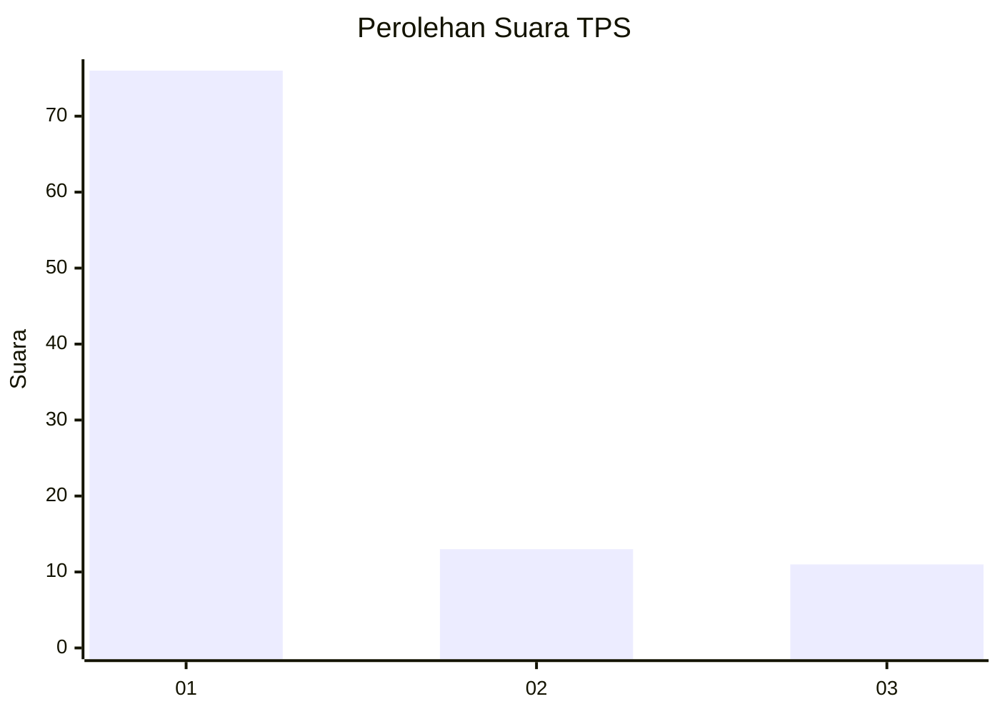
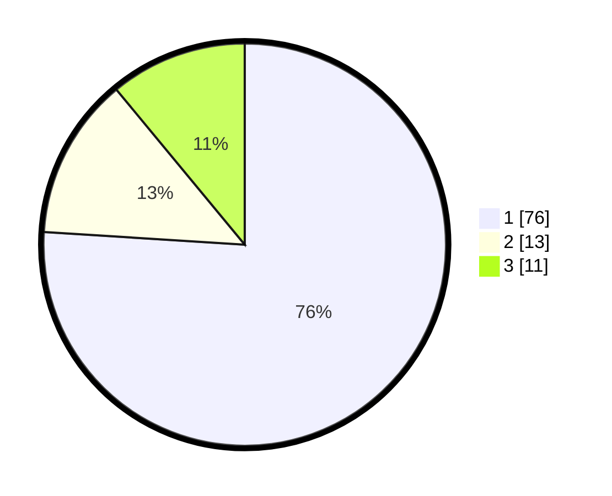

# Hasil

## Grafik

## Tabel

| No. | Nama Paslon    | Suara | Suara (raw) | Persentase |
|:--- |:-------------- | -----:| -----------:| ----------:|
| 1   | ANIES MUHAIMIN | 76    | [76][p-1]   | 76,00      |
| 2   | PRABOWO GIBRAN | 13    | [13][p-2]   | 13,00      |
| 3   | GANJAR MAHFUD  | 11    | [11][p-3]   | 11,00      |

[p-1]: https://github.com/gigit-pemilu/pemilu-2024-11-aceh/blob/main/pilpres/hitung-suara/sub/11-aceh/sub/07-pidie/sub/14-padang-tiji/sub/2002-piala-kunyet/sub/001-tps/sub/paslon-1.txt
[p-2]: https://github.com/gigit-pemilu/pemilu-2024-11-aceh/blob/main/pilpres/hitung-suara/sub/11-aceh/sub/07-pidie/sub/14-padang-tiji/sub/2002-piala-kunyet/sub/001-tps/sub/paslon-2.txt
[p-3]: https://github.com/gigit-pemilu/pemilu-2024-11-aceh/blob/main/pilpres/hitung-suara/sub/11-aceh/sub/07-pidie/sub/14-padang-tiji/sub/2002-piala-kunyet/sub/001-tps/sub/paslon-3.txt

## Foto C Plano

https://sirekap-obj-formc.kpu.go.id/7948/pemilu/ppwp/11/07/14/20/02/1107142002001-20240215-074823--8b702363-95da-45ec-bfd5-df00afc97221.jpg

https://sirekap-obj-formc.kpu.go.id/7948/pemilu/ppwp/11/07/14/20/02/1107142002001-20240215-074921--5b442d27-961d-4a1a-b7c7-fe7ecee5bce9.jpg

https://sirekap-obj-formc.kpu.go.id/7948/pemilu/ppwp/11/07/14/20/02/1107142002001-20240215-121602--1fc4d5b9-4476-40fa-872d-d547da462672.jpg

## Metadata

| Key        | Value               |
| ---------- | ------------------- |
| Time Stamp | 2024-02-19 06:16:00 |

