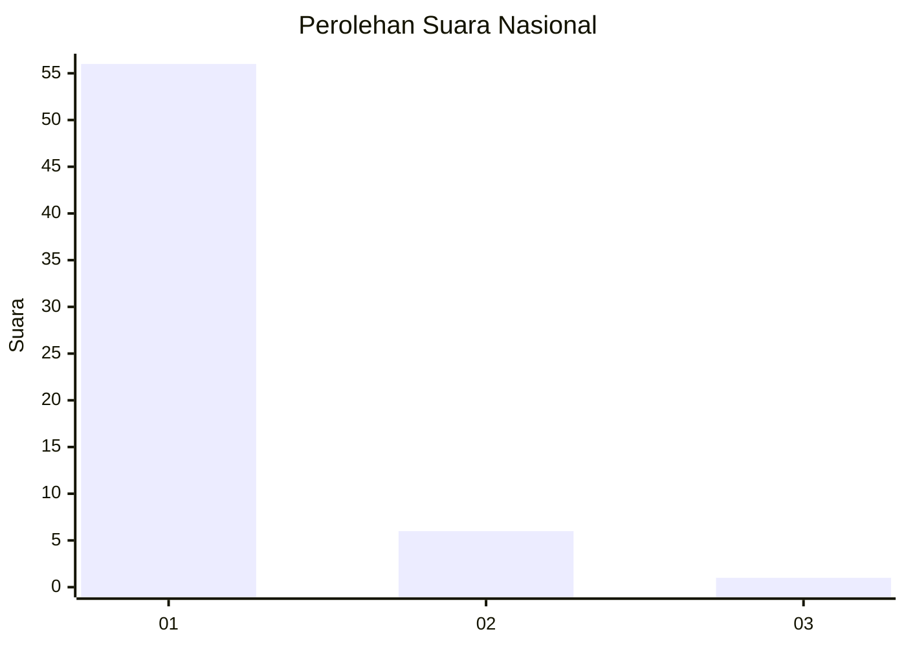
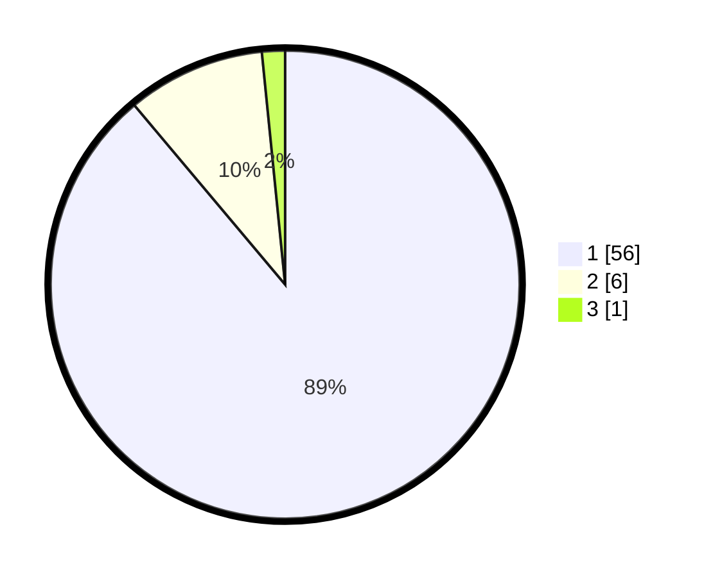

# Hasil

## Grafik

## Tabel

| No. | Nama Paslon    | Suara | Suara (raw) | Persentase |
|:--- |:-------------- | -----:| -----------:| ----------:|
| 1   | ANIES MUHAIMIN | 56    | [56][p-1]   | 88,89      |
| 2   | PRABOWO GIBRAN | 6     | [6][p-2]    | 9,52       |
| 3   | GANJAR MAHFUD  | 1     | [1][p-3]    | 1,59       |

[p-1]: https://github.com/gigit-pemilu/pemilu-2024/blob/main/pilpres/hitung-suara/sub/11-aceh/sub/07-pidie/sub/14-padang-tiji/sub/2003-hagu-kunyet/sub/001-tps/sub/paslon-1.txt
[p-2]: https://github.com/gigit-pemilu/pemilu-2024/blob/main/pilpres/hitung-suara/sub/11-aceh/sub/07-pidie/sub/14-padang-tiji/sub/2003-hagu-kunyet/sub/001-tps/sub/paslon-2.txt
[p-3]: https://github.com/gigit-pemilu/pemilu-2024/blob/main/pilpres/hitung-suara/sub/11-aceh/sub/07-pidie/sub/14-padang-tiji/sub/2003-hagu-kunyet/sub/001-tps/sub/paslon-3.txt

## Foto C Plano

https://sirekap-obj-formc.kpu.go.id/36b6/pemilu/ppwp/11/07/14/20/03/1107142003001-20240214-214400--ca11d5c5-7a90-4a33-b471-26f9bedfc2b9.jpg

https://sirekap-obj-formc.kpu.go.id/36b6/pemilu/ppwp/11/07/14/20/03/1107142003001-20240214-214414--7a386304-5d55-47ff-b17f-98d884a3b6cf.jpg

https://sirekap-obj-formc.kpu.go.id/36b6/pemilu/ppwp/11/07/14/20/03/1107142003001-20240214-214421--ec86a0a1-7aa5-40f2-afaa-e616309b53e3.jpg

## Metadata

| Key        | Value               |
| ---------- | ------------------- |
| Time Stamp | 2024-02-19 06:16:00 |

