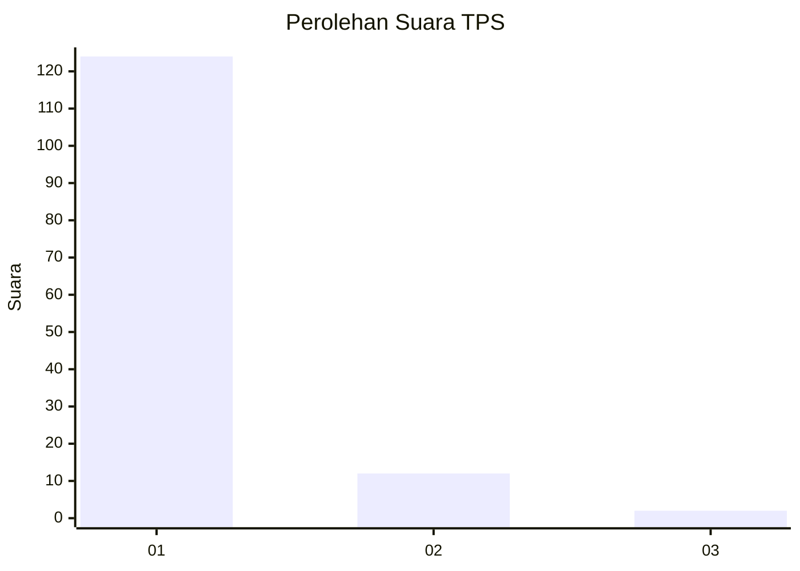
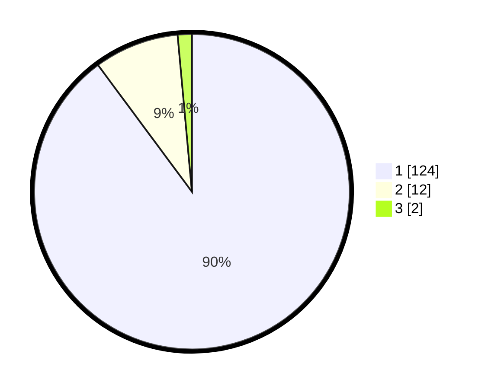

# Hasil

## Grafik

## Tabel

| No. | Nama Paslon    | Suara | Suara (raw) | Persentase |
|:--- |:-------------- | -----:| -----------:| ----------:|
| 1   | ANIES MUHAIMIN | 124   | [124][p-1]  | 89,86      |
| 2   | PRABOWO GIBRAN | 12    | [12][p-2]   | 8,70       |
| 3   | GANJAR MAHFUD  | 2     | [2][p-3]    | 1,45       |

[p-1]: https://github.com/gigit-pemilu/pemilu-2024-11-aceh/blob/main/pilpres/hitung-suara/sub/11-aceh/sub/07-pidie/sub/14-padang-tiji/sub/2004-baro-kunyet/sub/001-tps/sub/paslon-1.txt
[p-2]: https://github.com/gigit-pemilu/pemilu-2024-11-aceh/blob/main/pilpres/hitung-suara/sub/11-aceh/sub/07-pidie/sub/14-padang-tiji/sub/2004-baro-kunyet/sub/001-tps/sub/paslon-2.txt
[p-3]: https://github.com/gigit-pemilu/pemilu-2024-11-aceh/blob/main/pilpres/hitung-suara/sub/11-aceh/sub/07-pidie/sub/14-padang-tiji/sub/2004-baro-kunyet/sub/001-tps/sub/paslon-3.txt

## Foto C Plano

https://sirekap-obj-formc.kpu.go.id/6349/pemilu/ppwp/11/07/14/20/04/1107142004001-20240215-043901--81a61ca2-04f5-4d44-aa77-c8d531e105c2.jpg

https://sirekap-obj-formc.kpu.go.id/6349/pemilu/ppwp/11/07/14/20/04/1107142004001-20240215-044115--52344907-eaae-49eb-bed5-2e1067cefa97.jpg

https://sirekap-obj-formc.kpu.go.id/6349/pemilu/ppwp/11/07/14/20/04/1107142004001-20240215-043104--5068d9e1-4905-466f-b661-ee312a96fd41.jpg

## Metadata

| Key        | Value               |
| ---------- | ------------------- |
| Time Stamp | 2024-02-24 22:31:28 |

