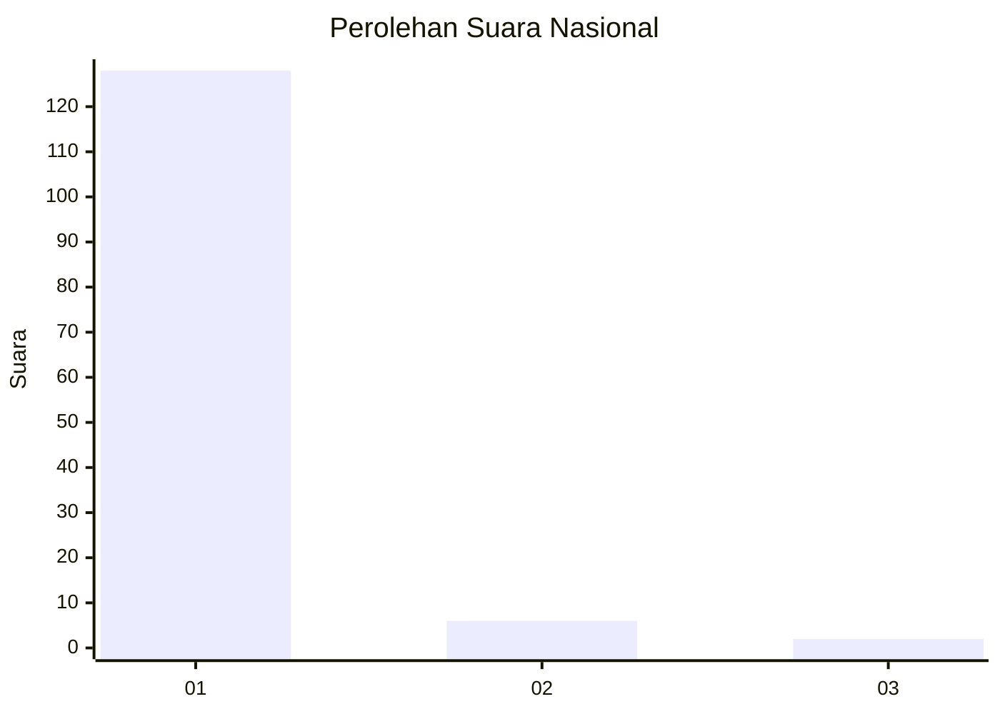
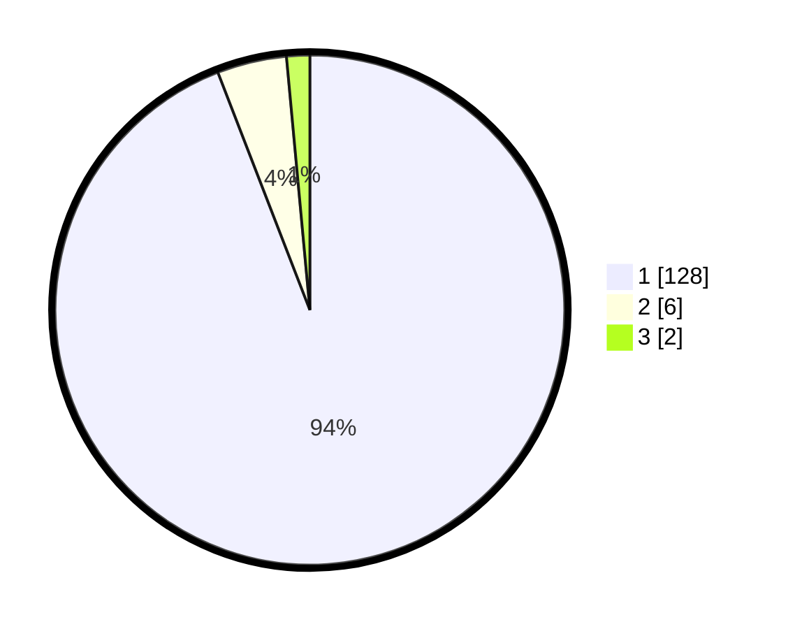

# Hasil

## Grafik

## Tabel

| No. | Nama Paslon    | Suara | Suara (raw) | Persentase |
|:--- |:-------------- | -----:| -----------:| ----------:|
| 1   | ANIES MUHAIMIN | 128   | [128][p-1]  | 94,12      |
| 2   | PRABOWO GIBRAN | 6     | [6][p-2]    | 4,41       |
| 3   | GANJAR MAHFUD  | 2     | [2][p-3]    | 1,47       |

[p-1]: https://github.com/gigit-pemilu/pemilu-2024/blob/main/pilpres/hitung-suara/sub/11-aceh/sub/07-pidie/sub/14-padang-tiji/sub/2004-baro-kunyet/sub/002-tps/sub/paslon-1.txt
[p-2]: https://github.com/gigit-pemilu/pemilu-2024/blob/main/pilpres/hitung-suara/sub/11-aceh/sub/07-pidie/sub/14-padang-tiji/sub/2004-baro-kunyet/sub/002-tps/sub/paslon-2.txt
[p-3]: https://github.com/gigit-pemilu/pemilu-2024/blob/main/pilpres/hitung-suara/sub/11-aceh/sub/07-pidie/sub/14-padang-tiji/sub/2004-baro-kunyet/sub/002-tps/sub/paslon-3.txt

## Foto C Plano

https://sirekap-obj-formc.kpu.go.id/24c3/pemilu/ppwp/11/07/14/20/04/1107142004002-20240215-042006--6d781c12-0bf9-48d9-9570-f89ffbf9e2ab.jpg

https://sirekap-obj-formc.kpu.go.id/24c3/pemilu/ppwp/11/07/14/20/04/1107142004002-20240215-042110--970dd6c4-d385-4028-86e1-813dfef5069d.jpg

https://sirekap-obj-formc.kpu.go.id/24c3/pemilu/ppwp/11/07/14/20/04/1107142004002-20240215-042143--d9ea8857-afe2-4407-ba25-1c75438d5627.jpg

## Metadata

| Key        | Value               |
| ---------- | ------------------- |
| Time Stamp | 2024-02-19 06:16:00 |

