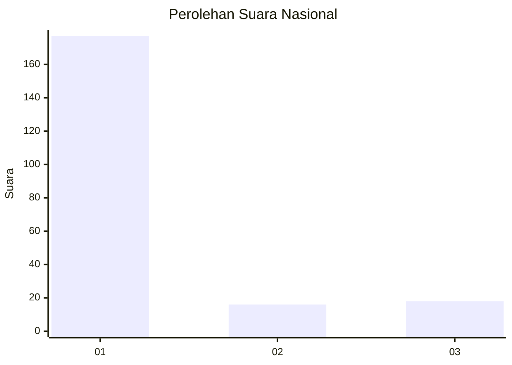
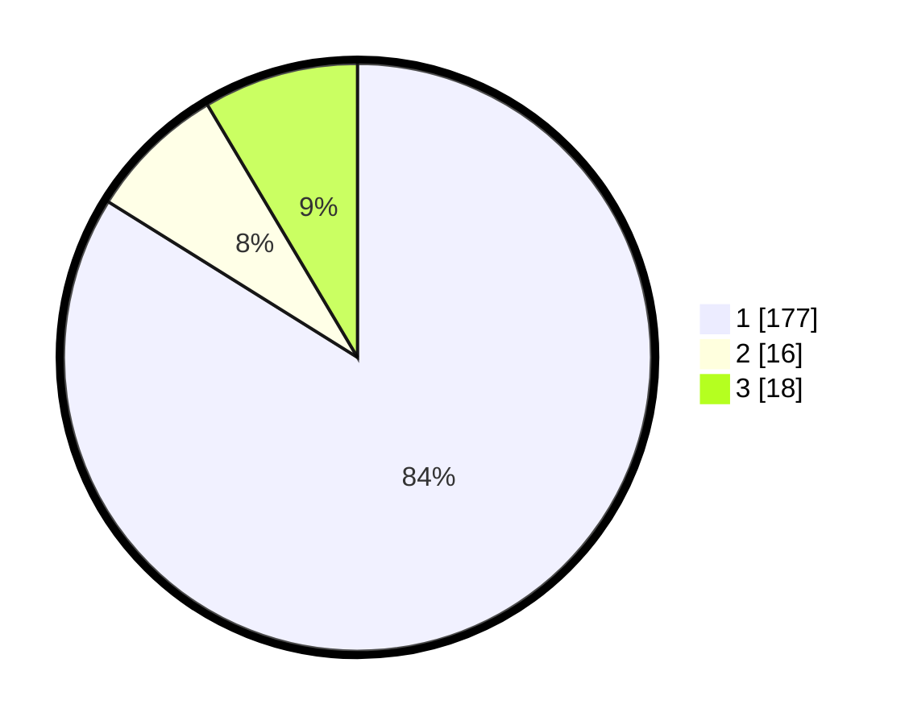

# Hasil

## Grafik

## Tabel

| No. | Nama Paslon    | Suara | Suara (raw) | Persentase |
|:--- |:-------------- | -----:| -----------:| ----------:|
| 1   | ANIES MUHAIMIN | 177   | [177][p-1]  | 83,89      |
| 2   | PRABOWO GIBRAN | 16    | [16][p-2]   | 7,58       |
| 3   | GANJAR MAHFUD  | 18    | [18][p-3]   | 8,53       |

[p-1]: https://github.com/gigit-pemilu/pemilu-2024/blob/main/pilpres/hitung-suara/sub/11-aceh/sub/07-pidie/sub/14-padang-tiji/sub/2005-dayah-tanoh-kunyet/sub/001-tps/sub/paslon-1.txt
[p-2]: https://github.com/gigit-pemilu/pemilu-2024/blob/main/pilpres/hitung-suara/sub/11-aceh/sub/07-pidie/sub/14-padang-tiji/sub/2005-dayah-tanoh-kunyet/sub/001-tps/sub/paslon-2.txt
[p-3]: https://github.com/gigit-pemilu/pemilu-2024/blob/main/pilpres/hitung-suara/sub/11-aceh/sub/07-pidie/sub/14-padang-tiji/sub/2005-dayah-tanoh-kunyet/sub/001-tps/sub/paslon-3.txt

## Foto C Plano

https://sirekap-obj-formc.kpu.go.id/cbfb/pemilu/ppwp/11/07/14/20/05/1107142005001-20240215-105022--471c9edf-ace6-499b-a7d8-8b9d1e570957.jpg

https://sirekap-obj-formc.kpu.go.id/cbfb/pemilu/ppwp/11/07/14/20/05/1107142005001-20240215-105243--67c15c83-8c2e-4349-a33d-2fe3a02e6b10.jpg

https://sirekap-obj-formc.kpu.go.id/cbfb/pemilu/ppwp/11/07/14/20/05/1107142005001-20240215-105540--20f13d5e-5c5e-4961-9686-869e064a6a5a.jpg

## Metadata

| Key        | Value               |
| ---------- | ------------------- |
| Time Stamp | 2024-02-15 17:30:25 |

## DATA PEMILIH TETAP

Jumlah pemilih dalam DPT: **220**.
 * L: **110**.
 * P: **110**.

## DATA PENGGUNA HAK PILIH

Jumlah pengguna hak pilih dalam DPT: **208**.
 * L: **104**.
 * P: **104**.

Jumlah pengguna hak pilih dalam DPTb: **0**.
 * L: **0**.
 * P: **0**.

Jumlah pengguna hak pilih dalam DPK: **3**.
 * L: **1**.
 * P: **2**.

Jumlah pengguna hak pilih: **211**.
 * L: **105**.
 * P: **106**.

## JUMLAH SUARA SAH DAN TIDAK SAH

JUMLAH SELURUH SUARA SAH: **211**.

JUMLAH SUARA TIDAK SAH: **0**.

JUMLAH SELURUH SUARA SAH DAN SUARA TIDAK SAH: **211**.

