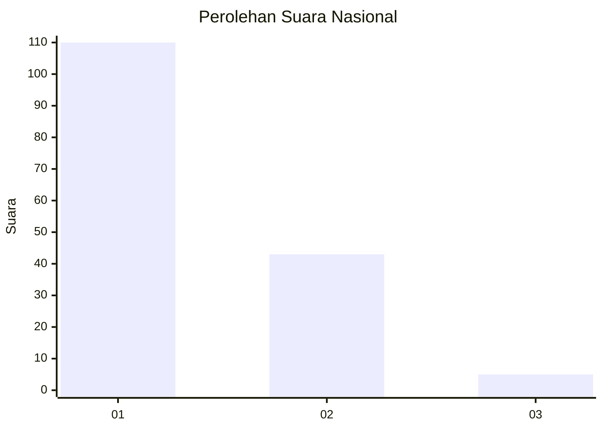
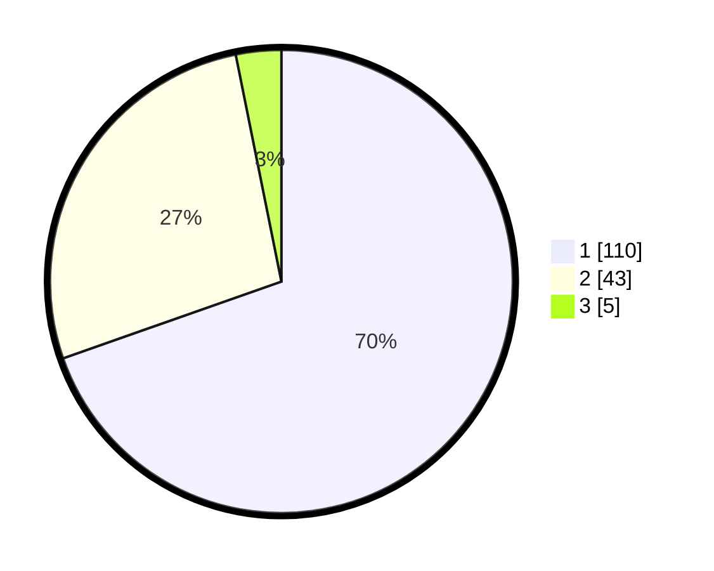

# Hasil

## Grafik

## Tabel

| No. | Nama Paslon    | Suara | Suara (raw) | Persentase |
|:--- |:-------------- | -----:| -----------:| ----------:|
| 1   | ANIES MUHAIMIN | 110   | [110][p-1]  | 69,62      |
| 2   | PRABOWO GIBRAN | 43    | [43][p-2]   | 27,22      |
| 3   | GANJAR MAHFUD  | 5     | [5][p-3]    | 3,16       |

[p-1]: https://github.com/gigit-pemilu/pemilu-2024/blob/main/pilpres/hitung-suara/sub/11-aceh/sub/07-pidie/sub/14-padang-tiji/sub/2006-kambuek-nicah-kunyet/sub/001-tps/sub/paslon-1.txt
[p-2]: https://github.com/gigit-pemilu/pemilu-2024/blob/main/pilpres/hitung-suara/sub/11-aceh/sub/07-pidie/sub/14-padang-tiji/sub/2006-kambuek-nicah-kunyet/sub/001-tps/sub/paslon-2.txt
[p-3]: https://github.com/gigit-pemilu/pemilu-2024/blob/main/pilpres/hitung-suara/sub/11-aceh/sub/07-pidie/sub/14-padang-tiji/sub/2006-kambuek-nicah-kunyet/sub/001-tps/sub/paslon-3.txt

## Foto C Plano

https://sirekap-obj-formc.kpu.go.id/ad94/pemilu/ppwp/11/07/14/20/06/1107142006001-20240215-121247--d7915e40-fc65-4257-a1b2-b338473b64d3.jpg

https://sirekap-obj-formc.kpu.go.id/ad94/pemilu/ppwp/11/07/14/20/06/1107142006001-20240215-150009--0d070d53-8405-40ef-a3a5-88abe2482a4a.jpg

https://sirekap-obj-formc.kpu.go.id/ad94/pemilu/ppwp/11/07/14/20/06/1107142006001-20240215-121610--b7de3bd0-4807-4240-a0dd-f50cf7433e55.jpg

## Metadata

| Key        | Value               |
| ---------- | ------------------- |
| Time Stamp | 2024-02-19 06:16:00 |

