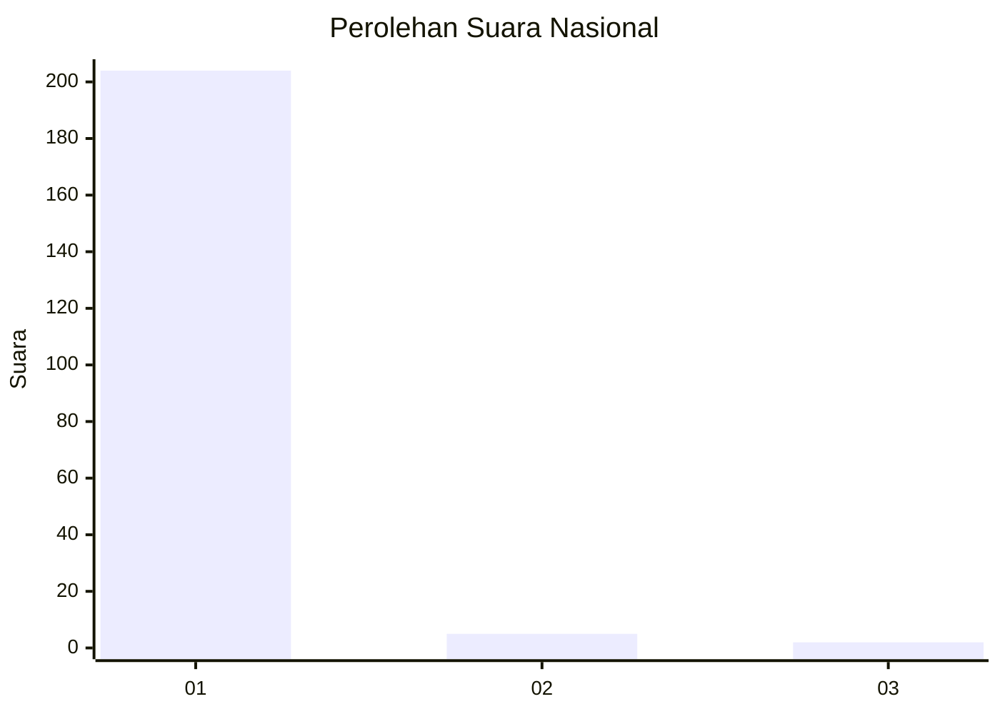
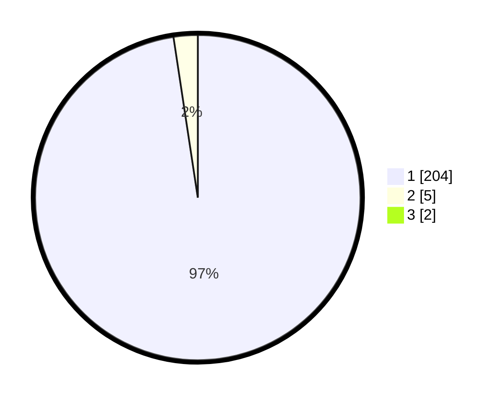

# Hasil

## Grafik

## Tabel

| No. | Nama Paslon    | Suara | Suara (raw) | Persentase |
|:--- |:-------------- | -----:| -----------:| ----------:|
| 1   | ANIES MUHAIMIN | 204   | [204][p-1]  | 96,68      |
| 2   | PRABOWO GIBRAN | 5     | [5][p-2]    | 2,37       |
| 3   | GANJAR MAHFUD  | 2     | [2][p-3]    | 0,95       |

[p-1]: https://github.com/gigit-pemilu/pemilu-2024/blob/main/pilpres/hitung-suara/sub/11-aceh/sub/07-pidie/sub/14-padang-tiji/sub/2007-kambuek-payapi-kunyet/sub/001-tps/sub/paslon-1.txt
[p-2]: https://github.com/gigit-pemilu/pemilu-2024/blob/main/pilpres/hitung-suara/sub/11-aceh/sub/07-pidie/sub/14-padang-tiji/sub/2007-kambuek-payapi-kunyet/sub/001-tps/sub/paslon-2.txt
[p-3]: https://github.com/gigit-pemilu/pemilu-2024/blob/main/pilpres/hitung-suara/sub/11-aceh/sub/07-pidie/sub/14-padang-tiji/sub/2007-kambuek-payapi-kunyet/sub/001-tps/sub/paslon-3.txt

## Foto C Plano

https://sirekap-obj-formc.kpu.go.id/3b9d/pemilu/ppwp/11/07/14/20/07/1107142007001-20240215-110043--fff223b2-dd7c-4f91-85e1-a09ea99c56d1.jpg

https://sirekap-obj-formc.kpu.go.id/3b9d/pemilu/ppwp/11/07/14/20/07/1107142007001-20240215-110253--218ad24f-388d-454d-9aa6-76cffa612cf6.jpg

https://sirekap-obj-formc.kpu.go.id/3b9d/pemilu/ppwp/11/07/14/20/07/1107142007001-20240215-110401--cd76b7a0-3be0-49d5-b665-7d7eb08beae8.jpg

## Metadata

| Key        | Value               |
| ---------- | ------------------- |
| Time Stamp | 2024-02-19 06:16:00 |

