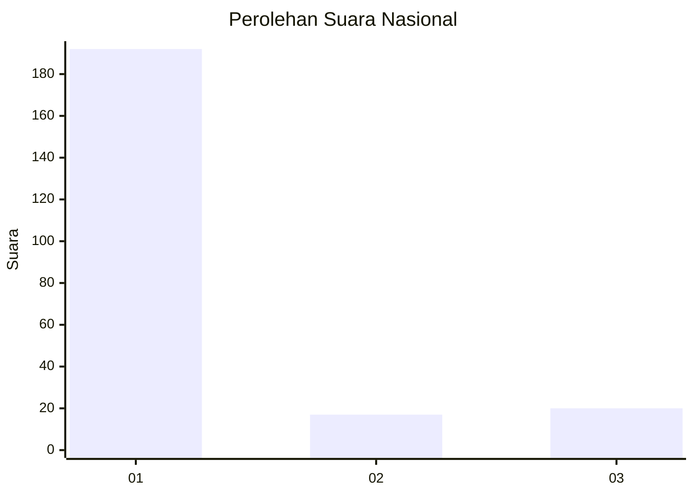
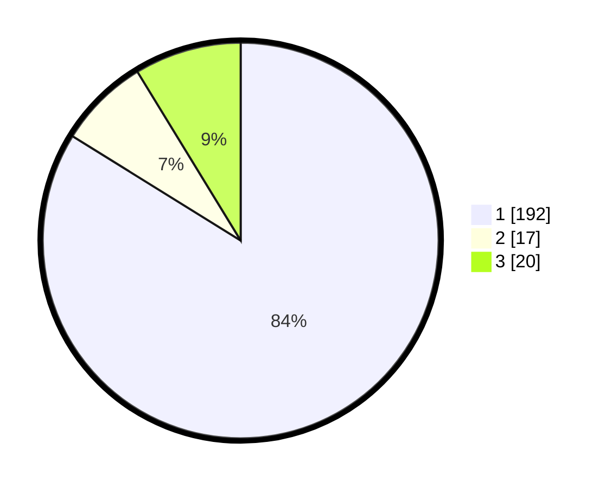

# Hasil

## Grafik

## Tabel

| No. | Nama Paslon    | Suara | Suara (raw) | Persentase |
|:--- |:-------------- | -----:| -----------:| ----------:|
| 1   | ANIES MUHAIMIN | 192   | [192][p-1]  | 83,84      |
| 2   | PRABOWO GIBRAN | 17    | [17][p-2]   | 7,42       |
| 3   | GANJAR MAHFUD  | 20    | [20][p-3]   | 8,73       |

[p-1]: https://github.com/gigit-pemilu/pemilu-2024/blob/main/pilpres/hitung-suara/sub/11-aceh/sub/07-pidie/sub/14-padang-tiji/sub/2008-seunadeu-kunyet/sub/001-tps/sub/paslon-1.txt
[p-2]: https://github.com/gigit-pemilu/pemilu-2024/blob/main/pilpres/hitung-suara/sub/11-aceh/sub/07-pidie/sub/14-padang-tiji/sub/2008-seunadeu-kunyet/sub/001-tps/sub/paslon-2.txt
[p-3]: https://github.com/gigit-pemilu/pemilu-2024/blob/main/pilpres/hitung-suara/sub/11-aceh/sub/07-pidie/sub/14-padang-tiji/sub/2008-seunadeu-kunyet/sub/001-tps/sub/paslon-3.txt

## Foto C Plano

https://sirekap-obj-formc.kpu.go.id/ffbf/pemilu/ppwp/11/07/14/20/08/1107142008001-20240215-085151--f407f3ca-62d0-4470-853f-4dff7f135d95.jpg

https://sirekap-obj-formc.kpu.go.id/ffbf/pemilu/ppwp/11/07/14/20/08/1107142008001-20240215-085028--eac6a133-51a9-4425-b2a1-c71a9ad8c3b6.jpg

https://sirekap-obj-formc.kpu.go.id/ffbf/pemilu/ppwp/11/07/14/20/08/1107142008001-20240215-084800--dc95f5e3-d2f8-497f-9c62-822f11163d0d.jpg

## Metadata

| Key        | Value               |
| ---------- | ------------------- |
| Time Stamp | 2024-02-19 06:16:00 |

