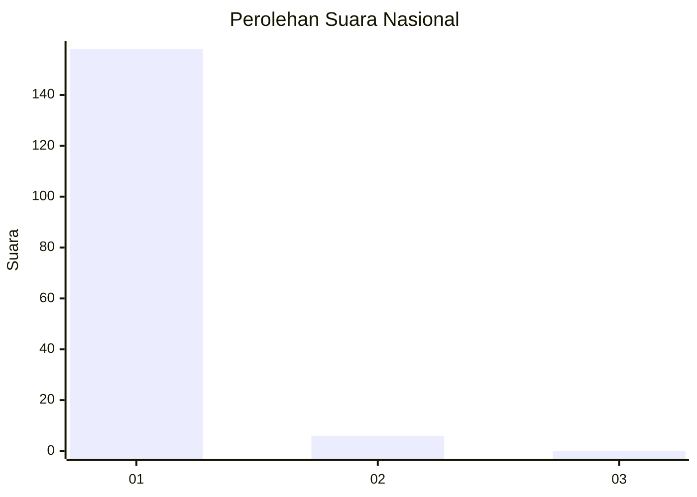
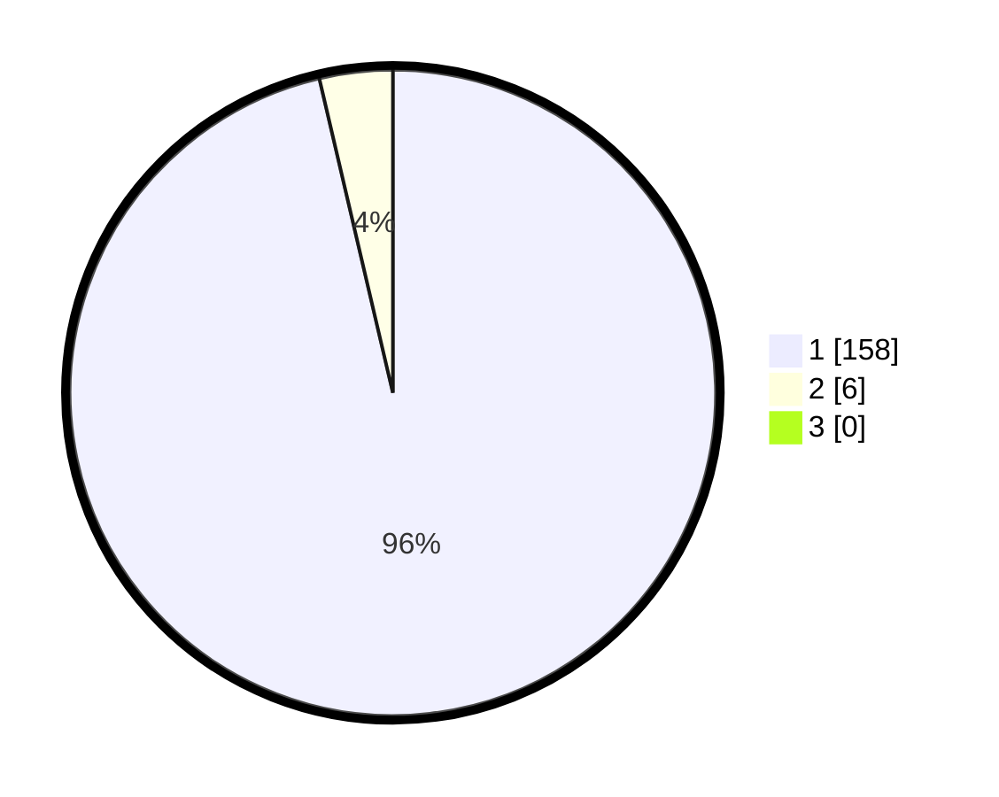

# Hasil

## Grafik

## Tabel

| No. | Nama Paslon    | Suara | Suara (raw) | Persentase |
|:--- |:-------------- | -----:| -----------:| ----------:|
| 1   | ANIES MUHAIMIN | 158   | [158][p-1]  | 96,34      |
| 2   | PRABOWO GIBRAN | 6     | [6][p-2]    | 3,66       |
| 3   | GANJAR MAHFUD  | 0     | [0][p-3]    | 0,00       |

[p-1]: https://github.com/gigit-pemilu/pemilu-2024/blob/main/pilpres/hitung-suara/sub/11-aceh/sub/07-pidie/sub/14-padang-tiji/sub/2010-dayah-baroh-kunyet/sub/001-tps/sub/paslon-1.txt
[p-2]: https://github.com/gigit-pemilu/pemilu-2024/blob/main/pilpres/hitung-suara/sub/11-aceh/sub/07-pidie/sub/14-padang-tiji/sub/2010-dayah-baroh-kunyet/sub/001-tps/sub/paslon-2.txt
[p-3]: https://github.com/gigit-pemilu/pemilu-2024/blob/main/pilpres/hitung-suara/sub/11-aceh/sub/07-pidie/sub/14-padang-tiji/sub/2010-dayah-baroh-kunyet/sub/001-tps/sub/paslon-3.txt

## Foto C Plano

https://sirekap-obj-formc.kpu.go.id/f4b3/pemilu/ppwp/11/07/14/20/10/1107142010001-20240216-114349--7a11ed0f-6593-4b50-92f5-672a097f5deb.jpg

https://sirekap-obj-formc.kpu.go.id/f4b3/pemilu/ppwp/11/07/14/20/10/1107142010001-20240216-114858--9bbe8386-0ae4-4757-bfcd-130b8e5a86ce.jpg

https://sirekap-obj-formc.kpu.go.id/f4b3/pemilu/ppwp/11/07/14/20/10/1107142010001-20240214-233222--804d6e5e-c2ce-4d86-91db-bf0a548f9887.jpg

## Metadata

| Key        | Value               |
| ---------- | ------------------- |
| Time Stamp | 2024-02-24 22:31:28 |

