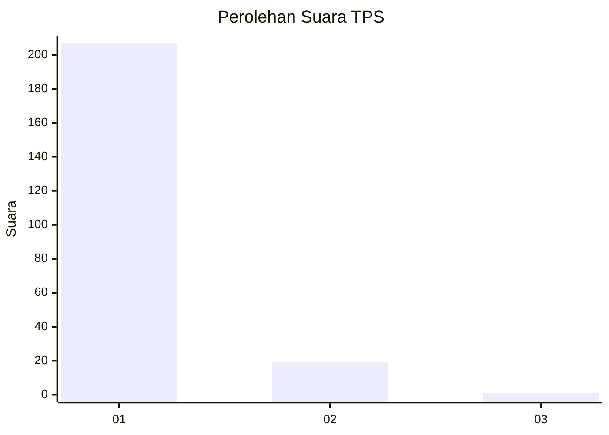
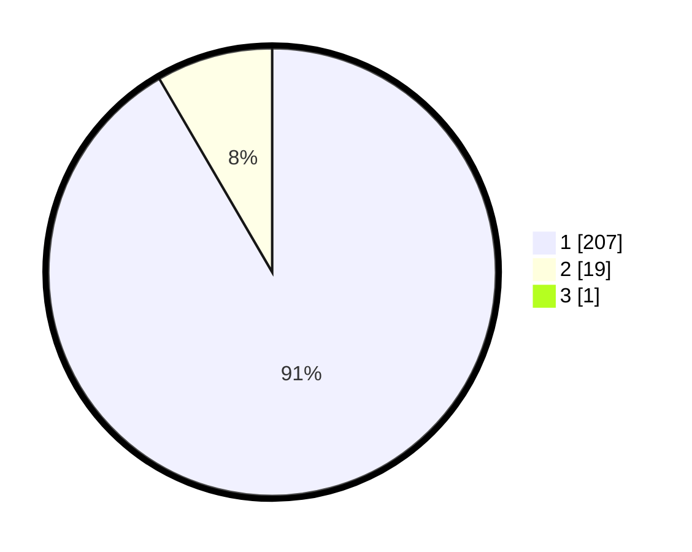

# Hasil

## Grafik

## Tabel

| No. | Nama Paslon    | Suara | Suara (raw) | Persentase |
|:--- |:-------------- | -----:| -----------:| ----------:|
| 1   | ANIES MUHAIMIN | 207   | [207][p-1]  | 91,19      |
| 2   | PRABOWO GIBRAN | 19    | [19][p-2]   | 8,37       |
| 3   | GANJAR MAHFUD  | 1     | [1][p-3]    | 0,44       |

[p-1]: https://github.com/gigit-pemilu/pemilu-2024-11-aceh/blob/main/pilpres/hitung-suara/sub/11-aceh/sub/07-pidie/sub/14-padang-tiji/sub/2012-geulumpang-geuleudieng/sub/001-tps/sub/paslon-1.txt
[p-2]: https://github.com/gigit-pemilu/pemilu-2024-11-aceh/blob/main/pilpres/hitung-suara/sub/11-aceh/sub/07-pidie/sub/14-padang-tiji/sub/2012-geulumpang-geuleudieng/sub/001-tps/sub/paslon-2.txt
[p-3]: https://github.com/gigit-pemilu/pemilu-2024-11-aceh/blob/main/pilpres/hitung-suara/sub/11-aceh/sub/07-pidie/sub/14-padang-tiji/sub/2012-geulumpang-geuleudieng/sub/001-tps/sub/paslon-3.txt

## Foto C Plano

https://sirekap-obj-formc.kpu.go.id/8034/pemilu/ppwp/11/07/14/20/12/1107142012001-20240215-141558--ba38b07c-8c52-4752-9cdd-d660387c527a.jpg

https://sirekap-obj-formc.kpu.go.id/8034/pemilu/ppwp/11/07/14/20/12/1107142012001-20240215-155328--414e920c-7c45-405e-a789-59df3a95363c.jpg

https://sirekap-obj-formc.kpu.go.id/8034/pemilu/ppwp/11/07/14/20/12/1107142012001-20240215-114427--b2642187-9347-4cad-8717-0400de9b0985.jpg

## Metadata

| Key        | Value               |
| ---------- | ------------------- |
| Time Stamp | 2024-02-25 17:00:00 |

