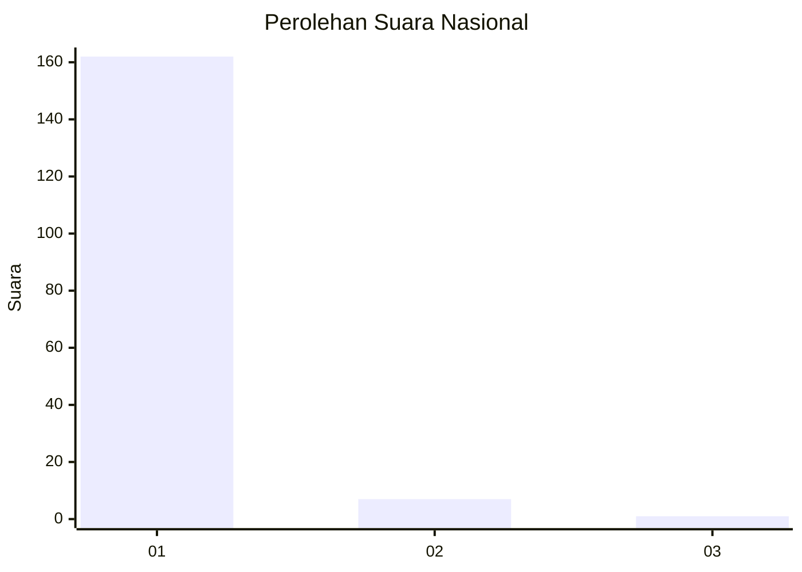
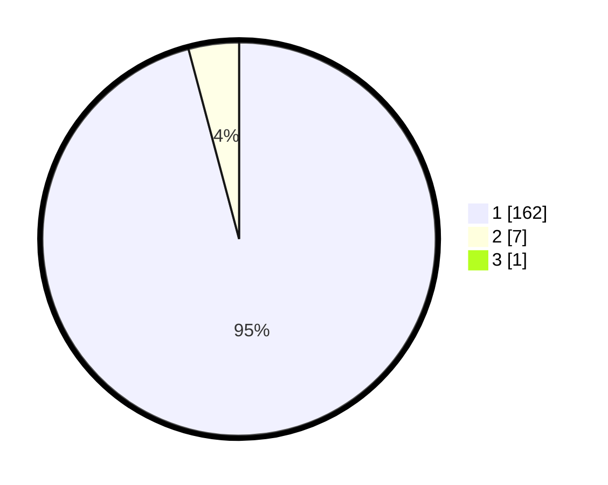

# Hasil

## Grafik

## Tabel

| No. | Nama Paslon    | Suara | Suara (raw) | Persentase |
|:--- |:-------------- | -----:| -----------:| ----------:|
| 1   | ANIES MUHAIMIN | 162   | [162][p-1]  | 95,29      |
| 2   | PRABOWO GIBRAN | 7     | [7][p-2]    | 4,12       |
| 3   | GANJAR MAHFUD  | 1     | [1][p-3]    | 0,59       |

[p-1]: https://github.com/gigit-pemilu/pemilu-2024/blob/main/pilpres/hitung-suara/sub/11-aceh/sub/07-pidie/sub/14-padang-tiji/sub/2014-sukon-peudaya/sub/001-tps/sub/paslon-1.txt
[p-2]: https://github.com/gigit-pemilu/pemilu-2024/blob/main/pilpres/hitung-suara/sub/11-aceh/sub/07-pidie/sub/14-padang-tiji/sub/2014-sukon-peudaya/sub/001-tps/sub/paslon-2.txt
[p-3]: https://github.com/gigit-pemilu/pemilu-2024/blob/main/pilpres/hitung-suara/sub/11-aceh/sub/07-pidie/sub/14-padang-tiji/sub/2014-sukon-peudaya/sub/001-tps/sub/paslon-3.txt

## Foto C Plano

https://sirekap-obj-formc.kpu.go.id/59a5/pemilu/ppwp/11/07/14/20/14/1107142014001-20240215-032630--2b037e9b-e2a3-4718-a7a9-7278cba84232.jpg

https://sirekap-obj-formc.kpu.go.id/59a5/pemilu/ppwp/11/07/14/20/14/1107142014001-20240215-032805--b78dffeb-4935-4b5f-ad2c-2b16daa92bc3.jpg

https://sirekap-obj-formc.kpu.go.id/59a5/pemilu/ppwp/11/07/14/20/14/1107142014001-20240215-032929--1589b4ee-7ce2-47c4-b1dd-a85a3fe4081c.jpg

## Metadata

| Key        | Value               |
| ---------- | ------------------- |
| Time Stamp | 2024-02-19 06:16:00 |

