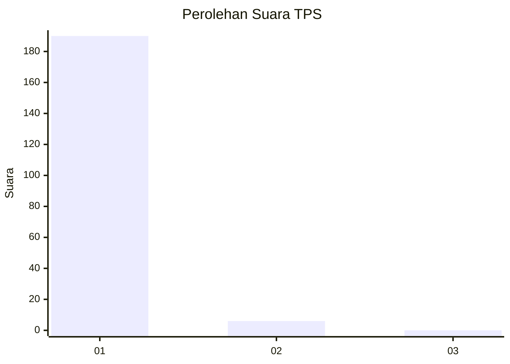
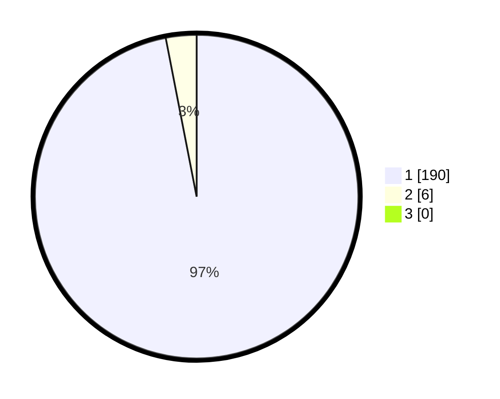

# Hasil

## Grafik

## Tabel

| No. | Nama Paslon    | Suara | Suara (raw) | Persentase |
|:--- |:-------------- | -----:| -----------:| ----------:|
| 1   | ANIES MUHAIMIN | 190   | [190][p-1]  | 96,94      |
| 2   | PRABOWO GIBRAN | 6     | [6][p-2]    | 3,06       |
| 3   | GANJAR MAHFUD  | 0     | [0][p-3]    | 0,00       |

[p-1]: https://github.com/gigit-pemilu/pemilu-2024-11-aceh/blob/main/pilpres/hitung-suara/sub/11-aceh/sub/07-pidie/sub/14-padang-tiji/sub/2017-buloh-peudaya/sub/001-tps/sub/paslon-1.txt
[p-2]: https://github.com/gigit-pemilu/pemilu-2024-11-aceh/blob/main/pilpres/hitung-suara/sub/11-aceh/sub/07-pidie/sub/14-padang-tiji/sub/2017-buloh-peudaya/sub/001-tps/sub/paslon-2.txt
[p-3]: https://github.com/gigit-pemilu/pemilu-2024-11-aceh/blob/main/pilpres/hitung-suara/sub/11-aceh/sub/07-pidie/sub/14-padang-tiji/sub/2017-buloh-peudaya/sub/001-tps/sub/paslon-3.txt

## Foto C Plano

https://sirekap-obj-formc.kpu.go.id/7a75/pemilu/ppwp/11/07/14/20/17/1107142017001-20240215-024649--13307c4d-e4f8-4db4-abe8-1ae6c2b59430.jpg

https://sirekap-obj-formc.kpu.go.id/7a75/pemilu/ppwp/11/07/14/20/17/1107142017001-20240215-024829--205013c6-e2f8-44df-9504-160d54fca819.jpg

https://sirekap-obj-formc.kpu.go.id/7a75/pemilu/ppwp/11/07/14/20/17/1107142017001-20240215-024924--4fe5df09-31f1-4439-9406-827ee91c0855.jpg

## Metadata

| Key        | Value               |
| ---------- | ------------------- |
| Time Stamp | 2024-02-19 06:16:00 |

