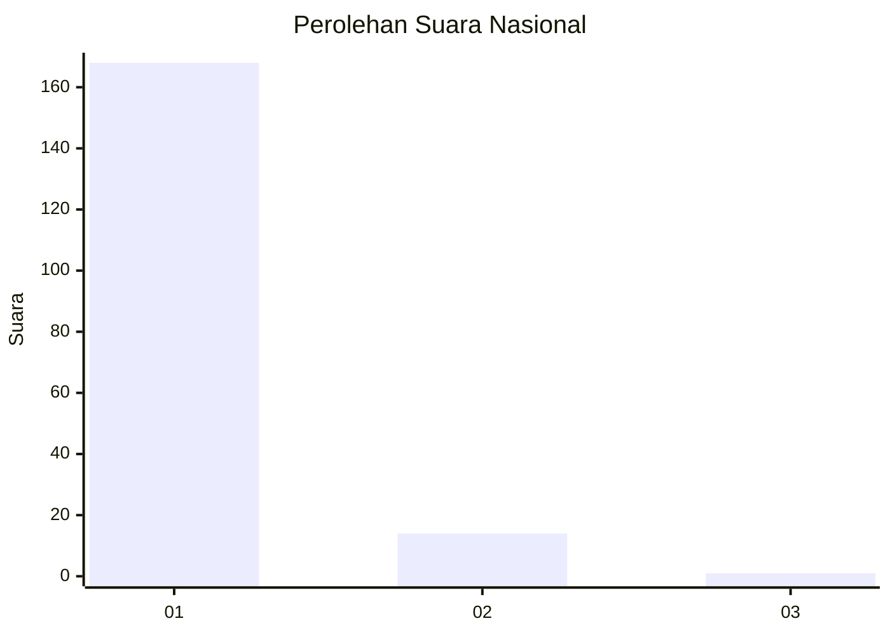
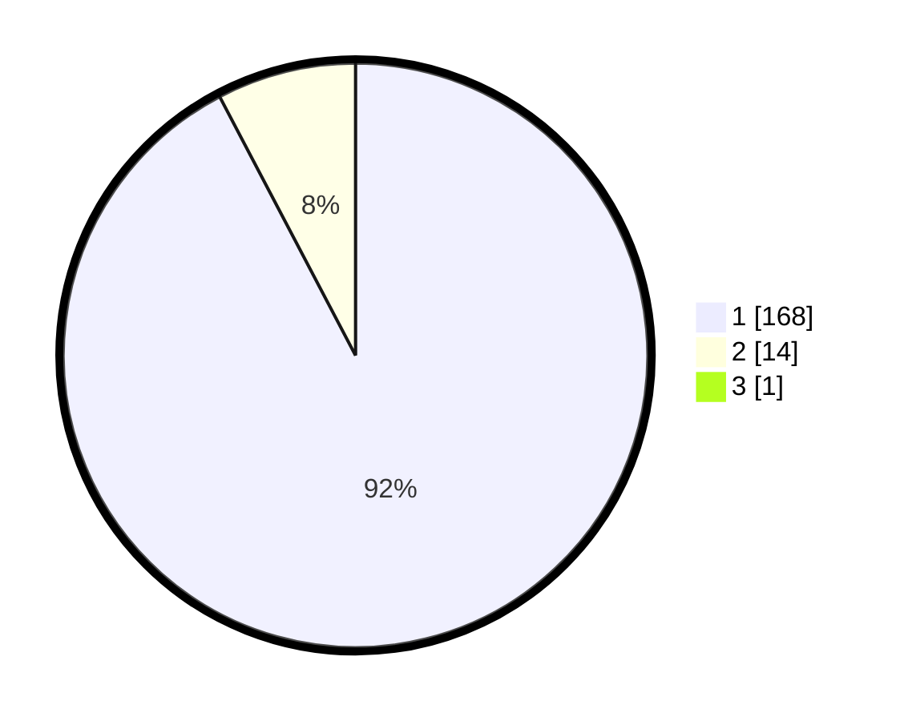

# Hasil

## Grafik

## Tabel

| No. | Nama Paslon    | Suara | Suara (raw) | Persentase |
|:--- |:-------------- | -----:| -----------:| ----------:|
| 1   | ANIES MUHAIMIN | 168   | [168][p-1]  | 91,80      |
| 2   | PRABOWO GIBRAN | 14    | [14][p-2]   | 7,65       |
| 3   | GANJAR MAHFUD  | 1     | [1][p-3]    | 0,55       |

[p-1]: https://github.com/gigit-pemilu/pemilu-2024/blob/main/pilpres/hitung-suara/sub/11-aceh/sub/07-pidie/sub/14-padang-tiji/sub/2019-dayah-peudaya/sub/001-tps/sub/paslon-1.txt
[p-2]: https://github.com/gigit-pemilu/pemilu-2024/blob/main/pilpres/hitung-suara/sub/11-aceh/sub/07-pidie/sub/14-padang-tiji/sub/2019-dayah-peudaya/sub/001-tps/sub/paslon-2.txt
[p-3]: https://github.com/gigit-pemilu/pemilu-2024/blob/main/pilpres/hitung-suara/sub/11-aceh/sub/07-pidie/sub/14-padang-tiji/sub/2019-dayah-peudaya/sub/001-tps/sub/paslon-3.txt

## Foto C Plano

https://sirekap-obj-formc.kpu.go.id/6933/pemilu/ppwp/11/07/14/20/19/1107142019001-20240215-154044--dc73e231-753c-43de-8a8a-00238e8180e8.jpg

https://sirekap-obj-formc.kpu.go.id/6933/pemilu/ppwp/11/07/14/20/19/1107142019001-20240215-172008--89dcc0ff-8601-4bea-908a-a7d0765ea415.jpg

https://sirekap-obj-formc.kpu.go.id/6933/pemilu/ppwp/11/07/14/20/19/1107142019001-20240215-172048--5981fd3d-4cfd-4e7a-8e9c-67552bf0a5e5.jpg

## Metadata

| Key        | Value               |
| ---------- | ------------------- |
| Time Stamp | 2024-02-19 06:16:00 |

