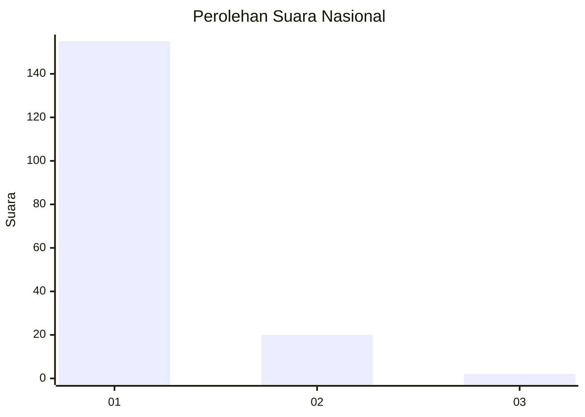
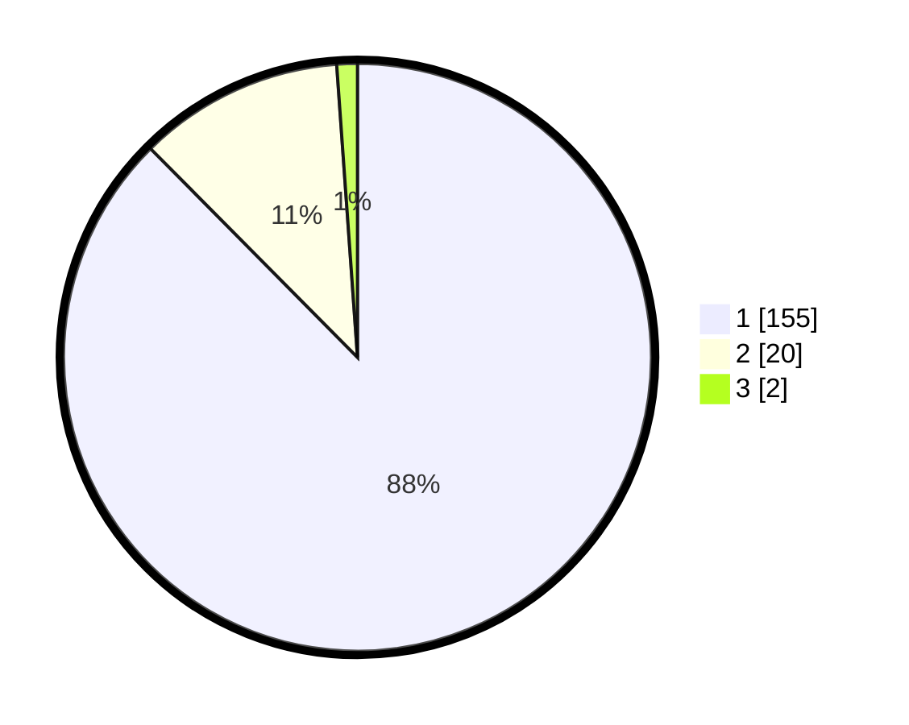

# Hasil

## Grafik

## Tabel

| No. | Nama Paslon    | Suara | Suara (raw) | Persentase |
|:--- |:-------------- | -----:| -----------:| ----------:|
| 1   | ANIES MUHAIMIN | 155   | [155][p-1]  | 87,57      |
| 2   | PRABOWO GIBRAN | 20    | [20][p-2]   | 11,30      |
| 3   | GANJAR MAHFUD  | 2     | [2][p-3]    | 1,13       |

[p-1]: https://github.com/gigit-pemilu/pemilu-2024/blob/main/pilpres/hitung-suara/sub/11-aceh/sub/07-pidie/sub/14-padang-tiji/sub/2022-tunong-peudaya/sub/001-tps/sub/paslon-1.txt
[p-2]: https://github.com/gigit-pemilu/pemilu-2024/blob/main/pilpres/hitung-suara/sub/11-aceh/sub/07-pidie/sub/14-padang-tiji/sub/2022-tunong-peudaya/sub/001-tps/sub/paslon-2.txt
[p-3]: https://github.com/gigit-pemilu/pemilu-2024/blob/main/pilpres/hitung-suara/sub/11-aceh/sub/07-pidie/sub/14-padang-tiji/sub/2022-tunong-peudaya/sub/001-tps/sub/paslon-3.txt

## Foto C Plano

https://sirekap-obj-formc.kpu.go.id/3496/pemilu/ppwp/11/07/14/20/22/1107142022001-20240215-092711--6efad2fc-36b7-40a2-9fd1-b1dedd96cc6a.jpg

https://sirekap-obj-formc.kpu.go.id/3496/pemilu/ppwp/11/07/14/20/22/1107142022001-20240215-092916--98216782-7115-423d-b5a1-ea0e4eaeaa21.jpg

https://sirekap-obj-formc.kpu.go.id/3496/pemilu/ppwp/11/07/14/20/22/1107142022001-20240215-093029--ba8edb09-8cac-4f38-b7d3-f2e44f54d596.jpg

## Metadata

| Key        | Value               |
| ---------- | ------------------- |
| Time Stamp | 2024-02-24 22:31:28 |

