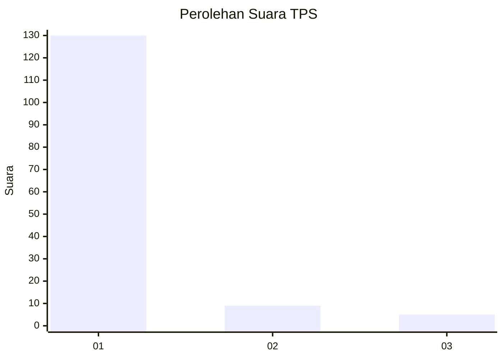
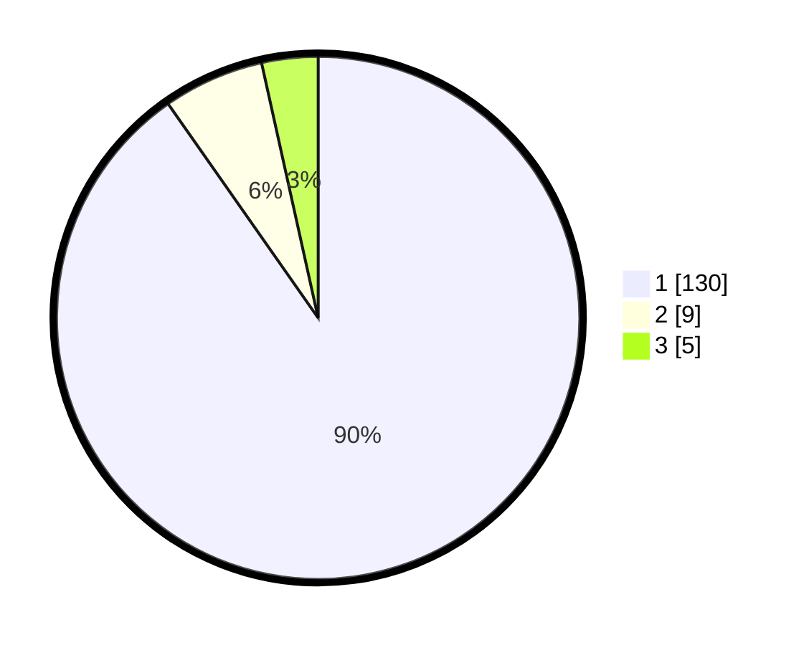

# Hasil

## Grafik

## Tabel

| No. | Nama Paslon    | Suara | Suara (raw) | Persentase |
|:--- |:-------------- | -----:| -----------:| ----------:|
| 1   | ANIES MUHAIMIN | 130   | [130][p-1]  | 90,28      |
| 2   | PRABOWO GIBRAN | 9     | [9][p-2]    | 6,25       |
| 3   | GANJAR MAHFUD  | 5     | [5][p-3]    | 3,47       |

[p-1]: https://github.com/gigit-pemilu/pemilu-2024-11-aceh/blob/main/pilpres/hitung-suara/sub/11-aceh/sub/07-pidie/sub/14-padang-tiji/sub/2022-tunong-peudaya/sub/002-tps/sub/paslon-1.txt
[p-2]: https://github.com/gigit-pemilu/pemilu-2024-11-aceh/blob/main/pilpres/hitung-suara/sub/11-aceh/sub/07-pidie/sub/14-padang-tiji/sub/2022-tunong-peudaya/sub/002-tps/sub/paslon-2.txt
[p-3]: https://github.com/gigit-pemilu/pemilu-2024-11-aceh/blob/main/pilpres/hitung-suara/sub/11-aceh/sub/07-pidie/sub/14-padang-tiji/sub/2022-tunong-peudaya/sub/002-tps/sub/paslon-3.txt

## Foto C Plano

https://sirekap-obj-formc.kpu.go.id/53aa/pemilu/ppwp/11/07/14/20/22/1107142022002-20240215-125858--7ec7aa06-bc71-449d-a358-32d2136bcff0.jpg

https://sirekap-obj-formc.kpu.go.id/53aa/pemilu/ppwp/11/07/14/20/22/1107142022002-20240215-130057--a5b7b827-9e0f-4f7c-b30d-fda48acafad3.jpg

https://sirekap-obj-formc.kpu.go.id/53aa/pemilu/ppwp/11/07/14/20/22/1107142022002-20240215-130134--49deb48e-db71-4fc1-8bdf-8e6d7d4e56f7.jpg

## Metadata

| Key        | Value               |
| ---------- | ------------------- |
| Time Stamp | 2024-02-19 06:16:00 |

